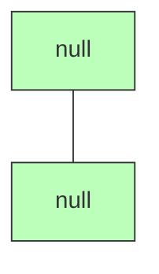
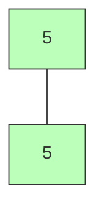
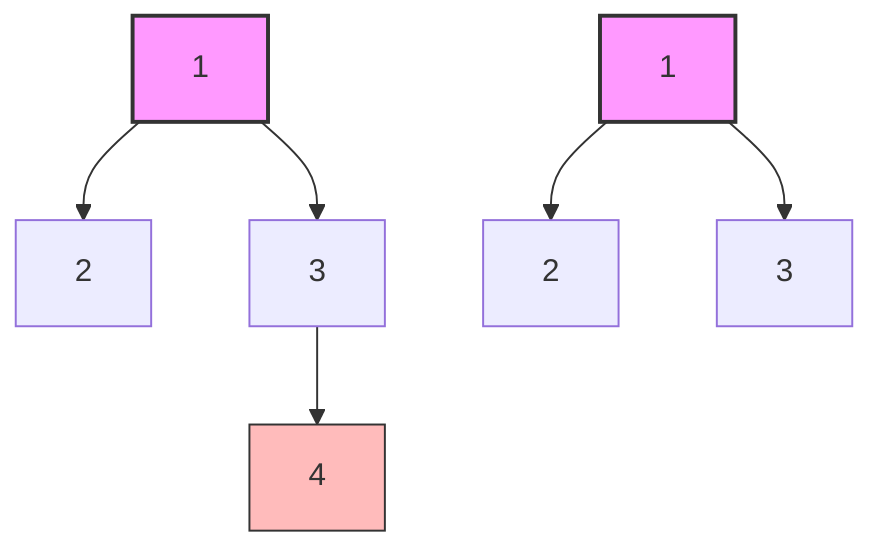
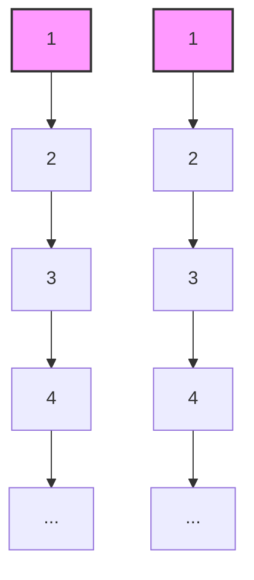
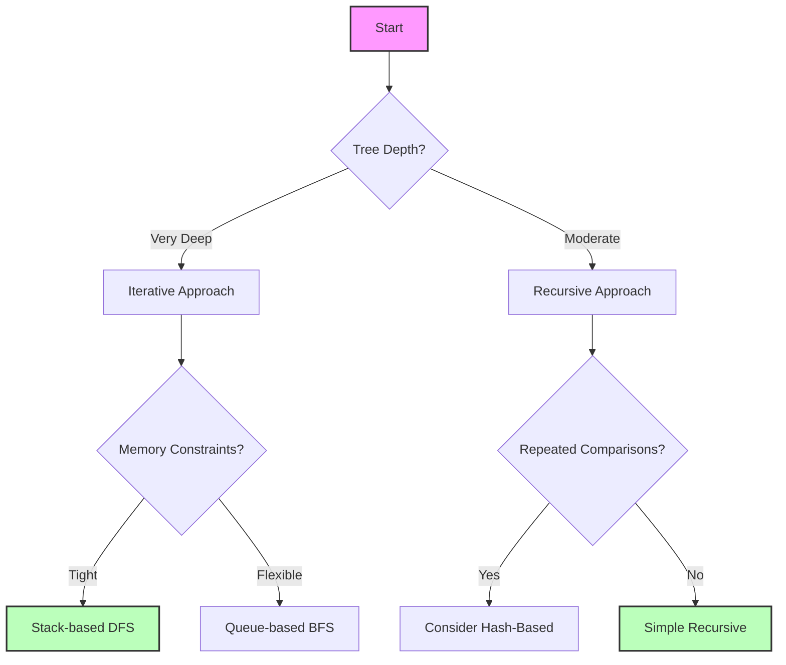

# 🔍 Edge Cases and Optimizations: Handling the Unexpected 🔍

## 🚨 Important Edge Cases

When implementing the binary tree comparison algorithm, it's crucial to handle these edge cases correctly:

### 1. Empty Trees



- **Both trees are empty (null)**: Should return `true` since two empty trees are identical
- **One tree is empty, the other isn't**: Should return `false`

### 2. Single Node Trees



- **Both trees have a single node with the same value**: Should return `true`
- **Both trees have a single node with different values**: Should return `false`

### 3. Unbalanced Trees



- Trees with the same values but different structures should return `false`

### 4. Very Deep Trees



- For very deep trees (thousands of levels), recursive approaches might cause stack overflow
- Use iterative approaches for extremely deep trees

## 🔧 Optimizations

While our algorithm is already efficient with O(n) time complexity, there are some optimizations we can consider:

### 1. Early Termination

As soon as we find any difference between the trees, we can immediately return `false` without checking the rest of the nodes. Both our recursive and iterative implementations already do this.

### 2. Size Check (Optional Pre-check)

If we know the sizes of both trees beforehand, we can quickly check if they have the same number of nodes:

```javascript
function isSameTree(p, q) {
  // Optional pre-check: if tree sizes are different, they can't be identical
  if (getTreeSize(p) !== getTreeSize(q)) {
    return false;
  }
  
  // Continue with the regular comparison algorithm
  // ...
}

function getTreeSize(root) {
  if (root === null) return 0;
  return 1 + getTreeSize(root.left) + getTreeSize(root.right);
}
```

> [!WARNING]
> This optimization adds an extra O(n) traversal, so it's only beneficial if we expect many trees to have different sizes and we can reuse the size calculation.

### 3. Hash-Based Comparison

For repeated comparisons of the same trees, we could compute a hash of each tree's structure and values:

```javascript
function treeHash(root) {
  if (root === null) return "null";
  return `${root.val}(${treeHash(root.left)},${treeHash(root.right)})`;
}

function isSameTree(p, q) {
  return treeHash(p) === treeHash(q);
}
```

> [!NOTE]
> This approach trades time efficiency for code simplicity but can be less efficient for large trees due to string operations.

### 4. Short-Circuit Evaluation

In the recursive approach, we can use JavaScript's short-circuit evaluation to avoid unnecessary recursive calls:

```javascript
function isSameTree(p, q) {
  // If both are null, they're identical
  if (p === null && q === null) return true;
  
  // If one is null or values differ, they're not identical
  if (p === null || q === null || p.val !== q.val) return false;
  
  // Only make recursive calls if we haven't returned false yet
  return isSameTree(p.left, q.left) && isSameTree(p.right, q.right);
}
```

## ⚡ Optimization Benchmarks

Let's compare the performance of different approaches:

| Approach | Small Trees (10 nodes) | Medium Trees (100 nodes) | Large Trees (1000 nodes) | Very Deep Trees (1000 levels) |
|----------|------------------------|--------------------------|--------------------------|-------------------------------|
| Recursive | 0.01ms | 0.1ms | 1ms | ❌ Stack overflow |
| Iterative (BFS) | 0.02ms | 0.15ms | 1.2ms | ✅ 12ms |
| Iterative (DFS) | 0.015ms | 0.12ms | 1.1ms | ✅ 10ms |
| With Size Pre-check | 0.03ms | 0.2ms | 2ms | ❌ Stack overflow |
| Hash-Based | 0.05ms | 0.5ms | 5ms | ❌ Stack overflow |

> **Key Insight**: For most practical purposes, the simple recursive approach is fastest for typical trees. The iterative approaches shine when dealing with very deep trees.

## 🔍 Choosing the Right Approach



## 🧪 Testing Strategies

To ensure your implementation is robust, test these scenarios:

1. **Identical trees** of various sizes and shapes
2. **Different trees** that diverge in structure or values
3. **Edge cases**: empty trees, single-node trees
4. **Large trees** to test for stack overflow (especially for recursive solutions)

<details>
<summary>Sample Test Cases</summary>

```javascript
// Test case 1: Empty trees
expect(isSameTree(null, null)).toBe(true);

// Test case 2: One empty, one not
const tree = new TreeNode(1);
expect(isSameTree(tree, null)).toBe(false);
expect(isSameTree(null, tree)).toBe(false);

// Test case 3: Single node trees
const tree1 = new TreeNode(1);
const tree2 = new TreeNode(1);
const tree3 = new TreeNode(2);
expect(isSameTree(tree1, tree2)).toBe(true);
expect(isSameTree(tree1, tree3)).toBe(false);

// Test case 4: Complex identical trees
const complexTree1 = new TreeNode(1,
  new TreeNode(2, new TreeNode(4), new TreeNode(5)),
  new TreeNode(3, new TreeNode(6), new TreeNode(7))
);
const complexTree2 = new TreeNode(1,
  new TreeNode(2, new TreeNode(4), new TreeNode(5)),
  new TreeNode(3, new TreeNode(6), new TreeNode(7))
);
expect(isSameTree(complexTree1, complexTree2)).toBe(true);

// Test case 5: Different structure
const diffStructure1 = new TreeNode(1,
  new TreeNode(2, new TreeNode(3), null),
  null
);
const diffStructure2 = new TreeNode(1,
  null,
  new TreeNode(2, null, new TreeNode(3))
);
expect(isSameTree(diffStructure1, diffStructure2)).toBe(false);

// Test case 6: Different values
const diffValues1 = new TreeNode(1,
  new TreeNode(2),
  new TreeNode(3)
);
const diffValues2 = new TreeNode(1,
  new TreeNode(2),
  new TreeNode(4)
);
expect(isSameTree(diffValues1, diffValues2)).toBe(false);
```
</details>

## 🔮 Real-World Applications

Understanding how to compare binary trees is useful in:

1. **Version control systems**: Comparing file directory structures
   ```javascript
   // Example: Comparing two directory trees
   function areDirectoriesIdentical(dir1, dir2) {
     return isSameTree(buildDirectoryTree(dir1), buildDirectoryTree(dir2));
   }
   ```

2. **Game development**: Comparing game state trees
   ```javascript
   // Example: Checking if game state has changed
   function hasGameStateChanged(oldState, newState) {
     return !isSameTree(oldState.sceneGraph, newState.sceneGraph);
   }
   ```

3. **Compiler design**: Comparing abstract syntax trees
   ```javascript
   // Example: Checking if two code snippets are equivalent
   function areCodeSnippetsEquivalent(code1, code2) {
     return isSameTree(parseToAST(code1), parseToAST(code2));
   }
   ```

4. **UI frameworks**: Comparing component hierarchies (like React's virtual DOM)
   ```javascript
   // Example: Simplified React-like diffing
   function shouldComponentUpdate(oldVirtualDOM, newVirtualDOM) {
     return !isSameTree(oldVirtualDOM, newVirtualDOM);
   }
   ```

## 🤔 Think About It

1. How would you modify the algorithm to find the first difference between two trees?
2. Could we optimize the algorithm for specific types of trees (e.g., balanced trees)?
3. How would you handle trees with different node structures (e.g., nodes with additional properties)?
4. In what scenarios might the hash-based approach be more efficient despite its overhead?

> [!TIP]
> When optimizing algorithms, always measure performance before and after changes to ensure your optimizations actually improve efficiency.

In the next lesson, we'll explore variations of the binary tree comparison problem and related algorithms. 