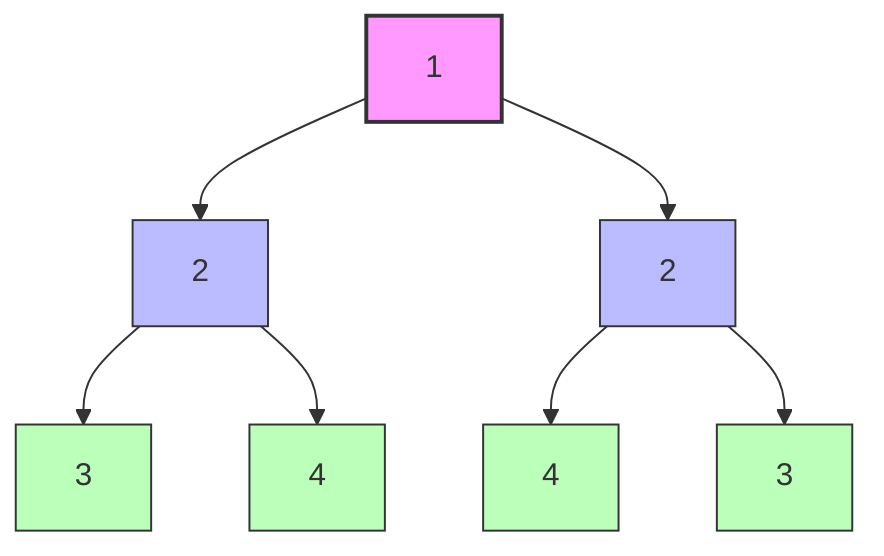
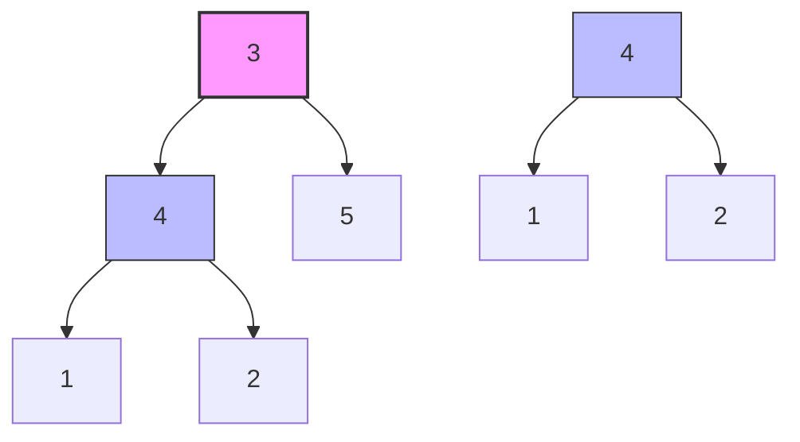
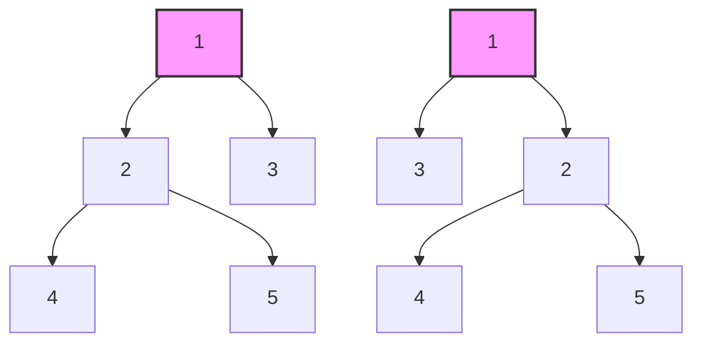

# 🔀 Related Problems and Variations: Expanding Your Horizons 🔀

Now that you understand how to compare binary trees for exact equality, let's explore related problems and variations that build on this knowledge.

## 🧩 Framework for Adapting Tree Comparison

When facing a new tree comparison problem, follow these steps:

1. **Identify the comparison criteria**: What makes two trees or subtrees "equal" in this context?
2. **Determine the traversal strategy**: Will you need to visit nodes in a specific order?
3. **Choose the right data structures**: Will you need to store additional information during traversal?
4. **Handle edge cases**: What happens with empty trees, single nodes, or unbalanced structures?
5. **Optimize if necessary**: Can you use early termination or other optimizations?

Let's apply this framework to several related problems.

## 🔄 Related Problems by Difficulty

### 🟢 Beginner Level

#### Symmetric Tree

**Problem**: Given the root of a binary tree, check if it is a mirror of itself (i.e., symmetric around its center).



**Applying our framework**:
1. **Comparison criteria**: Left subtree should be a mirror image of right subtree
2. **Traversal strategy**: Need to compare left.left with right.right and left.right with right.left
3. **Data structures**: Simple recursion works well
4. **Edge cases**: Empty tree is symmetric; single node tree is symmetric
5. **Optimizations**: Can terminate early if any comparison fails

**Approach**:
1. Modify our tree comparison to check if the left subtree is a mirror image of the right subtree
2. In a mirror image, the left child of one tree corresponds to the right child of the other

```javascript
function isSymmetric(root) {
  if (root === null) return true;
  return isMirror(root.left, root.right);
}

function isMirror(left, right) {
  // Both null means this part is symmetric
  if (left === null && right === null) return true;
  
  // One null but not the other means asymmetric
  if (left === null || right === null) return false;
  
  // Values must match, and subtrees must be mirrors of each other
  return (left.val === right.val) &&
         isMirror(left.left, right.right) &&
         isMirror(left.right, right.left);
}
```

### 🟡 Intermediate Level

#### Subtree of Another Tree

**Problem**: Given two binary trees `root` and `subRoot`, determine if `subRoot` is a subtree of `root`.



**Applying our framework**:
1. **Comparison criteria**: The subtree must be exactly identical to a part of the main tree
2. **Traversal strategy**: Need to check each node in the main tree as a potential root of the subtree
3. **Data structures**: Reuse our `isSameTree` function
4. **Edge cases**: Empty subtree is always a subtree; empty main tree can only contain empty subtree
5. **Optimizations**: Can use early termination when a match is found

**Approach**:
1. For each node in the main tree, check if the subtree rooted at that node is identical to the second tree
2. Use our `isSameTree` function as a helper

```javascript
function isSubtree(root, subRoot) {
  // Base cases
  if (subRoot === null) return true; // Empty tree is always a subtree
  if (root === null) return false; // Empty tree cannot contain a non-empty subtree
  
  // Check if the current subtree matches
  if (isSameTree(root, subRoot)) return true;
  
  // Check left and right subtrees
  return isSubtree(root.left, subRoot) || isSubtree(root.right, subRoot);
}

// Reuse our previously defined isSameTree function
function isSameTree(p, q) {
  if (p === null && q === null) return true;
  if (p === null || q === null) return false;
  if (p.val !== q.val) return false;
  return isSameTree(p.left, q.left) && isSameTree(p.right, q.right);
}
```

#### Merge Two Binary Trees

**Problem**: Given two binary trees, merge them by adding the values of corresponding nodes. If only one tree has a node at a certain position, use that node in the merged tree.

```mermaid
graph TD;
    A1[1] --> B1[3]
    A1 --> C1[2]
    B1 --> D1[5]
    
    A2[2] --> B2[1]
    A2 --> C2[3]
    C2 --> E2[7]
    
    A3[3] --> B3[4]
    A3 --> C3[5]
    B3 --> D3[5]
    C3 --> E3[7]
    
    style A1 fill:#bbf,stroke:#333,stroke-width:1px
    style A2 fill:#bbf,stroke:#333,stroke-width:1px
    style A3 fill:#f9f,stroke:#333,stroke-width:2px,label:"Result"
```

**Applying our framework**:
1. **Comparison criteria**: We're not checking equality but combining nodes
2. **Traversal strategy**: Need to traverse both trees simultaneously
3. **Data structures**: Create a new tree as we traverse
4. **Edge cases**: Handle when one tree has a node but the other doesn't
5. **Optimizations**: Can skip traversal when one subtree is null

**Approach**:
1. Traverse both trees simultaneously
2. At each step, create a new node with the sum of values
3. Recursively merge the left and right subtrees

```javascript
function mergeTrees(root1, root2) {
  // If one tree is empty, return the other
  if (root1 === null) return root2;
  if (root2 === null) return root1;
  
  // Create a new node with the sum of values
  const newNode = new TreeNode(root1.val + root2.val);
  
  // Recursively merge left and right subtrees
  newNode.left = mergeTrees(root1.left, root2.left);
  newNode.right = mergeTrees(root1.right, root2.right);
  
  return newNode;
}
```

### 🔴 Advanced Level

#### Flip Equivalent Binary Trees

**Problem**: Determine if two binary trees are "flip equivalent" - meaning one can be transformed into the other by flipping some of its subtrees.



**Applying our framework**:
1. **Comparison criteria**: Trees are equivalent if they can be made identical by flipping subtrees
2. **Traversal strategy**: Need to check both normal and flipped arrangements at each level
3. **Data structures**: Recursive approach with branching logic
4. **Edge cases**: Empty trees are flip equivalent; single node trees with same value are flip equivalent
5. **Optimizations**: Can terminate early when values don't match

**Approach**:
1. Similar to our tree comparison, but allow for flipped subtrees
2. At each step, check both the normal and flipped arrangements

```javascript
function flipEquiv(root1, root2) {
  // Both null means they're equivalent
  if (root1 === null && root2 === null) return true;
  
  // One null but not the other means they're not equivalent
  if (root1 === null || root2 === null) return false;
  
  // Values must match
  if (root1.val !== root2.val) return false;
  
  // Check both normal and flipped arrangements
  return (
    // Normal arrangement: left1 with left2, right1 with right2
    (flipEquiv(root1.left, root2.left) && flipEquiv(root1.right, root2.right)) ||
    // Flipped arrangement: left1 with right2, right1 with left2
    (flipEquiv(root1.left, root2.right) && flipEquiv(root1.right, root2.left))
  );
}
```

#### Find All Duplicate Subtrees

**Problem**: Given the root of a binary tree, find all duplicate subtrees (subtrees with the same structure and values).

**Applying our framework**:
1. **Comparison criteria**: Subtrees are duplicates if they have identical structure and values
2. **Traversal strategy**: Need to serialize each subtree to compare it with others
3. **Data structures**: Use a hash map to track occurrences of each serialized subtree
4. **Edge cases**: Handle empty subtrees; avoid duplicate reporting
5. **Optimizations**: Use a concise serialization format

**Approach**:
1. Serialize each subtree into a unique string representation
2. Use a hash map to track occurrences of each serialized subtree
3. Return roots of subtrees that appear more than once

```javascript
function findDuplicateSubtrees(root) {
  const map = new Map(); // Maps serialized subtree to count
  const result = [];
  
  function serialize(node) {
    if (node === null) return "#"; // Represent null nodes
    
    // Create a unique string representation of this subtree
    const serialized = `${node.val},${serialize(node.left)},${serialize(node.right)}`;
    
    // Update count in map
    map.set(serialized, (map.get(serialized) || 0) + 1);
    
    // If this is the second occurrence, add to result
    if (map.get(serialized) === 2) {
      result.push(node);
    }
    
    return serialized;
  }
  
  serialize(root);
  return result;
}
```

## 🧠 What You've Learned

By mastering binary tree comparison, you've gained skills that apply to many related problems:

1. **Recursive tree traversal** - A fundamental technique for tree problems
2. **Simultaneous traversal** of multiple trees
3. **Tree serialization** for comparison and hashing
4. **Edge case handling** for tree structures
5. **Problem adaptation** - Modifying algorithms for related problems

> [!TIP]
> When approaching a new tree problem, ask yourself: "Can I adapt my tree comparison knowledge to solve this?"

## 🔄 Applying Your Knowledge

Let's see how you might adapt the tree comparison algorithm to solve a custom problem:

**Problem**: Count the number of differences between two binary trees (instead of just returning true/false).

```javascript
function countTreeDifferences(p, q) {
  // Base cases
  if (p === null && q === null) return 0;
  if (p === null || q === null) return 1; // Structural difference
  
  let differences = 0;
  
  // Value difference
  if (p.val !== q.val) differences++;
  
  // Add differences in subtrees
  differences += countTreeDifferences(p.left, q.left);
  differences += countTreeDifferences(p.right, q.right);
  
  return differences;
}
```

## 🤔 Think About It

1. How would you modify the tree comparison algorithm to allow for "fuzzy" matching, where some differences are allowed?
2. Could you create an algorithm to find the "edit distance" between two trees (minimum number of operations to transform one tree into another)?
3. How would you compare trees where the order of children doesn't matter (unordered trees)?
4. How would you adapt the algorithm to compare n-ary trees (trees where nodes can have any number of children)?

In the next and final lesson, we'll summarize what we've learned and provide practice exercises to reinforce your understanding. 