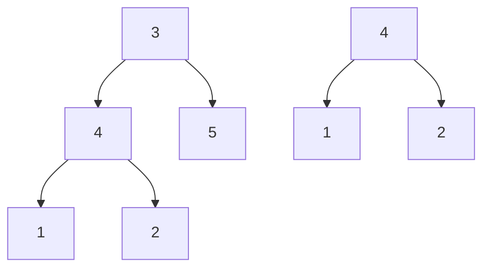
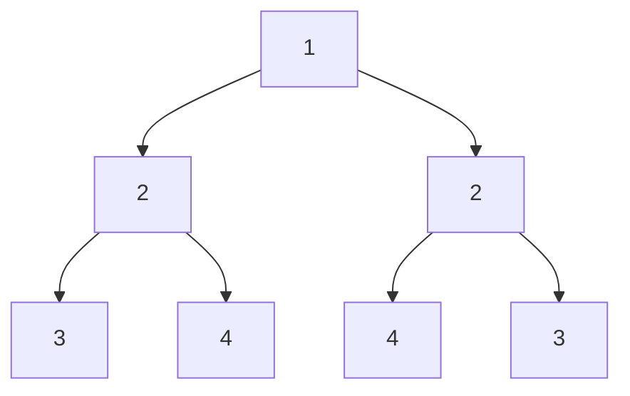
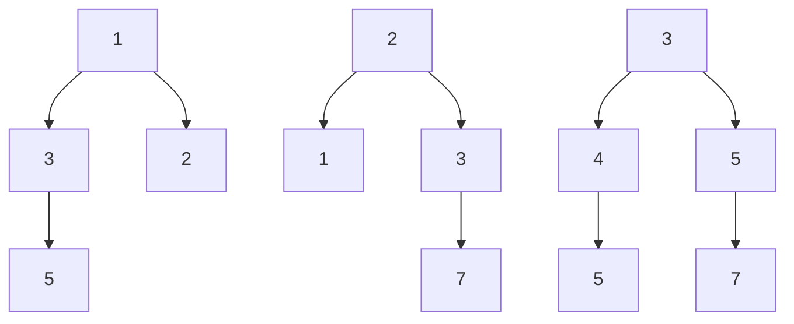
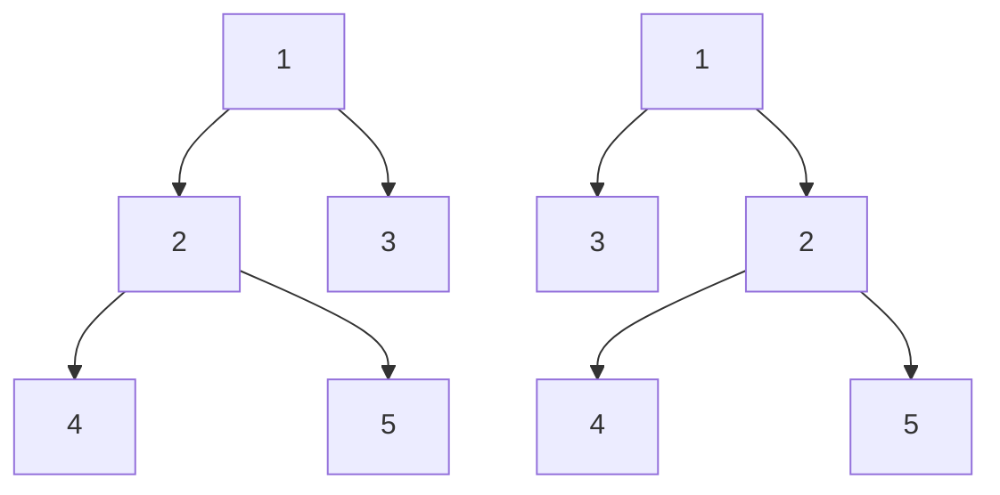

# 🔀 Related Problems and Variations: Expanding Your Horizons 🔀

Now that you understand how to compare binary trees for exact equality, let's explore related problems and variations that build on this knowledge.

## 🌱 Subtree of Another Tree

**Problem**: Given two binary trees `root` and `subRoot`, determine if `subRoot` is a subtree of `root`.



**Approach**:
1. For each node in the main tree, check if the subtree rooted at that node is identical to the second tree
2. Use our `isSameTree` function as a helper

```javascript
function isSubtree(root, subRoot) {
  if (root === null) return subRoot === null;
  
  // Check if the current subtree matches
  if (isSameTree(root, subRoot)) return true;
  
  // Check left and right subtrees
  return isSubtree(root.left, subRoot) || isSubtree(root.right, subRoot);
}
```

## 🔄 Symmetric Tree

**Problem**: Given the root of a binary tree, check if it is a mirror of itself (i.e., symmetric around its center).



**Approach**:
1. Modify our tree comparison to check if the left subtree is a mirror image of the right subtree
2. In a mirror image, the left child of one tree corresponds to the right child of the other

```javascript
function isSymmetric(root) {
  if (root === null) return true;
  return isMirror(root.left, root.right);
}

function isMirror(left, right) {
  // Both null means this part is symmetric
  if (left === null && right === null) return true;
  
  // One null but not the other means asymmetric
  if (left === null || right === null) return false;
  
  // Values must match, and subtrees must be mirrors of each other
  return (left.val === right.val) &&
         isMirror(left.left, right.right) &&
         isMirror(left.right, right.left);
}
```

## 🔍 Find All Duplicate Subtrees

**Problem**: Given the root of a binary tree, find all duplicate subtrees (subtrees with the same structure and values).

**Approach**:
1. Serialize each subtree into a unique string representation
2. Use a hash map to track occurrences of each serialized subtree
3. Return roots of subtrees that appear more than once

```javascript
function findDuplicateSubtrees(root) {
  const map = new Map();
  const result = [];
  
  function serialize(node) {
    if (node === null) return "#";
    
    const serialized = `${node.val},${serialize(node.left)},${serialize(node.right)}`;
    
    map.set(serialized, (map.get(serialized) || 0) + 1);
    
    if (map.get(serialized) === 2) {
      result.push(node);
    }
    
    return serialized;
  }
  
  serialize(root);
  return result;
}
```

## 🌳 Merge Two Binary Trees

**Problem**: Given two binary trees, merge them by adding the values of corresponding nodes. If only one tree has a node at a certain position, use that node in the merged tree.



**Approach**:
1. Traverse both trees simultaneously
2. At each step, create a new node with the sum of values
3. Recursively merge the left and right subtrees

```javascript
function mergeTrees(root1, root2) {
  // If one tree is empty, return the other
  if (root1 === null) return root2;
  if (root2 === null) return root1;
  
  // Create a new node with the sum of values
  const newNode = new TreeNode(root1.val + root2.val);
  
  // Recursively merge left and right subtrees
  newNode.left = mergeTrees(root1.left, root2.left);
  newNode.right = mergeTrees(root1.right, root2.right);
  
  return newNode;
}
```

## 🔄 Flip Equivalent Binary Trees

**Problem**: Determine if two binary trees are "flip equivalent" - meaning one can be transformed into the other by flipping some of its subtrees.



**Approach**:
1. Similar to our tree comparison, but allow for flipped subtrees
2. At each step, check both the normal and flipped arrangements

```javascript
function flipEquiv(root1, root2) {
  // Both null means they're equivalent
  if (root1 === null && root2 === null) return true;
  
  // One null but not the other means they're not equivalent
  if (root1 === null || root2 === null) return false;
  
  // Values must match
  if (root1.val !== root2.val) return false;
  
  // Check both normal and flipped arrangements
  return (flipEquiv(root1.left, root2.left) && flipEquiv(root1.right, root2.right)) ||
         (flipEquiv(root1.left, root2.right) && flipEquiv(root1.right, root2.left));
}
```

## 🧠 What You've Learned

By mastering binary tree comparison, you've gained skills that apply to many related problems:

1. **Recursive tree traversal** - A fundamental technique for tree problems
2. **Simultaneous traversal** of multiple trees
3. **Tree serialization** for comparison and hashing
4. **Edge case handling** for tree structures

> [!TIP]
> When approaching a new tree problem, ask yourself: "Can I adapt my tree comparison knowledge to solve this?"

## 🤔 Think About It

1. How would you modify the tree comparison algorithm to allow for "fuzzy" matching, where some differences are allowed?
2. Could you create an algorithm to find the "edit distance" between two trees (minimum number of operations to transform one tree into another)?
3. How would you compare trees where the order of children doesn't matter (unordered trees)?

In the next and final lesson, we'll summarize what we've learned and provide practice exercises to reinforce your understanding. 