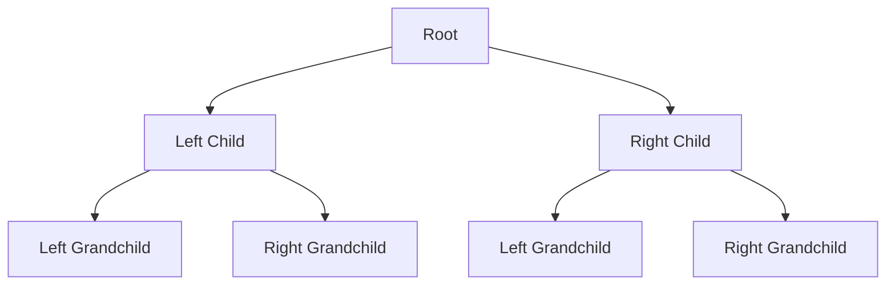

# 🌲 Binary Tree Depth-First Search (DFS)

> [!NOTE]
> Depth-First Search is a fundamental algorithm for exploring tree structures that prioritizes going deep before going wide.

## 🔍 The Problem

Imagine you're exploring a maze with many branching paths. You decide to follow one path as far as it goes before backtracking to try other routes. This is exactly how Depth-First Search works in a binary tree!

### What is a Binary Tree?

A binary tree is a hierarchical data structure where each node has at most two children:
- A **left** child
- A **right** child



### The Challenge

**Given a binary tree, we need to visit every node exactly once, exploring as deeply as possible along each branch before backtracking.**

For example, given this tree:

```
    1
   / \
  2   3
 / \   \
4   5   6
```

A proper DFS traversal (using pre-order) would visit nodes in this order: `[1, 2, 4, 5, 3, 6]`

> [!TIP]
> Think of DFS as exploring a family tree by following one lineage all the way down before moving to cousins!

## 🤔 Why Do We Need This?

DFS is incredibly useful for:
- Finding paths in a tree
- Searching for elements
- Analyzing tree structures
- Solving puzzles and mazes
- Detecting cycles in graphs

<details>
<summary>Real-world applications</summary>

- **Web crawling**: Following links deeply before backtracking
- **File system traversal**: Exploring nested directories
- **Game AI**: Exploring decision trees in games like chess
- **Network routing**: Finding paths in network topologies
- **Compiler design**: Parsing and syntax tree traversal

</details>

## 🎯 Our Goal

By the end of this lesson series, you'll understand:
- How DFS works conceptually
- Different ways to implement DFS (recursive and iterative)
- Various traversal orders (pre-order, in-order, post-order)
- When and how to apply DFS to solve problems

**Are you ready to dive deep into the world of tree traversal?** Let's begin our journey! 