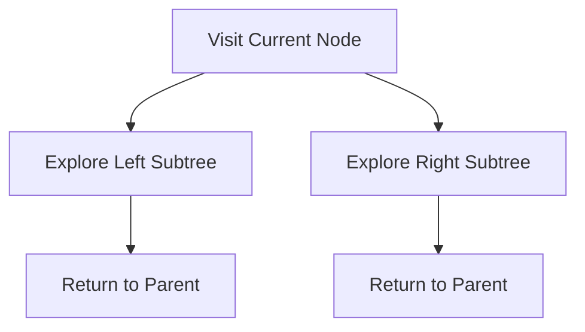

# 🧠 Core Concepts of DFS

## The Fundamental Idea

Depth-First Search (DFS) follows a simple principle: **go deep before going wide**. 

Imagine you're exploring a cave system with many branching tunnels. Using DFS, you would:
1. Pick a tunnel and follow it to its end
2. Backtrack to the last junction
3. Take another unexplored tunnel
4. Repeat until you've explored the entire cave

> [!NOTE]
> DFS always prioritizes depth over breadth, exploring as far as possible along a branch before backtracking.

## 🔄 The Recursive Nature of DFS

Binary trees have a naturally recursive structure - each node can be seen as the root of its own subtree. This makes DFS a perfect fit for recursive implementation!



### The Mental Model

Think of DFS as having a conversation with each node in the tree:

1. "Hello, node! I'll visit you first." 👋
2. "Now, let me talk to your left child." 👈
3. "After I'm done with the left side, I'll talk to your right child." 👉
4. "Once I've spoken with all your descendants, I'll go back to your parent." 👆

## 🔍 Three Ways to Traverse

There are three common orders for DFS traversal, each with different properties:

### 1. Pre-order Traversal (Root → Left → Right)
- Visit the current node **before** exploring children
- Great for creating a copy of the tree or prefix expression evaluation

### 2. In-order Traversal (Left → Root → Right)
- Visit the left subtree, then the current node, then the right subtree
- In a binary search tree, this gives nodes in ascending order

### 3. Post-order Traversal (Left → Right → Root)
- Visit the current node **after** exploring children
- Useful for deletion operations or postfix expression evaluation

> [!TIP]
> The name of each traversal tells you when the root is processed: **pre**-order (before children), **in**-order (between children), **post**-order (after children).

<details>
<summary>Visual comparison of traversal orders</summary>

For this tree:
```
    A
   / \
  B   C
 / \   \
D   E   F
```

- **Pre-order**: A, B, D, E, C, F
- **In-order**: D, B, E, A, C, F
- **Post-order**: D, E, B, F, C, A

</details>

## 🧩 Key Components of DFS

Every DFS implementation has these essential components:

1. **Data Structure**: Either recursion (implicit stack) or an explicit stack
2. **Visited Tracking**: For trees, we don't need to track visited nodes (no cycles)
3. **Processing Logic**: What to do when visiting each node
4. **Traversal Order**: Pre-order, in-order, or post-order

## 🤔 Think About It

What would happen if we explored the right child before the left child in our DFS algorithm? Would the algorithm still work? How would the traversal order change?

In the next lesson, we'll dive into the recursive implementation of DFS! 