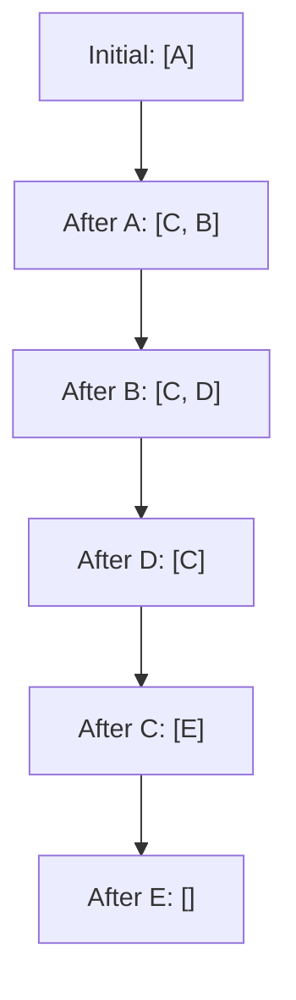

# 🔄 Iterative Implementation of DFS

## Why Go Iterative?

While recursion is elegant, an iterative approach has several advantages:

- **No stack overflow risk** for very deep trees
- **Better memory efficiency** in some cases
- **Easier debugging** with explicit state management
- **More control** over the traversal process

> [!NOTE]
> The key insight: we can replace the implicit call stack used in recursion with an explicit stack data structure that we control!

## 🧩 The Building Blocks

For an iterative DFS implementation, we need:

1. A **stack** to keep track of nodes to visit
2. A **result array** to store the traversal order
3. A **while loop** to process nodes until the stack is empty

## 📝 Pre-order DFS Implementation (Iterative)

```javascript
function binaryTreeDFS(root) {
  const result = [];
  if (!root) return result;
  
  // Initialize stack with root node
  const stack = [root];
  
  while (stack.length > 0) {
    // 1. Pop the top node from the stack
    const node = stack.pop();
    
    // 2. Process the current node (pre-order)
    result.push(node.val);
    
    // 3. Push right child first (so left is processed first)
    if (node.right) stack.push(node.right);
    if (node.left) stack.push(node.left);
  }
  
  return result;
}
```

> [!TIP]
> Notice we push the right child first, then the left child. This ensures that when we pop from the stack, we'll get the left child before the right child - maintaining the pre-order traversal order.

## 🔍 How It Works: Step by Step

Let's trace through this algorithm with a simple tree:

```
    A
   / \
  B   C
 /     \
D       E
```

<details open>
<summary>Execution trace</summary>

1. Initialize `stack = [A]`, `result = []`
2. Pop A: `stack = []`, `result = [A]`
3. Push A.right (C): `stack = [C]`
4. Push A.left (B): `stack = [C, B]`
5. Pop B: `stack = [C]`, `result = [A, B]`
6. Push B.right (null): no change
7. Push B.left (D): `stack = [C, D]`
8. Pop D: `stack = [C]`, `result = [A, B, D]`
9. Push D.right (null): no change
10. Push D.left (null): no change
11. Pop C: `stack = []`, `result = [A, B, D, C]`
12. Push C.right (E): `stack = [E]`
13. Push C.left (null): no change
14. Pop E: `stack = []`, `result = [A, B, D, C, E]`
15. Stack is empty, return `result = [A, B, D, C, E]`

</details>

## 🔄 Stack Visualization

The stack evolves throughout the algorithm:



## 🧠 Implementing Other Traversal Orders Iteratively

### In-order Traversal (Left → Root → Right)

In-order traversal is a bit trickier iteratively:

```javascript
function inOrderDFS(root) {
  const result = [];
  const stack = [];
  let current = root;
  
  while (current || stack.length > 0) {
    // Go as far left as possible
    while (current) {
      stack.push(current);
      current = current.left;
    }
    
    // Process the node at the top of the stack
    current = stack.pop();
    result.push(current.val);
    
    // Move to the right child
    current = current.right;
  }
  
  return result;
}
```

### Post-order Traversal (Left → Right → Root)

Post-order is even more complex iteratively and typically requires either:
- Two stacks
- A visited flag
- Tracking the last visited node

<details>
<summary>Post-order implementation (using two stacks)</summary>

```javascript
function postOrderDFS(root) {
  const result = [];
  if (!root) return result;
  
  const stack1 = [root];
  const stack2 = [];
  
  // First, process nodes in order: Root → Right → Left
  while (stack1.length > 0) {
    const node = stack1.pop();
    stack2.push(node);
    
    if (node.left) stack1.push(node.left);
    if (node.right) stack1.push(node.right);
  }
  
  // Then, pop from second stack to get: Left → Right → Root
  while (stack2.length > 0) {
    result.push(stack2.pop().val);
  }
  
  return result;
}
```

</details>

## 🔍 Recursive vs. Iterative: A Comparison

| Aspect | Recursive | Iterative |
|--------|-----------|-----------|
| Code Simplicity | ✅ Simpler, more elegant | ❌ More verbose |
| Memory Usage | ❌ Implicit call stack | ✅ Explicit stack |
| Stack Overflow Risk | ❌ Higher risk | ✅ No risk |
| Performance | ❌ Slightly slower | ✅ Slightly faster |
| Debugging | ❌ Harder to debug | ✅ Easier to debug |
| Control Flow | ❌ Less control | ✅ More control |

> [!TIP]
> For most practical purposes, both approaches work well. Choose recursive for readability and iterative for very deep trees or performance-critical code.

## 🤔 Think About It

How would you modify the iterative DFS to find the maximum depth of a binary tree? What additional information would you need to track?

In the next lesson, we'll explore practical applications of DFS! 