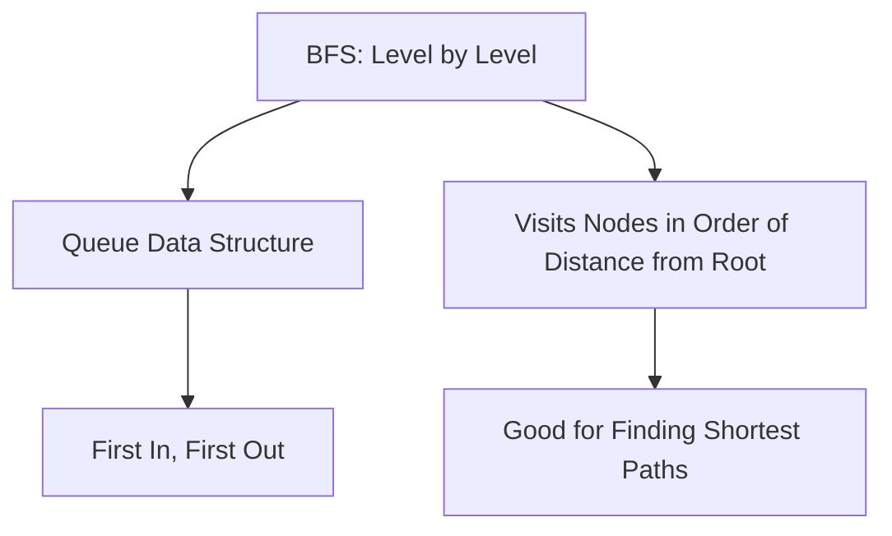
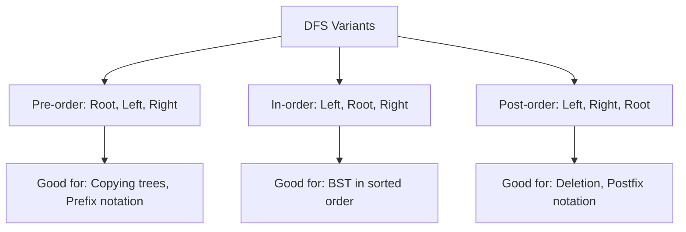

# 🔄 DFS vs. Other Tree Traversal Algorithms

While DFS is a powerful algorithm for tree traversal, it's important to understand how it compares to other traversal methods and when to choose each one.

## 🌳 DFS vs. BFS (Breadth-First Search)

DFS and BFS are the two fundamental approaches to tree traversal, each with distinct characteristics:

### Breadth-First Search (BFS)

BFS explores a tree level by level, visiting all nodes at the current depth before moving to nodes at the next depth.

```javascript
function bfs(root) {
  if (!root) return [];
  const result = [];
  const queue = [root];
  
  while (queue.length > 0) {
    const node = queue.shift(); // Remove from front
    result.push(node.val);
    
    if (node.left) queue.push(node.left);
    if (node.right) queue.push(node.right);
  }
  
  return result;
}
```



### Key Differences

| Aspect | DFS | BFS |
|--------|-----|-----|
| Traversal Order | Deep first, then wide | Wide first, then deep |
| Data Structure | Stack (or recursion) | Queue |
| Memory Usage | O(h) - height of tree | O(w) - max width of tree |
| Implementation | Often simpler (recursive) | Always iterative |
| Best For | Searching deep paths, exhaustive exploration | Finding shortest paths, level-order processing |

> [!NOTE]
> For a balanced binary tree, the maximum width is approximately half the number of nodes in the last level, which can be much larger than the height!

### Visual Comparison

For this tree:
```
    A
   / \
  B   C
 / \   \
D   E   F
```

- **DFS (Pre-order)**: A, B, D, E, C, F
- **BFS (Level-order)**: A, B, C, D, E, F

<details>
<summary>When to choose DFS over BFS</summary>

Choose DFS when:
- Memory is limited and the tree is wide (BFS would need to store too many nodes)
- You need to search deep into the tree quickly
- The solution is likely to be far from the root
- You're working with recursive structures (like expression parsing)
- You need to explore all possible paths (exhaustive search)

</details>

<details>
<summary>When to choose BFS over DFS</summary>

Choose BFS when:
- You need to find the shortest path
- The solution is likely to be close to the root
- You need to process nodes level by level
- The tree is very deep but not very wide
- You need to find all nodes at a certain distance from the root

</details>

## 🔄 Different DFS Variants

We've already discussed the three main DFS traversal orders, but let's compare them side by side:

### Pre-order vs. In-order vs. Post-order



For this tree:
```
    1
   / \
  2   3
 / \   \
4   5   6
```

- **Pre-order**: 1, 2, 4, 5, 3, 6
- **In-order**: 4, 2, 5, 1, 3, 6
- **Post-order**: 4, 5, 2, 6, 3, 1

> [!TIP]
> If you're working with a Binary Search Tree (BST), in-order traversal will visit nodes in ascending order of their values!

## 🧮 DFS vs. Dynamic Programming

For certain tree problems, you might need to choose between a pure DFS approach and dynamic programming:

```javascript
// Pure DFS for calculating tree height
function treeHeight(root) {
  if (!root) return 0;
  return 1 + Math.max(treeHeight(root.left), treeHeight(root.right));
}

// Dynamic Programming (memoization) approach
function treeHeightDP(root, memo = new Map()) {
  if (!root) return 0;
  if (memo.has(root)) return memo.get(root);
  
  const height = 1 + Math.max(
    treeHeightDP(root.left, memo),
    treeHeightDP(root.right, memo)
  );
  
  memo.set(root, height);
  return height;
}
```

The DP approach is beneficial when:
- The same subproblems are solved multiple times
- The tree has overlapping substructures
- You need to optimize for time complexity

## 🔍 DFS vs. Divide and Conquer

Many tree problems can be solved using either a DFS approach or a divide-and-conquer strategy:

```javascript
// DFS approach to find max value
function findMaxDFS(root) {
  let max = Number.MIN_SAFE_INTEGER;
  
  function dfs(node) {
    if (!node) return;
    max = Math.max(max, node.val);
    dfs(node.left);
    dfs(node.right);
  }
  
  dfs(root);
  return max;
}

// Divide and conquer approach
function findMaxDivideConquer(root) {
  if (!root) return Number.MIN_SAFE_INTEGER;
  
  const leftMax = findMaxDivideConquer(root.left);
  const rightMax = findMaxDivideConquer(root.right);
  
  return Math.max(root.val, leftMax, rightMax);
}
```

The divide-and-conquer approach:
- Breaks the problem into subproblems
- Solves each subproblem independently
- Combines the results
- Often leads to cleaner, more modular code

## 🚀 Performance Comparison

Let's compare the performance characteristics of these algorithms:

| Algorithm | Time Complexity | Space Complexity | When to Use |
|-----------|----------------|-----------------|------------|
| DFS (recursive) | O(n) | O(h) - height | General tree traversal, deep paths |
| DFS (iterative) | O(n) | O(h) - height | Very deep trees, avoiding recursion |
| BFS | O(n) | O(w) - width | Level-order, shortest paths |
| DFS + Memoization | O(n) | O(n) | Overlapping subproblems |
| Divide & Conquer | O(n) | O(h) - height | Problems with clear substructure |

> [!NOTE]
> For most binary tree problems, the time complexity is O(n) because you need to visit each node at least once. The key differences are in space complexity and the order of traversal.

## 🌟 Hybrid Approaches

For complex problems, you might combine multiple approaches:

### Bidirectional Search

```javascript
function findPathBidirectional(root, start, end) {
  // Run BFS from both start and end nodes
  // When the searches meet, we've found the path
}
```

### DFS with Pruning

```javascript
function dfsWithPruning(root, target) {
  if (!root) return null;
  if (shouldPrune(root)) return null; // Skip entire subtrees
  
  if (root.val === target) return root;
  
  return dfsWithPruning(root.left, target) || 
         dfsWithPruning(root.right, target);
}
```

### Level-aware DFS

```javascript
function levelAwareDFS(root) {
  const result = [];
  
  function dfs(node, level) {
    if (!node) return;
    
    // Ensure array exists for this level
    if (result.length === level) result.push([]);
    
    // Add to the appropriate level
    result[level].push(node.val);
    
    dfs(node.left, level + 1);
    dfs(node.right, level + 1);
  }
  
  dfs(root, 0);
  return result;
}
```

## 🤔 Think About It

For each of these problems, which traversal algorithm would you choose and why?

1. Finding the node closest to the root that has a value greater than X
2. Determining if a binary tree is a valid binary search tree
3. Finding all leaf nodes in a tree
4. Calculating the diameter of a binary tree (longest path between any two nodes)

In the next lesson, we'll wrap up with a comprehensive conclusion and practice problems! 