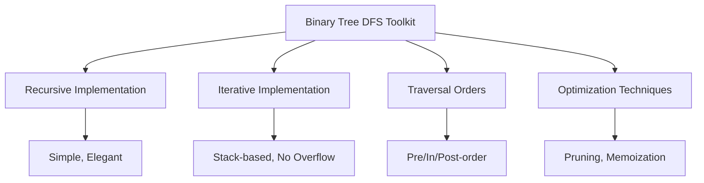

# 🎯 Conclusion: Mastering Binary Tree DFS

Congratulations! You've completed a comprehensive journey through the Binary Tree Depth-First Search algorithm. Let's recap what we've learned and explore some practice problems to solidify your understanding.

## 🧠 Key Takeaways

### 1. The Core Concept

DFS is all about exploring as far as possible along each branch before backtracking. This fundamental approach allows us to traverse and process tree structures efficiently.

### 2. Implementation Approaches

We've explored two main implementation strategies:

- **Recursive DFS**: Elegant and concise, leveraging the call stack
- **Iterative DFS**: More control and better for very deep trees, using an explicit stack

### 3. Traversal Orders

DFS comes in three flavors, each with specific use cases:

- **Pre-order** (Root → Left → Right): Great for creating copies and prefix notation
- **In-order** (Left → Root → Right): Gives sorted order in BSTs
- **Post-order** (Left → Right → Root): Useful for deletion and postfix notation

### 4. Practical Applications

We've seen how DFS can be applied to solve various tree problems:

- Finding paths and values
- Calculating tree properties (height, balance)
- Transforming trees
- Validating tree structures

### 5. Comparison with Other Algorithms

We've compared DFS with other approaches:

- BFS for level-order traversal
- Dynamic Programming for optimization
- Divide and Conquer for problem decomposition

## 🏆 Your DFS Toolkit

You now have a powerful set of tools for working with binary trees:



## 💪 Practice Problems

To truly master DFS, try solving these practice problems:

### Problem 1: Path Sum II

Find all root-to-leaf paths where the sum of node values equals a given target.

```javascript
function pathSum(root, targetSum) {
  const result = [];
  const currentPath = [];
  
  function dfs(node, remainingSum) {
    if (!node) return;
    
    // Add current node to path
    currentPath.push(node.val);
    
    // Check if leaf node and sum matches
    if (!node.left && !node.right && remainingSum === node.val) {
      result.push([...currentPath]);
    }
    
    // Recurse on children
    dfs(node.left, remainingSum - node.val);
    dfs(node.right, remainingSum - node.val);
    
    // Backtrack
    currentPath.pop();
  }
  
  dfs(root, targetSum);
  return result;
}
```

### Problem 2: Validate Binary Search Tree

Determine if a binary tree is a valid binary search tree (BST).

<details>
<summary>Solution approach</summary>

```javascript
function isValidBST(root) {
  function validate(node, min, max) {
    if (!node) return true;
    
    // Check if current node's value is within valid range
    if ((min !== null && node.val <= min) || 
        (max !== null && node.val >= max)) {
      return false;
    }
    
    // Validate left and right subtrees
    return validate(node.left, min, node.val) && 
           validate(node.right, node.val, max);
  }
  
  return validate(root, null, null);
}
```

</details>

### Problem 3: Construct Binary Tree from Traversals

Given preorder and inorder traversal arrays, reconstruct the binary tree.

<details>
<summary>Solution approach</summary>

```javascript
function buildTree(preorder, inorder) {
  if (!preorder.length || !inorder.length) return null;
  
  // First element in preorder is the root
  const rootVal = preorder[0];
  const root = { val: rootVal, left: null, right: null };
  
  // Find root's position in inorder array
  const rootIndex = inorder.indexOf(rootVal);
  
  // Split inorder array into left and right subtrees
  const inorderLeft = inorder.slice(0, rootIndex);
  const inorderRight = inorder.slice(rootIndex + 1);
  
  // Split preorder array into left and right subtrees
  const preorderLeft = preorder.slice(1, inorderLeft.length + 1);
  const preorderRight = preorder.slice(inorderLeft.length + 1);
  
  // Recursively build left and right subtrees
  root.left = buildTree(preorderLeft, inorderLeft);
  root.right = buildTree(preorderRight, inorderRight);
  
  return root;
}
```

</details>

### Problem 4: Serialize and Deserialize Binary Tree

Design an algorithm to serialize and deserialize a binary tree.

<details>
<summary>Solution approach</summary>

```javascript
// Serialize a binary tree to a string
function serialize(root) {
  if (!root) return "null";
  
  // Pre-order traversal: Root, Left, Right
  return root.val + "," + serialize(root.left) + "," + serialize(root.right);
}

// Deserialize a string to a binary tree
function deserialize(data) {
  const nodes = data.split(",");
  
  function buildTree() {
    const val = nodes.shift();
    if (val === "null") return null;
    
    const node = { val: parseInt(val), left: null, right: null };
    node.left = buildTree();
    node.right = buildTree();
    
    return node;
  }
  
  return buildTree();
}
```

</details>

## 🚀 Next Steps

To continue your journey with tree algorithms:

1. **Explore more complex tree structures**:
   - N-ary trees
   - Trie data structures
   - Segment trees

2. **Study related graph algorithms**:
   - DFS for general graphs
   - Topological sorting
   - Strongly connected components

3. **Apply DFS to real-world problems**:
   - File system traversal
   - Web crawling
   - Game AI

4. **Optimize for specific constraints**:
   - Memory-efficient implementations
   - Parallel processing for large trees
   - Specialized algorithms for balanced trees

## 🌟 Final Thoughts

Binary Tree DFS is more than just an algorithm—it's a fundamental pattern of thinking that will help you solve countless problems in computer science and beyond. The ability to systematically explore hierarchical structures is a powerful skill that transfers to many domains.

Remember that the best way to master DFS is through practice. Each tree problem you solve will deepen your understanding and make the algorithm more intuitive.

> [!TIP]
> When approaching a new tree problem, ask yourself: "How can I break this down into subproblems that can be solved recursively?" This mindset will serve you well in algorithmic problem-solving.

Happy coding, and may your traversals always find what they're looking for! 🌳🔍 