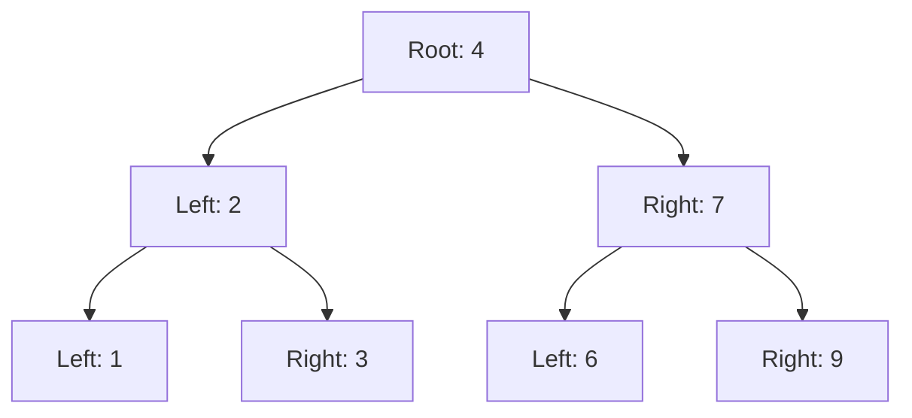

# 🌳 Inverting a Binary Tree: The Problem

> [!NOTE]
> In this lesson, we'll understand what it means to invert a binary tree and why this algorithm is important.

## What is a Binary Tree? 🌱

Before diving into inversion, let's make sure we understand what a binary tree is:

A binary tree is a hierarchical data structure where each node has at most two children, referred to as the **left child** and the **right child**. Each node contains a value and references to its children.

<details>
<summary>Binary Tree Structure</summary>



</details>

## The Inversion Challenge 🔄

**The problem:** Given the root of a binary tree, invert the tree and return its root.

What does "inverting" mean? It means creating a mirror image of the original tree by swapping the left and right children of every node in the tree.

> [!TIP]
> Think of it like looking at the tree in a mirror - everything that was on the left is now on the right, and vice versa!

### Visual Example

Original Tree:
```
    4
   / \
  2   7
 / \ / \
1  3 6  9
```

Inverted Tree:
```
    4
   / \
  7   2
 / \ / \
9  6 3  1
```

Notice how each node's children have been swapped!

## Why is this Important? 🤔

You might wonder why we would want to invert a binary tree. Here are some practical applications:

- **Image Processing**: Creating mirror images of hierarchical image representations
- **UI Development**: Flipping interface elements for right-to-left language support
- **Game Development**: Creating symmetrical game levels or environments
- **Data Visualization**: Creating symmetrical visualizations of hierarchical data

## The Challenge Ahead

In the following lessons, we'll break down this problem step by step and explore different approaches to solving it. We'll see how this seemingly simple operation reveals fundamental concepts in tree traversal and recursion.

> [!WARNING]
> Don't be fooled by the simplicity of the problem statement! This algorithm tests your understanding of tree structures and recursive thinking.

**Ready to dive in?** Let's move on to understanding the key concepts behind binary tree inversion! 