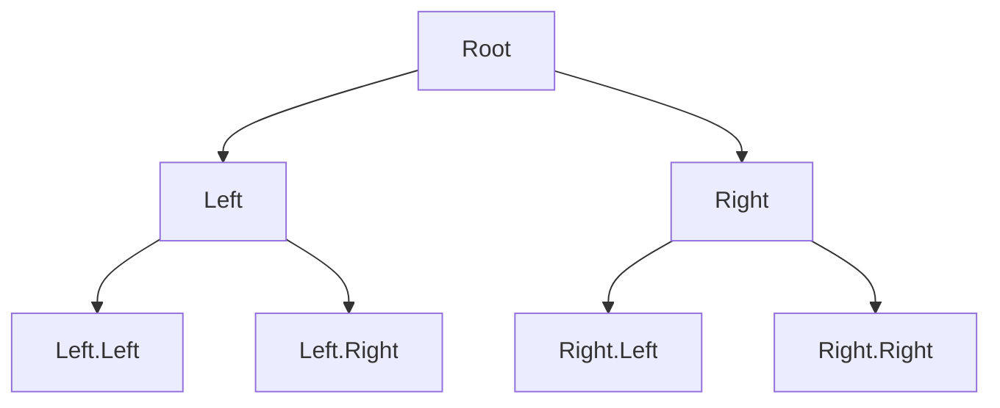
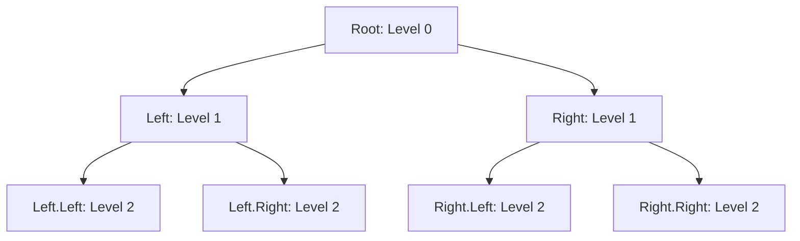

# 🔑 Key Concepts for Binary Tree Inversion

> [!NOTE]
> Before we dive into the algorithm itself, let's understand the fundamental concepts that make binary tree inversion possible.

## Binary Tree Representation 📊

In code, a binary tree is typically represented using a node structure:

```javascript
function TreeNode(val, left = null, right = null) {
  this.val = val;     // The value stored in this node
  this.left = left;   // Reference to the left child
  this.right = right; // Reference to the right child
}
```

Each node contains:
- A value (often a number, but could be any data)
- A reference to its left child (or null if none exists)
- A reference to its right child (or null if none exists)

## Tree Traversal Methods 🚶‍♂️

To invert a binary tree, we need to visit each node. There are several ways to traverse a tree:

### 1. Depth-First Traversal

In depth-first traversal, we explore as far as possible along each branch before backtracking:

<details>
<summary>Types of Depth-First Traversals</summary>

- **Pre-order**: Process the current node, then left subtree, then right subtree
- **In-order**: Process the left subtree, then current node, then right subtree
- **Post-order**: Process the left subtree, then right subtree, then current node



Pre-order: A, B, D, E, C, F, G  
In-order: D, B, E, A, F, C, G  
Post-order: D, E, B, F, G, C, A

</details>

### 2. Breadth-First Traversal (Level-Order)

In breadth-first traversal, we visit all nodes at the current depth before moving to nodes at the next depth level:

<details>
<summary>Breadth-First Traversal Example</summary>



Breadth-first order: A, B, C, D, E, F, G

</details>

## Recursion vs. Iteration 🔄

There are two main approaches to implementing tree algorithms:

### Recursive Approach

Recursion is a natural fit for tree problems because trees have a recursive structure:
- A tree is a node with subtrees
- Each subtree is itself a tree

> [!TIP]
> When using recursion for tree problems, think about:
> 1. What is the base case? (Often when the node is null)
> 2. How do I break down the problem for subtrees?
> 3. How do I combine the results?

### Iterative Approach

Iteration uses explicit data structures (like queues or stacks) to keep track of nodes to visit:
- Using a queue gives breadth-first traversal
- Using a stack gives depth-first traversal

## The Core Operation: Swapping Children 🔀

The fundamental operation in binary tree inversion is swapping the left and right children of each node:

```javascript
// Swap the children
const temp = node.left;
node.left = node.right;
node.right = temp;
```

This simple swap operation, when applied to every node in the tree, creates the mirror image we're looking for.

## Think About It 🤔

Before moving on, consider these questions:

1. Why does swapping the children of every node create a mirror image of the tree?
2. Does the order in which we visit nodes matter for this algorithm?
3. What would happen if we only swapped children at certain levels of the tree?

In the next lesson, we'll explore the recursive approach to solving this problem! 