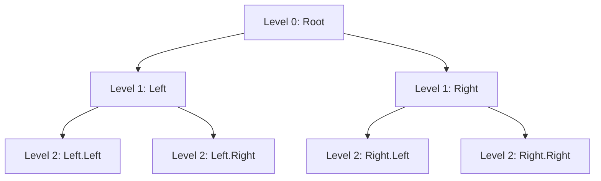

# 🔄 The Iterative Approach

> [!NOTE]
> In this lesson, we'll explore how to solve the binary tree inversion problem using iteration instead of recursion.

## Why Consider an Iterative Approach? 🤔

While recursion provides an elegant solution for tree problems, iterative approaches have their own advantages:

- **No recursion stack limit**: Avoids potential stack overflow for very deep trees
- **Explicit control flow**: Makes the algorithm's execution more visible
- **Flexibility in traversal**: Easier to implement different traversal orders

## Iterative Approaches to Tree Traversal 🚶‍♂️

There are two main iterative approaches for tree traversal:

1. **Breadth-First (Level Order)**: Using a queue
2. **Depth-First**: Using a stack

For binary tree inversion, either approach works! Let's explore the breadth-first approach.

## Breadth-First Approach with a Queue 📋

In breadth-first traversal, we process nodes level by level, from top to bottom:

<details>
<summary>Breadth-First Traversal Visualization</summary>



Traversal order: A, B, C, D, E, F, G

</details>

## The Algorithm Step by Step 📝

1. **Initialize**: Create a queue and add the root node
2. **Process**: While the queue is not empty:
   - Dequeue a node
   - Swap its left and right children
   - Enqueue the non-null children
3. **Return**: Return the root of the inverted tree

## Implementation in JavaScript 💻

```javascript
function invertTree(root) {
  // Handle empty tree
  if (!root) return null;
  
  // Create a queue and add the root
  const queue = [root];
  
  // Process nodes level by level
  while (queue.length > 0) {
    // Dequeue the next node
    const node = queue.shift();
    
    // Swap the children
    const temp = node.left;
    node.left = node.right;
    node.right = temp;
    
    // Add non-null children to the queue
    if (node.left) queue.push(node.left);
    if (node.right) queue.push(node.right);
  }
  
  // Return the inverted tree
  return root;
}
```

## Tracing the Algorithm 🔍

Let's trace through the execution of this algorithm on a simple tree:

<details>
<summary>Iterative Execution Trace</summary>

For the tree:
```
    4
   / \
  2   7
 / \ / \
1  3 6  9
```

1. Initialize queue with [4]
2. Dequeue 4, swap its children: 4's children are now 7 and 2
   - Queue: [7, 2]
3. Dequeue 7, swap its children: 7's children are now 9 and 6
   - Queue: [2, 9, 6]
4. Dequeue 2, swap its children: 2's children are now 3 and 1
   - Queue: [9, 6, 3, 1]
5. Dequeue 9, it has no children
   - Queue: [6, 3, 1]
6. Dequeue 6, it has no children
   - Queue: [3, 1]
7. Dequeue 3, it has no children
   - Queue: [1]
8. Dequeue 1, it has no children
   - Queue: []
9. Queue is empty, algorithm terminates

Result:
```
    4
   / \
  7   2
 / \ / \
9  6 3  1
```

</details>

## Alternative: Depth-First Approach with a Stack 📚

We can also use a stack for a depth-first traversal:

```javascript
function invertTree(root) {
  if (!root) return null;
  
  const stack = [root];
  
  while (stack.length > 0) {
    const node = stack.pop();
    
    // Swap the children
    const temp = node.left;
    node.left = node.right;
    node.right = temp;
    
    // Add non-null children to the stack
    // Note: We add right first so left is processed first (LIFO)
    if (node.right) stack.push(node.right);
    if (node.left) stack.push(node.left);
  }
  
  return root;
}
```

## Time and Space Complexity ⏱️

- **Time Complexity**: O(n), where n is the number of nodes in the tree
  - We visit each node exactly once

- **Space Complexity**: O(w), where w is the maximum width of the tree
  - For breadth-first approach, this is the maximum number of nodes at any level
  - In the worst case (a perfect binary tree), this becomes O(n/2) which is O(n)

## Comparing Recursive and Iterative Approaches 🔍

| Aspect | Recursive | Iterative (BFS) |
|--------|-----------|-----------------|
| Code Complexity | Simpler, more elegant | More verbose |
| Space Usage | O(h) - height of tree | O(w) - width of tree |
| Stack Overflow Risk | Yes, for very deep trees | No |
| Traversal Control | Implicit | Explicit |

> [!TIP]
> Choose the approach that best fits your specific constraints:
> - Use recursion for cleaner code when tree depth is reasonable
> - Use iteration for very deep trees or when you need explicit traversal control

## Think About It 🤔

Before moving on, consider these questions:

1. How would the algorithm behave differently if we used a stack instead of a queue?
2. What if we added the right child to the queue before the left child?
3. Can you think of a scenario where the iterative approach would be significantly better than the recursive approach?

In the next lesson, we'll explore some practical applications and variations of the binary tree inversion algorithm! 