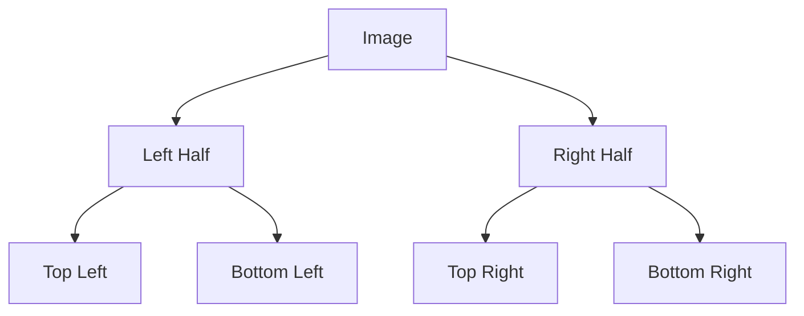
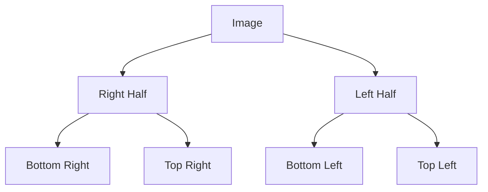

# 🌟 Practical Applications and Variations

> [!NOTE]
> In this lesson, we'll explore real-world applications of binary tree inversion and interesting variations of the algorithm.

## Real-World Applications 🌍

Binary tree inversion might seem like a purely academic exercise, but it has several practical applications:

### 1. Image Processing 🖼️

Binary trees can represent hierarchical image decompositions. Inverting these trees creates mirror images:

<details>
<summary>Image Mirroring Example</summary>



After inversion:



This effectively flips the image horizontally!

</details>

### 2. UI Development 🖥️

When developing user interfaces for right-to-left languages (like Arabic or Hebrew), tree inversion can help transform layout trees:

```
Left-to-Right Layout:
    Container
   /        \
Header      Content
  |         /    \
Logo    Sidebar  Main

Right-to-Left Layout (Inverted):
    Container
   /        \
Content      Header
/    \         |
Main  Sidebar  Logo
```

### 3. Game Development 🎮

Game developers use tree inversion to create symmetrical game levels or to flip game elements:

- Creating mirror versions of levels
- Generating symmetrical maps
- Implementing "flip world" game mechanics

### 4. Natural Language Processing 📝

In NLP, parse trees represent sentence structure. Inverting these trees can help with:

- Analyzing sentence transformations
- Studying language symmetry
- Generating alternative sentence structures

## Interesting Variations 🔄

Let's explore some variations of the basic binary tree inversion algorithm:

### 1. Partial Inversion 🔍

Instead of inverting the entire tree, we might want to invert only specific subtrees:

```javascript
function invertSubtree(root, targetValue) {
  if (!root) return null;
  
  // If this is the target node, invert its subtree
  if (root.val === targetValue) {
    // Standard inversion logic
    const temp = root.left;
    root.left = root.right;
    root.right = temp;
    
    if (root.left) invertTree(root.left);
    if (root.right) invertTree(root.right);
    return root;
  }
  
  // Otherwise, search for the target in both subtrees
  if (root.left) invertSubtree(root.left, targetValue);
  if (root.right) invertSubtree(root.right, targetValue);
  
  return root;
}
```

### 2. Conditional Inversion ⚖️

We might want to invert nodes only if they meet certain criteria:

```javascript
function conditionalInvert(root, condition) {
  if (!root) return null;
  
  // Recursively process subtrees
  conditionalInvert(root.left, condition);
  conditionalInvert(root.right, condition);
  
  // Only invert if the condition is met
  if (condition(root)) {
    const temp = root.left;
    root.left = root.right;
    root.right = temp;
  }
  
  return root;
}

// Example: Only invert nodes with even values
conditionalInvert(root, node => node.val % 2 === 0);
```

### 3. Level-Specific Inversion 📊

We might want to invert nodes only at specific levels of the tree:

```javascript
function invertAtLevel(root, targetLevel) {
  function dfs(node, level) {
    if (!node) return;
    
    // If we're at the target level, invert this node
    if (level === targetLevel) {
      const temp = node.left;
      node.left = node.right;
      node.right = temp;
    } else {
      // Otherwise, continue searching
      dfs(node.left, level + 1);
      dfs(node.right, level + 1);
    }
  }
  
  dfs(root, 0);
  return root;
}

// Example: Only invert nodes at level 2
invertAtLevel(root, 2);
```

### 4. Alternate Level Inversion 🔀

We might want to invert nodes at alternate levels:

```javascript
function invertAlternateLevels(root) {
  function dfs(node, level) {
    if (!node) return;
    
    // Invert at even levels
    if (level % 2 === 0) {
      const temp = node.left;
      node.left = node.right;
      node.right = temp;
    }
    
    // Continue traversal
    dfs(node.left, level + 1);
    dfs(node.right, level + 1);
  }
  
  dfs(root, 0);
  return root;
}
```

## Beyond Binary Trees 🌳

The concept of inversion can be extended to other tree structures:

### N-ary Trees

For trees where nodes can have more than two children, inversion means reversing the order of all children:

```javascript
function invertNaryTree(root) {
  if (!root) return null;
  
  // Reverse the children array
  root.children.reverse();
  
  // Recursively invert each child
  for (const child of root.children) {
    invertNaryTree(child);
  }
  
  return root;
}
```

### Tries

For prefix trees (tries), inversion might involve reversing the characters in each word, creating a suffix-based structure instead.

## Think About It 🤔

Before moving on, consider these questions:

1. Can you think of other real-world applications where tree inversion might be useful?
2. How would you implement a "toggle inversion" feature that allows switching between original and inverted views?
3. What would happen if you inverted a binary search tree? Would it still maintain its search properties?

In the next lesson, we'll explore common pitfalls and optimization techniques for binary tree inversion! 