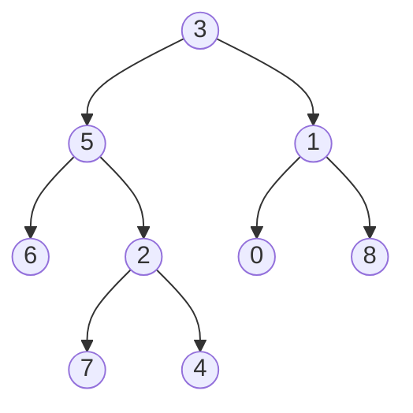

# 🌳 The Lowest Common Ancestor Problem

> [!NOTE]
> The Lowest Common Ancestor (LCA) is a fundamental concept in tree data structures with applications ranging from computational biology to network routing.

## What is the Lowest Common Ancestor? 🤔

Imagine a family tree where you want to find the most recent common ancestor between two family members. That's exactly what the Lowest Common Ancestor algorithm helps us find in a binary tree!

**Formal Definition:** The Lowest Common Ancestor (LCA) of two nodes p and q in a binary tree is the deepest node that has both p and q as descendants (where we allow a node to be a descendant of itself).

## Why is this important? 🎯

The LCA problem appears in many real-world applications:

- 🧬 Finding common ancestors in evolutionary trees (phylogenetics)
- 🌐 Optimizing routing in computer networks
- 📁 Finding common parent directories in file systems
- 🔍 Processing syntax trees in compilers

## Let's visualize the problem 📊

Consider this binary tree:

**Example 1:** If we want to find the LCA of nodes 5 and 1, the answer is node 3.
**Example 2:** If we want to find the LCA of nodes 5 and 4, the answer is node 5 (since a node can be a descendant of itself).

> [!TIP]
> When thinking about the LCA problem, it helps to trace paths from the root to each node. The point where these paths diverge is often the LCA!

## The Challenge Ahead 💪

Your task is to implement an algorithm that, given the root of a binary tree and two nodes p and q, finds their lowest common ancestor.

Think about this...

How would you approach this problem? Would you:
- Trace paths from the root to each node?
- Use a recursive approach to search the tree?
- Try an iterative solution with a stack or queue?

Each approach has its own advantages and trade-offs that we'll explore in the upcoming lessons.

In the next lesson, we'll start building our understanding of the key concepts needed to solve this problem efficiently. 