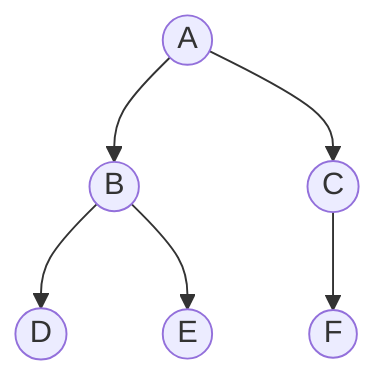
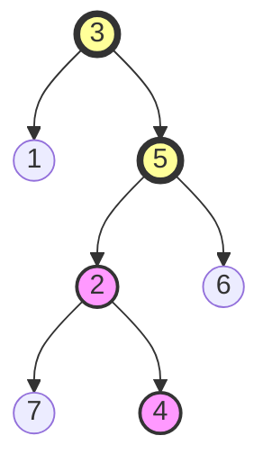

# 🌲 Binary Tree Fundamentals

Before diving into the LCA algorithm, let's make sure we understand the key concepts of binary trees that will be essential for our solution.

## What is a Binary Tree? 🌱

A binary tree is a hierarchical data structure where each node has at most two children, referred to as the left child and the right child.



> [!NOTE]
> In our code, each node in the binary tree is represented by a `TreeNode` class with three properties: a value, a left child reference, and a right child reference.

```javascript
class TreeNode {
  constructor(val = 0, left = null, right = null) {
    this.val = val;
    this.left = left;
    this.right = right;
  }
}
```

## Important Binary Tree Terminology 📚

Understanding these terms is crucial for working with the LCA algorithm:

- **Root**: The topmost node of the tree (node A in our example)
- **Parent**: A node that has children (A is the parent of B and C)
- **Child**: A node directly connected to another node when moving away from the root (B and C are children of A)
- **Leaf**: A node with no children (D, E, and F in our example)
- **Ancestor**: Any node on the path from the root to a given node (A and B are ancestors of D)
- **Descendant**: Any node in the subtree rooted at a given node (D and E are descendants of B)
- **Depth**: The length of the path from the root to a node (B has depth 1, D has depth 2)
- **Height**: The length of the longest path from a node to a leaf (A has height 2)

> [!TIP]
> Remember that in the context of the LCA problem, a node is considered a descendant of itself! This is an important detail that can be easy to overlook.

## Tree Traversal Methods 🚶‍♂️

There are several ways to traverse a binary tree:

1. **Depth-First Search (DFS)**:
   - **Preorder**: Visit the current node, then left subtree, then right subtree
   - **Inorder**: Visit the left subtree, then current node, then right subtree
   - **Postorder**: Visit the left subtree, then right subtree, then current node

2. **Breadth-First Search (BFS)**:
   - Visit all nodes at the same depth level before moving to the next level

<details>
<summary>Why is traversal important for LCA?</summary>

To find the LCA, we need to efficiently navigate the tree structure. The LCA algorithm typically uses a form of depth-first search to explore the tree and identify where the paths to the two target nodes diverge or converge.
</details>

## The Path Concept 🛣️

One way to think about the LCA problem is in terms of paths:

1. The path from the root to any node is unique in a tree
2. If we find the paths from the root to both nodes p and q, the LCA is the last common node in these two paths



In this example, the path to node 4 is [3,5,2,4] and the path to node 5 is [3,5]. The last common node is 5, which is the LCA.

> [!WARNING]
> While the path-based approach is intuitive, it requires storing paths for both nodes. There are more efficient approaches that we'll explore in the next lessons!

Now that we understand the fundamentals of binary trees, we're ready to explore different approaches to solving the LCA problem. 