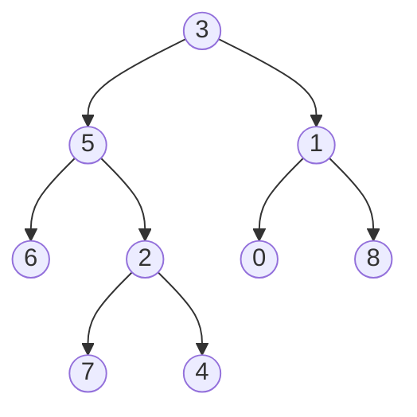

# 🔄 The Recursive Approach to LCA

One of the most elegant and intuitive ways to solve the Lowest Common Ancestor problem is using recursion. Let's explore how this approach works and why it's so effective.

## The Recursive Insight 💡

The key insight behind the recursive approach is this:

> [!NOTE]
> If both nodes p and q exist in the tree, then their LCA must be either:
> 1. A node that has one target in its left subtree and the other in its right subtree, OR
> 2. One of the target nodes itself (if one is an ancestor of the other)

This insight leads to a beautifully concise recursive solution.

## The Algorithm Step by Step 📝

Here's how the recursive algorithm works:

1. **Base Case**: If the current node is null or matches either p or q, return the current node
2. **Recursive Step**: Recursively search for p and q in the left and right subtrees
3. **Combine Results**: 
   - If both left and right subtrees return a non-null value, the current node is the LCA
   - Otherwise, return whichever subtree result is non-null (or null if both are null)

Let's visualize this with our example tree:



## Tracing the Algorithm 🔍

Let's trace through the algorithm to find the LCA of nodes 5 and 1:

1. Start at the root (node 3)
2. Recursively search the left subtree (rooted at 5)
   - Node 5 matches one of our targets, so return node 5
3. Recursively search the right subtree (rooted at 1)
   - Node 1 matches one of our targets, so return node 1
4. Both left and right recursive calls returned non-null values
   - This means node 3 is the LCA!

> [!TIP]
> The recursive approach is particularly elegant because it naturally handles both cases: when one node is an ancestor of the other, and when the nodes are in different subtrees.

## The Code Implementation 💻

Here's how the recursive approach looks in JavaScript:

```javascript
function lowestCommonAncestorRecursive(root, p, q) {
  // Base case: if root is null or matches either p or q
  if (root === null || root === p || root === q) {
    return root;
  }

  // Recursively search in left and right subtrees
  const left = lowestCommonAncestorRecursive(root.left, p, q);
  const right = lowestCommonAncestorRecursive(root.right, p, q);

  // If both left and right are non-null, root is the LCA
  if (left && right) {
    return root;
  }

  // Otherwise, return the non-null value (or null if both are null)
  return left ? left : right;
}
```

## Why Does This Work? 🤔

<details>
<summary>Let's analyze the different scenarios...</summary>

1. **If both p and q are in the tree:**
   - If they're in different subtrees of a node, that node is the LCA
   - If one is an ancestor of the other, the ancestor is the LCA

2. **If only one of p or q is in the tree:**
   - The algorithm will return that node

3. **If neither p nor q is in the tree:**
   - The algorithm will return null
</details>

## Time and Space Complexity ⏱️

- **Time Complexity**: O(N), where N is the number of nodes in the tree
  - In the worst case, we might need to visit all nodes in the tree

- **Space Complexity**: O(H), where H is the height of the tree
  - This is due to the recursion stack, which can go as deep as the height of the tree
  - In the worst case (a skewed tree), this could be O(N)

> [!WARNING]
> While the recursive approach is elegant and efficient for most trees, it could lead to stack overflow for very deep trees. In such cases, an iterative approach might be preferable.

## Think About It 🧠

What makes recursion particularly well-suited for tree problems like the LCA? How does the recursive approach naturally mirror the structure of the problem?

In the next lesson, we'll explore an alternative iterative approach to solving the LCA problem. 