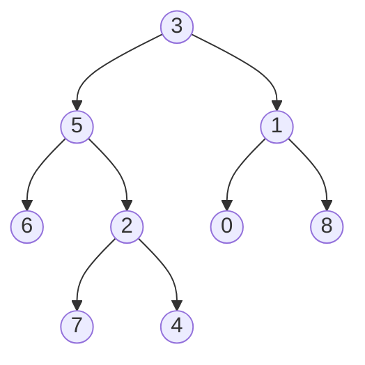

# 🔄 The Iterative Approach to LCA

While the recursive approach is elegant, sometimes an iterative solution is preferred, especially for deep trees where recursion might cause stack overflow. Let's explore how to solve the LCA problem iteratively.

## The Path-Based Insight 🛣️

The iterative approach is based on a different insight:

> [!NOTE]
> If we can find the path from the root to each target node, then the LCA is the last node that appears in both paths before they diverge.

This leads to a two-phase algorithm:
1. Find and store the path from root to each target node
2. Compare the paths to find the last common node

## The Algorithm Step by Step 📝

Here's how the iterative algorithm works:

1. **Phase 1: Build Parent Pointers**
   - Use a depth-first search to traverse the tree
   - For each node, store its parent in a map
   - Continue until we've found both target nodes

2. **Phase 2: Find the LCA**
   - Start from one target node and collect all its ancestors (including itself)
   - Start from the other target node and check if it or any of its ancestors is in the first set
   - The first common ancestor found is the LCA

Let's visualize this with our example tree:



## Tracing the Algorithm 🔍

Let's trace through the algorithm to find the LCA of nodes 5 and 1:

**Phase 1: Build Parent Pointers**
- Create a map: `{3: null, 5: 3, 1: 3, 6: 5, 2: 5, 0: 1, 8: 1, ...}`

**Phase 2: Find the LCA**
- Ancestors of node 5: `{5, 3}`
- Check node 1: Not in ancestors of 5
- Check parent of 1 (node 3): In ancestors of 5
- LCA is node 3!

> [!TIP]
> The iterative approach is more explicit about the steps it's taking, which can make it easier to understand for some people. It also avoids potential stack overflow issues with very deep trees.

## The Code Implementation 💻

Here's how the iterative approach looks in JavaScript:

```javascript
function lowestCommonAncestorIterative(root, p, q) {
  if (!root) return null;

  // Map to store parent pointers
  const parent = new Map();
  parent.set(root, null);
  const stack = [root];

  // Phase 1: Build parent pointers until we find both p and q
  while (!parent.has(p) || !parent.has(q)) {
    const node = stack.pop();
    
    // Process left child
    if (node.left) {
      parent.set(node.left, node);
      stack.push(node.left);
    }
    
    // Process right child
    if (node.right) {
      parent.set(node.right, node);
      stack.push(node.right);
    }
  }

  // Phase 2: Find the LCA
  // Collect ancestors of p
  const ancestors = new Set();
  let current = p;
  while (current) {
    ancestors.add(current);
    current = parent.get(current);
  }

  // Check if q or any of its ancestors is in p's ancestor set
  current = q;
  while (current) {
    if (ancestors.has(current)) return current;
    current = parent.get(current);
  }

  return null;
}
```

## Understanding the Code 🧩

<details>
<summary>Let's break down the key parts of the code...</summary>

1. **Parent Map**: We use a Map to store each node's parent. This allows us to trace back from any node to the root.

2. **DFS Traversal**: We use a stack to perform a depth-first search of the tree, building our parent map as we go.

3. **Ancestor Set**: We collect all ancestors of node p (including p itself) in a Set for efficient lookups.

4. **Finding LCA**: We check if q or any of its ancestors is in p's ancestor set. The first match is the LCA.
</details>

## Time and Space Complexity ⏱️

- **Time Complexity**: O(N), where N is the number of nodes in the tree
  - We might need to visit all nodes in the worst case

- **Space Complexity**: O(N)
  - We store parent pointers for potentially all nodes
  - We also store ancestors of one node in a set

## Recursive vs. Iterative: Which is Better? 🤔

Both approaches have their strengths:

| Recursive Approach | Iterative Approach |
|-------------------|-------------------|
| More concise and elegant | More explicit and step-by-step |
| Naturally mirrors the problem structure | Avoids potential stack overflow |
| Slightly less memory usage | More intuitive for some people |

> [!TIP]
> Choose the recursive approach for its elegance and simplicity in most cases, but consider the iterative approach for very deep trees or if you prefer a more explicit algorithm.

## Think About It 🧠

How would you modify the iterative approach if you needed to find the LCA of more than two nodes? What would change in the algorithm?

In the next lesson, we'll explore some optimizations and variations of the LCA algorithm. 