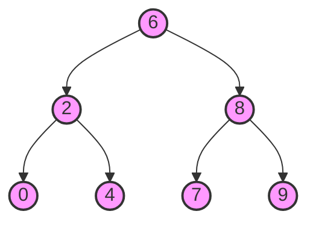

# 🚀 Optimizations and Special Cases

Now that we understand the basic approaches to solving the LCA problem, let's explore some optimizations and special cases that can make our solutions more robust and efficient.

## Special Case: Binary Search Trees 🌲

If our tree is a Binary Search Tree (BST), we can take advantage of its ordered property to optimize the LCA algorithm.

> [!NOTE]
> In a BST, for any node:
> - All values in the left subtree are less than the node's value
> - All values in the right subtree are greater than the node's value

This allows for a simpler LCA algorithm:

```javascript
function lowestCommonAncestorBST(root, p, q) {
  // Ensure p.val is smaller than q.val for simplicity
  if (p.val > q.val) {
    [p, q] = [q, p];
  }
  
  let current = root;
  while (current) {
    // If both nodes are greater than current, go right
    if (p.val > current.val && q.val > current.val) {
      current = current.right;
    }
    // If both nodes are less than current, go left
    else if (p.val < current.val && q.val < current.val) {
      current = current.left;
    }
    // We've found the split point - this is the LCA
    else {
      return current;
    }
  }
  
  return null;
}
```



> [!TIP]
> The BST approach has O(h) time complexity, where h is the height of the tree. This is potentially much better than O(n) for balanced BSTs!

## Optimization: Early Termination 🏁

In our recursive approach, we can add an early termination check:

```javascript
function lowestCommonAncestorOptimized(root, p, q) {
  // If we've already found the LCA, return it immediately
  if (!root || root === p || root === q) {
    return root;
  }
  
  const left = lowestCommonAncestorOptimized(root.left, p, q);
  
  // Early termination: if both nodes are found in the left subtree
  if (left && left !== p && left !== q) {
    return left;
  }
  
  const right = lowestCommonAncestorOptimized(root.right, p, q);
  
  if (left && right) {
    return root;
  }
  
  return left ? left : right;
}
```

## Special Case: Nodes Not in the Tree ⚠️

What if one or both of the target nodes don't exist in the tree? Our basic algorithms might return incorrect results.

Here's a more robust approach:

```javascript
function lowestCommonAncestorRobust(root, p, q) {
  let result = null;
  let pFound = false;
  let qFound = false;
  
  function dfs(node) {
    if (!node) return false;
    
    const leftContains = dfs(node.left);
    const rightContains = dfs(node.right);
    
    // Check if current node is p or q
    const currentIsTarget = (node === p || node === q);
    
    // Mark as found if we encounter p or q
    if (node === p) pFound = true;
    if (node === q) qFound = true;
    
    // If any two of {left contains target, right contains target, current is target} are true,
    // then this node is the LCA
    if ((leftContains && rightContains) || 
        (currentIsTarget && (leftContains || rightContains))) {
      result = node;
    }
    
    return leftContains || rightContains || currentIsTarget;
  }
  
  dfs(root);
  
  // Only return result if both p and q were found
  return (pFound && qFound) ? result : null;
}
```

> [!WARNING]
> Always consider edge cases in your implementation! What if the tree is empty? What if p or q is not in the tree? What if p and q are the same node?

## Optimization: Binary Lifting for Multiple Queries 📊

If we need to perform multiple LCA queries on the same tree, we can use a technique called "binary lifting" to preprocess the tree once and then answer each query in O(log n) time.

<details>
<summary>Binary Lifting Implementation (Advanced)</summary>

```javascript
class LCAFinder {
  constructor(root) {
    this.nodes = [];
    this.depth = [];
    this.parent = [];
    this.log = 0;
    
    // Map nodes to indices
    this.nodeToIndex = new Map();
    
    // Preprocess the tree
    this.dfs(root, null, 0);
    
    // Calculate log(n) for binary lifting
    while ((1 << this.log) <= this.nodes.length) {
      this.log++;
    }
    
    // Initialize binary lifting table
    this.up = Array(this.nodes.length).fill().map(() => Array(this.log).fill(0));
    
    // Fill first ancestors
    for (let i = 0; i < this.nodes.length; i++) {
      this.up[i][0] = this.parent[i];
    }
    
    // Fill binary lifting table
    for (let j = 1; j < this.log; j++) {
      for (let i = 0; i < this.nodes.length; i++) {
        if (this.up[i][j-1] !== -1) {
          this.up[i][j] = this.up[this.up[i][j-1]][j-1];
        } else {
          this.up[i][j] = -1;
        }
      }
    }
  }
  
  dfs(node, par, d) {
    if (!node) return;
    
    const idx = this.nodes.length;
    this.nodeToIndex.set(node, idx);
    this.nodes.push(node);
    this.depth.push(d);
    this.parent.push(par === null ? -1 : this.nodeToIndex.get(par));
    
    if (node.left) this.dfs(node.left, node, d + 1);
    if (node.right) this.dfs(node.right, node, d + 1);
  }
  
  getLCA(p, q) {
    if (!this.nodeToIndex.has(p) || !this.nodeToIndex.has(q)) {
      return null;
    }
    
    let u = this.nodeToIndex.get(p);
    let v = this.nodeToIndex.get(q);
    
    if (this.depth[u] < this.depth[v]) {
      [u, v] = [v, u];
    }
    
    // Bring nodes to same depth
    let diff = this.depth[u] - this.depth[v];
    for (let i = 0; i < this.log; i++) {
      if ((diff >> i) & 1) {
        u = this.up[u][i];
      }
    }
    
    if (u === v) return this.nodes[u];
    
    // Binary lift to find LCA
    for (let i = this.log - 1; i >= 0; i--) {
      if (this.up[u][i] !== this.up[v][i]) {
        u = this.up[u][i];
        v = this.up[v][i];
      }
    }
    
    return this.nodes[this.up[u][0]];
  }
}
```
</details>

## Time and Space Complexity Comparison 📈

| Approach | Time Complexity | Space Complexity | Best For |
|----------|----------------|-----------------|----------|
| Recursive | O(N) | O(H) | General purpose, simple trees |
| Iterative | O(N) | O(N) | Deep trees, avoiding recursion |
| BST Optimization | O(H) | O(1) | Binary Search Trees |
| Binary Lifting | O(N log N) preprocessing, O(log N) per query | O(N log N) | Multiple queries on same tree |

> [!TIP]
> Choose the approach that best fits your specific constraints and requirements!

## Think About It 🧠

1. How would you modify the LCA algorithm to find the distance between two nodes in a binary tree?
2. Can you think of a way to find the LCA of more than two nodes efficiently?

In the next lesson, we'll explore real-world applications of the LCA algorithm. 