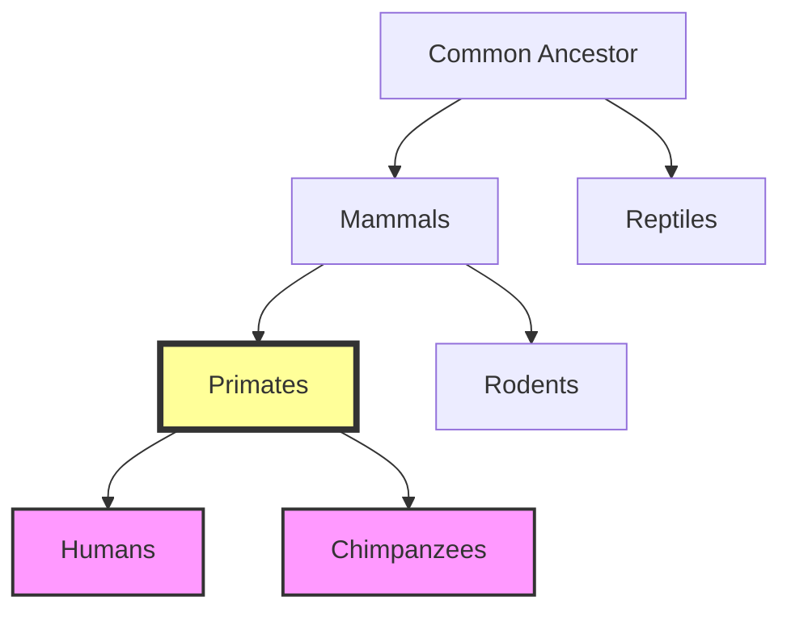
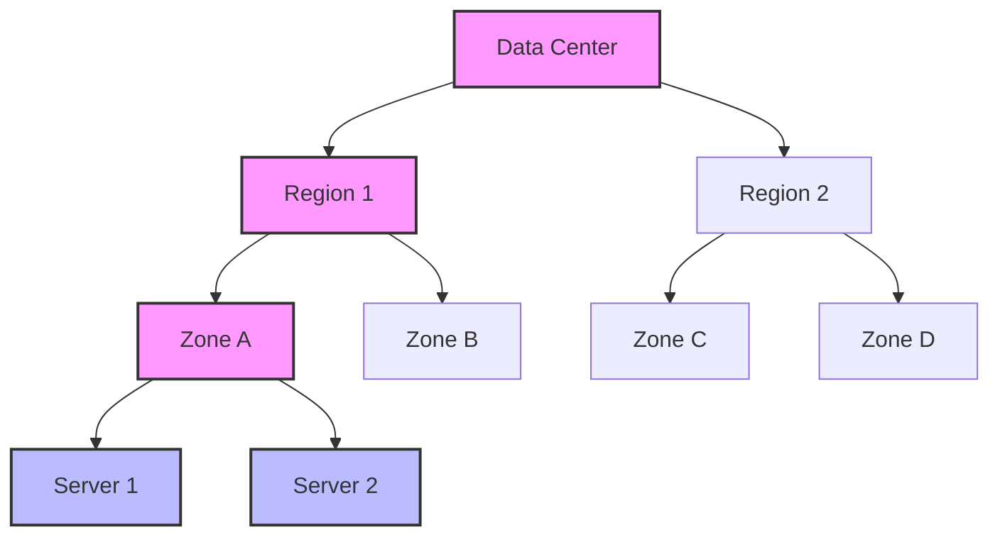
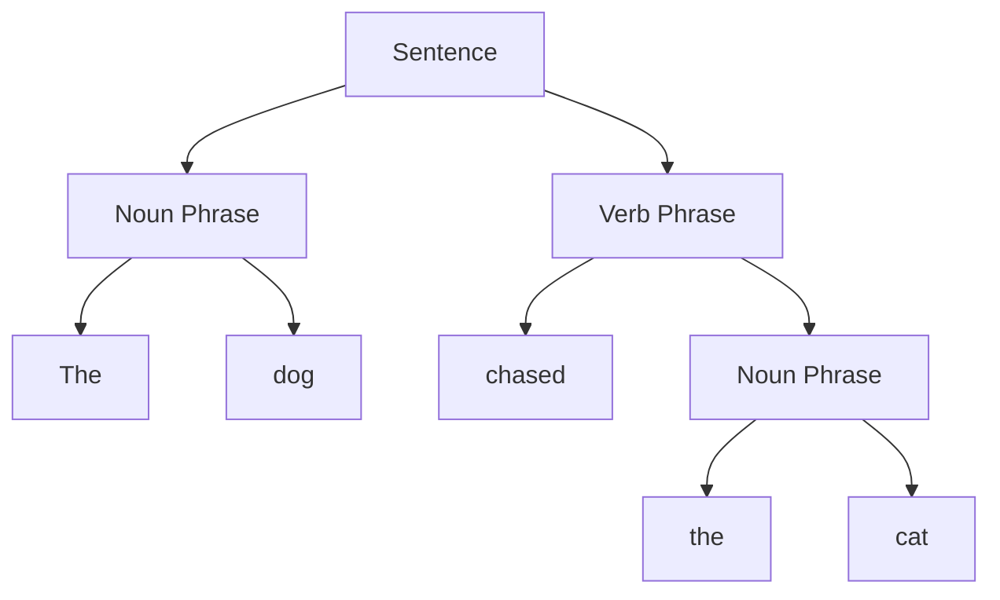

# 🌍 Real-World Applications of LCA

The Lowest Common Ancestor algorithm isn't just a theoretical concept—it has numerous practical applications across various domains. Let's explore some of these real-world use cases.

## Computational Biology 🧬

One of the most prominent applications of LCA is in phylogenetics, the study of evolutionary relationships among biological entities.

> [!NOTE]
> In phylogenetic trees, species are represented as leaves, and internal nodes represent their common ancestors. The LCA of two species represents their most recent common ancestor.



In this example, the LCA of humans and chimpanzees is the primate node, representing the most recent common ancestor of these two species.

**Applications in Genomics:**
- Comparing genetic sequences
- Studying gene evolution
- Identifying evolutionary divergence points
- Classifying new species

## Computer Networks 🌐

In network routing and design, LCA algorithms help optimize communication paths.

> [!TIP]
> When routing a message between two nodes in a network, finding their LCA can help identify the optimal junction point for the communication.



**Network Applications:**
- Optimizing routing tables
- Minimizing network latency
- Planning network infrastructure
- Implementing hierarchical addressing schemes

## File Systems 📁

File systems are naturally represented as trees, with directories as internal nodes and files as leaves.

> [!NOTE]
> Finding the LCA of two files gives you their common parent directory, which is useful for many file system operations.

```
/
├── home/
│   ├── user1/
│   │   ├── documents/
│   │   │   └── file1.txt
│   │   └── pictures/
│   │       └── image.jpg
│   └── user2/
│       └── downloads/
│           └── file2.txt
└── etc/
    └── config.ini
```

If we want to find the relative path between `file1.txt` and `image.jpg`, we first find their LCA (`user1/`), then compute the path from one to the other via this common ancestor.

**File System Applications:**
- Computing relative paths
- Organizing file hierarchies
- Implementing access control
- Optimizing file system operations

## Natural Language Processing 🗣️

In NLP, sentences are often parsed into syntax trees, where LCA can help analyze relationships between words.



**NLP Applications:**
- Analyzing syntactic dependencies
- Resolving anaphora (pronoun references)
- Extracting semantic relationships
- Improving machine translation

## Database Systems 💾

Hierarchical data in databases often uses tree structures, where LCA queries are common.

> [!TIP]
> Many databases now support hierarchical queries that internally use LCA algorithms to efficiently answer questions about relationships in the hierarchy.

**Example SQL Query using Common Table Expressions (CTE):**

```sql
WITH RECURSIVE Ancestors(id, name, path) AS (
  -- Base case: start with the nodes we're looking for
  SELECT id, name, ARRAY[id] as path
  FROM Employees
  WHERE id IN (42, 57)
  
  UNION ALL
  
  -- Recursive case: add parent nodes
  SELECT e.id, e.name, e.id || a.path
  FROM Employees e
  JOIN Ancestors a ON e.id = a.manager_id
)
-- Find the common ancestor with minimum path length
SELECT id, name
FROM Ancestors
WHERE id IN (
  SELECT id
  FROM Ancestors
  GROUP BY id
  HAVING COUNT(*) > 1
)
ORDER BY array_length(path, 1)
LIMIT 1;
```

**Database Applications:**
- Organizational charts
- Product categorization
- Geographic hierarchies
- Access control systems

## Web Development 🌐

In web development, the Document Object Model (DOM) is a tree structure where LCA can help with event handling and manipulation.

```javascript
function findCommonAncestor(element1, element2) {
  const path1 = [];
  const path2 = [];
  
  // Build path from root to element1
  let current = element1;
  while (current) {
    path1.unshift(current);
    current = current.parentElement;
  }
  
  // Build path from root to element2
  current = element2;
  while (current) {
    path2.unshift(current);
    current = current.parentElement;
  }
  
  // Find the last common element in both paths
  let lca = null;
  for (let i = 0; i < Math.min(path1.length, path2.length); i++) {
    if (path1[i] === path2[i]) {
      lca = path1[i];
    } else {
      break;
    }
  }
  
  return lca;
}
```

**Web Development Applications:**
- Event delegation and bubbling
- DOM manipulation
- Component hierarchies in frameworks
- CSS selector optimization

## Game Development 🎮

In game development, scene graphs and AI decision trees often use LCA for various operations.

> [!NOTE]
> In a game's scene graph, finding the LCA of two objects can help determine their relative positions or optimize rendering.

**Game Development Applications:**
- Collision detection hierarchies
- AI decision making
- Scene graph optimization
- Animation blending

## Think About It 🧠

Can you think of other domains where tree structures and LCA algorithms might be useful? How might you apply the LCA concept to solve problems in your own field?

<details>
<summary>More Application Ideas</summary>

- **Social Networks**: Finding common connections between users
- **Compiler Design**: Processing abstract syntax trees
- **Circuit Design**: Analyzing hierarchical circuit components
- **Project Management**: Handling task dependencies in project trees
- **Geographic Information Systems**: Managing hierarchical spatial data
</details>

In the next lesson, we'll wrap up our exploration of the LCA algorithm with a comprehensive conclusion and practice exercises. 