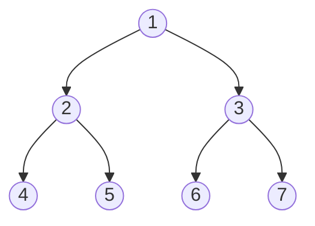

# 🏆 Mastering the Lowest Common Ancestor Algorithm

Congratulations on completing this comprehensive exploration of the Lowest Common Ancestor algorithm! Let's recap what we've learned and provide some practice exercises to reinforce your understanding.

## Key Takeaways 📝

Throughout this series, we've covered:

1. **The LCA Problem**: Finding the deepest node in a binary tree that is an ancestor of two given nodes.

2. **Binary Tree Fundamentals**: Understanding the structure and terminology of binary trees that form the foundation of the LCA problem.

3. **Recursive Approach**: A elegant solution that naturally mirrors the structure of the problem, using post-order traversal to find the LCA.

4. **Iterative Approach**: An alternative solution that avoids recursion by explicitly tracking parent pointers and ancestor sets.

5. **Optimizations and Special Cases**: Techniques to improve efficiency in specific scenarios, such as BSTs, and handling edge cases.

6. **Real-World Applications**: How the LCA algorithm is used in various domains, from computational biology to web development.

> [!NOTE]
> The LCA algorithm is a perfect example of how a relatively simple concept can have profound applications across many different fields.

## Comparing Approaches 📊

Let's summarize the different approaches we've explored:

| Approach | Pros | Cons |
|----------|------|------|
| Recursive | Elegant, concise, intuitive | Potential stack overflow for deep trees |
| Iterative | No recursion stack, explicit steps | More complex implementation, higher memory usage |
| BST Optimization | Very efficient for BSTs | Only applicable to binary search trees |
| Binary Lifting | Efficient for multiple queries | Complex preprocessing, higher memory usage |

## Practice Exercises 💪

To solidify your understanding, try these exercises:

### Exercise 1: Implement the LCA Algorithm

Implement the recursive LCA algorithm from scratch. Test it with the following binary tree:



Find the LCA of:
- Nodes 4 and 5
- Nodes 4 and 6
- Nodes 2 and 7

<details>
<summary>Solution</summary>

```javascript
class TreeNode {
  constructor(val = 0, left = null, right = null) {
    this.val = val;
    this.left = left;
    this.right = right;
  }
}

function lowestCommonAncestor(root, p, q) {
  if (!root || root === p || root === q) {
    return root;
  }
  
  const left = lowestCommonAncestor(root.left, p, q);
  const right = lowestCommonAncestor(root.right, p, q);
  
  if (left && right) {
    return root;
  }
  
  return left ? left : right;
}

// Build the tree
const node1 = new TreeNode(1);
const node2 = new TreeNode(2);
const node3 = new TreeNode(3);
const node4 = new TreeNode(4);
const node5 = new TreeNode(5);
const node6 = new TreeNode(6);
const node7 = new TreeNode(7);

node1.left = node2;
node1.right = node3;
node2.left = node4;
node2.right = node5;
node3.left = node6;
node3.right = node7;

// Test cases
console.log(lowestCommonAncestor(node1, node4, node5).val); // Should output 2
console.log(lowestCommonAncestor(node1, node4, node6).val); // Should output 1
console.log(lowestCommonAncestor(node1, node2, node7).val); // Should output 1
```
</details>

### Exercise 2: Extend the Algorithm

Modify the LCA algorithm to also return the distance between the two nodes (the number of edges in the path connecting them).

<details>
<summary>Solution</summary>

```javascript
function findLCAWithDistance(root, p, q) {
  // First find the LCA
  const lca = lowestCommonAncestor(root, p, q);
  
  // Then find the distance from LCA to each node
  const distToP = findDistance(lca, p, 0);
  const distToQ = findDistance(lca, q, 0);
  
  return {
    lca: lca,
    distance: distToP + distToQ
  };
}

function findDistance(root, target, depth) {
  if (!root) return -1;
  if (root === target) return depth;
  
  const leftDist = findDistance(root.left, target, depth + 1);
  if (leftDist !== -1) return leftDist;
  
  return findDistance(root.right, target, depth + 1);
}
```
</details>

### Exercise 3: LCA in a Binary Search Tree

Implement an optimized version of the LCA algorithm specifically for Binary Search Trees.

<details>
<summary>Solution</summary>

```javascript
function lowestCommonAncestorBST(root, p, q) {
  // Ensure p.val is smaller than q.val
  if (p.val > q.val) {
    [p, q] = [q, p];
  }
  
  let current = root;
  while (current) {
    if (p.val > current.val && q.val > current.val) {
      current = current.right;
    } else if (p.val < current.val && q.val < current.val) {
      current = current.left;
    } else {
      return current;
    }
  }
  
  return null;
}
```
</details>

### Exercise 4: LCA of Multiple Nodes

Extend the LCA algorithm to find the lowest common ancestor of three or more nodes.

<details>
<summary>Solution</summary>

```javascript
function lowestCommonAncestorMultiple(root, nodes) {
  if (!root || nodes.includes(root)) {
    return root;
  }
  
  const left = lowestCommonAncestorMultiple(root.left, nodes);
  const right = lowestCommonAncestorMultiple(root.right, nodes);
  
  if (left && right) {
    return root;
  }
  
  return left ? left : right;
}

// Alternative approach: reduce to pairwise LCA
function lowestCommonAncestorMultiple2(root, nodes) {
  if (nodes.length === 0) return null;
  if (nodes.length === 1) return nodes[0];
  
  let result = nodes[0];
  for (let i = 1; i < nodes.length; i++) {
    result = lowestCommonAncestor(root, result, nodes[i]);
  }
  
  return result;
}
```
</details>

## Final Thoughts 💭

The Lowest Common Ancestor algorithm is a beautiful example of how tree traversal techniques can solve complex problems efficiently. By understanding both the recursive and iterative approaches, you now have powerful tools to tackle a wide range of tree-related problems.

Remember these key insights:
- Trees are naturally recursive structures, making recursive solutions often elegant and intuitive
- The LCA problem has applications far beyond computer science
- Different variations of the algorithm can be optimized for specific scenarios

> [!TIP]
> As you continue your algorithmic journey, look for opportunities to apply the LCA concept in different contexts. The pattern of finding common points in hierarchical structures appears in many problems!

## What's Next? 🚀

Now that you've mastered the LCA algorithm, you might want to explore:

- Advanced tree algorithms like Segment Trees and Fenwick Trees
- Graph algorithms that build on tree concepts
- More complex LCA variations like dynamic LCA in changing trees

Keep practicing, and happy coding! 🌟 