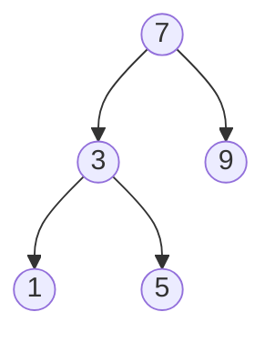

# 🌳 Binary Search Trees: The Organized Data Structure

> [!NOTE]
> A Binary Search Tree (BST) is a special type of binary tree where for each node, all values in its left subtree are less than the node's value, and all values in its right subtree are greater.

## What's the Problem? 🤔

Imagine you're organizing a massive library of books by their ID numbers. You want to:
- Quickly find if a specific book exists
- Add new books to your collection
- Remove books that are no longer needed

All while keeping your library perfectly organized at all times!

This is exactly what Binary Search Tree operations help us solve. They provide efficient ways to:

1. **Search** for values in a tree-like structure
2. **Insert** new values while maintaining order
3. **Delete** values without disrupting the organization

## Why It Matters 🚀

BST operations are fundamental techniques that power many real-world applications:

- Database indexing
- File systems
- Auto-complete features
- Priority queues
- Symbol tables in compilers

## Let's Visualize It 📊

In this BST:
- The root value is 7
- All values to the left (3, 1, 5) are less than 7
- All values to the right (9) are greater than 7
- Within the left subtree, 1 is less than 3, and 5 is greater than 3

## The Challenge Ahead 💪

Your challenge is to master the three core BST operations:

1. **Search**: Find a target value in the tree
2. **Insert**: Add a new value while maintaining the BST property
3. **Delete**: Remove a value without breaking the tree structure

As we explore each operation step-by-step, you'll gain both the **conceptual understanding** and the **practical skills** to implement these powerful algorithms.

> [!TIP]
> Take a moment to really understand the BST property (left < node < right) – it's the foundation for everything we'll learn!

Are you ready to organize your data efficiently? Let's dive in! 🏊‍♂️ 