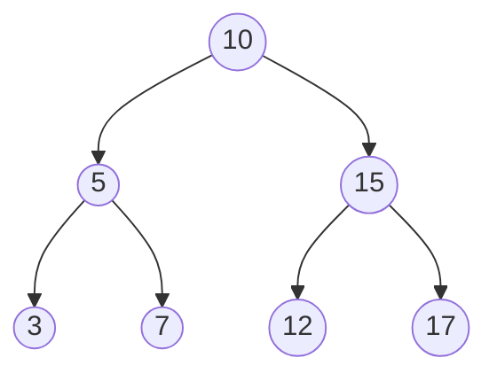
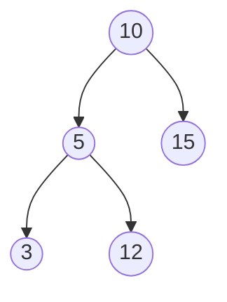

# 🏗️ Building Blocks: BST Structure

Before we dive into operations, let's understand how a BST is structured. This foundation will make implementing the algorithms much more intuitive.

## The Node: Our Basic Building Block 🧱

Every BST consists of **nodes** connected together. Each node contains:

```javascript
function TreeNode(val) {
  this.val = val;     // The value stored in this node
  this.left = null;   // Reference to left child (smaller values)
  this.right = null;  // Reference to right child (larger values)
}
```

> [!NOTE]
> This simple node structure supports the BST property: values to the left are smaller, values to the right are larger.

## The BST Property: The Golden Rule 📏

The defining characteristic of a BST is its **ordering property**:

- For any node, **ALL** values in its left subtree must be **less than** the node's value
- For any node, **ALL** values in its right subtree must be **greater than** the node's value

This property applies recursively to every node in the tree, creating a naturally ordered structure.

## Visualizing a Valid BST 🔍



Is this a valid BST? Let's check:
- All values left of 10 (5, 3, 7) are < 10 ✅
- All values right of 10 (15, 12, 17) are > 10 ✅
- All values left of 5 (3) are < 5 ✅
- All values right of 5 (7) are > 5 ✅
- All values left of 15 (12) are < 15 ✅
- All values right of 15 (17) are > 15 ✅

Yes, it's valid! The BST property is maintained at every node.

## Not All Binary Trees Are BSTs 🚫

Consider this binary tree:



This is **not** a valid BST because 12 is in the left subtree of 10, but 12 > 10.

<details>
<summary>Common Misconception</summary>

A common mistake is thinking that only the direct children need to follow the BST property. In reality, **all descendants** must follow it.

For example, this is **NOT** a valid BST:


Even though 12 > 5 (its parent), it's still in the left subtree of 10, and 12 > 10, which violates the BST property.
</details>

## BST Traversal: Walking Through the Tree 🚶‍♂️

A key feature of BSTs is that an **in-order traversal** visits nodes in ascending order:

```javascript
function inorderTraversal(root, arr = []) {
  if (root) {
    inorderTraversal(root.left, arr);  // Visit left subtree
    arr.push(root.val);                // Visit current node
    inorderTraversal(root.right, arr); // Visit right subtree
  }
  return arr;
}
```

For our example BST, an in-order traversal would visit: 3, 5, 7, 10, 12, 15, 17.

> [!TIP]
> Try performing an in-order traversal on any BST by hand. Notice how the values are always visited in ascending order. This is a useful property for many algorithms!

## Think Like a Tree 🌿

Before moving on, take a moment to think about:

1. How would you determine if a binary tree satisfies the BST property?
2. What's the maximum and minimum possible height of a BST with n nodes?
3. How might the shape of a BST affect the efficiency of operations?

In the next lesson, we'll explore our first algorithm: how to search for a value in a BST. Get ready to put this structure to work! 🔍 