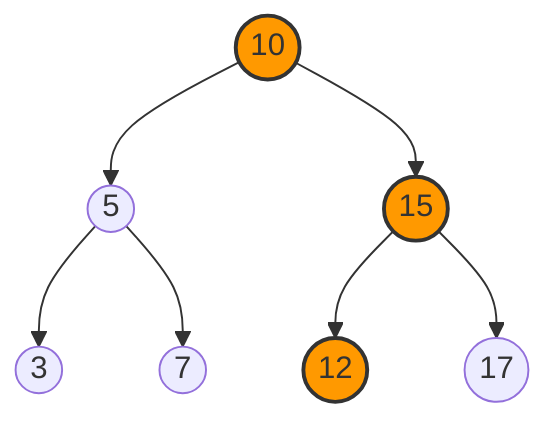
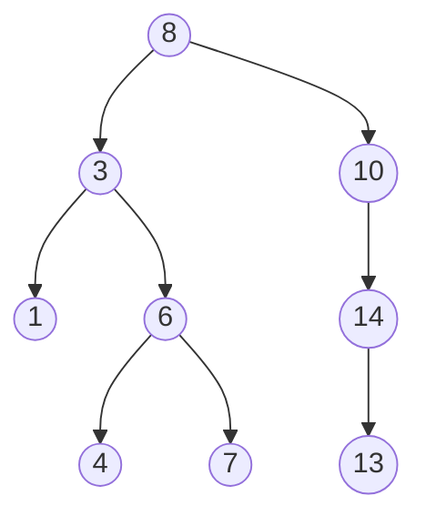

# 🔍 Finding Values: The BST Search Algorithm

Now that we understand the BST structure, let's learn how to efficiently **search** for values in our tree. This is one of the primary reasons we use BSTs in the first place!

## The Intuition: Divide and Conquer 🧠

Imagine you're looking for a word in a dictionary. You wouldn't start from page 1 and check every single word, right? Instead, you'd:
- Open somewhere in the middle
- Check if your word comes before or after that page
- Eliminate half the dictionary and repeat

The BST search works exactly the same way! At each step, we eliminate half of the remaining tree we need to search.

## The Search Algorithm Step-by-Step 📝

Here's how we search for a value in a BST:

1. Start at the root node
2. Compare the target value with the current node's value
3. If they match, we found it! Return true
4. If the target is smaller, search in the left subtree
5. If the target is larger, search in the right subtree
6. If we reach a null node (empty tree), the value doesn't exist - return false

## The Algorithm in Action: Visual Example 👁️

Let's search for the value 12 in our BST:



1. Start at **10** (root): 12 > 10, so move right
2. Visit **15**: 12 < 15, so move left
3. Visit **12**: 12 === 12, found it! Return true

If we were searching for 8, the path would be:
- 10 → 5 → 7 → null (not found, return false)

## Implementation: Two Approaches 💻

### Recursive Approach (Elegant)

```javascript
function search(root, key) {
  // Base cases: empty tree or found the key
  if (!root) return false;
  if (root.val === key) return true;
  
  // Recursive cases: search left or right subtree
  return key < root.val 
    ? search(root.left, key) 
    : search(root.right, key);
}
```

### Iterative Approach (Efficient)

```javascript
function search(root, key) {
  let current = root;
  while (current) {
    if (current.val === key) return true;
    current = key < current.val ? current.left : current.right;
  }
  return false;
}
```

<details>
<summary>Why two approaches?</summary>

The recursive approach is elegant and closely mirrors the algorithm description, but it uses extra memory for the call stack.

The iterative approach is generally more efficient for deep trees as it avoids potential stack overflow, but some find it less intuitive.

Both have the same time complexity, so choose based on your preferences and requirements!
</details>

## Time and Space Complexity ⏱️

- **Time Complexity**: O(h) where h is the height of the tree
  - Best case (balanced tree): O(log n)
  - Worst case (degenerate/linear tree): O(n)

- **Space Complexity**:
  - Recursive: O(h) due to call stack
  - Iterative: O(1) constant space

> [!TIP]
> The shape of the tree matters a lot for performance! A balanced tree gives logarithmic search time, while a degenerate tree (effectively a linked list) gives linear time.

## Try It Yourself! 💪

Given the BST below, trace the search algorithm for the values 4 and 11:



<details>
<summary>Solution for searching 4</summary>

1. Start at 8: 4 < 8, go left
2. Visit 3: 4 > 3, go right
3. Visit 6: 4 < 6, go left
4. Visit 4: Found! Return true
</details>

<details>
<summary>Solution for searching 11</summary>

1. Start at 8: 11 > 8, go right
2. Visit 10: 11 > 10, go right
3. Visit 14: 11 < 14, go left
4. Visit 13: 11 < 13, go left
5. Reach null: Not found! Return false
</details>

## Think Deeper 🤔

1. How would the search algorithm change if our BST allowed duplicate values?
2. If we know the tree is unbalanced, is there anything we can do to improve search performance?
3. In what scenarios would a BST search outperform a hash table lookup, and vice versa?

In the next lesson, we'll learn how to add new values to our BST while maintaining its ordering property. Stay tuned! 🌱 