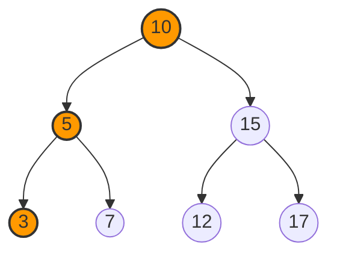
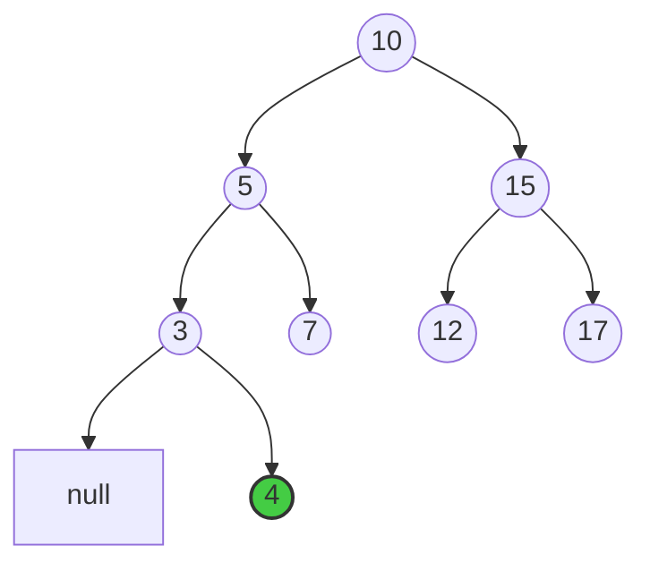
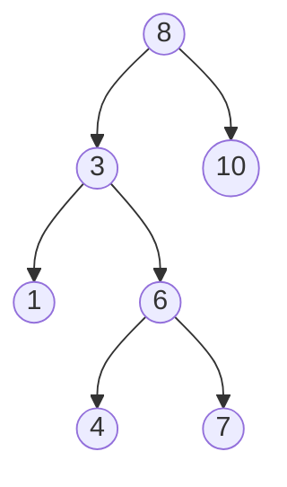
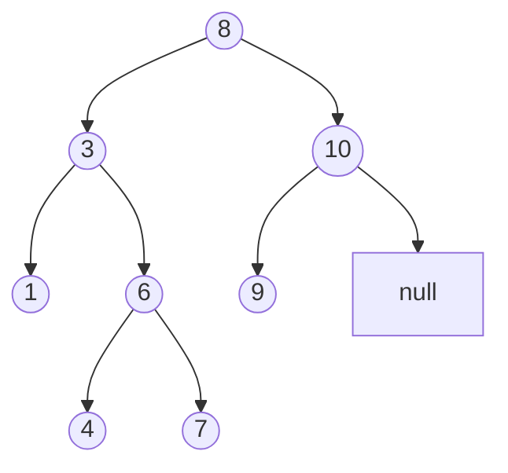
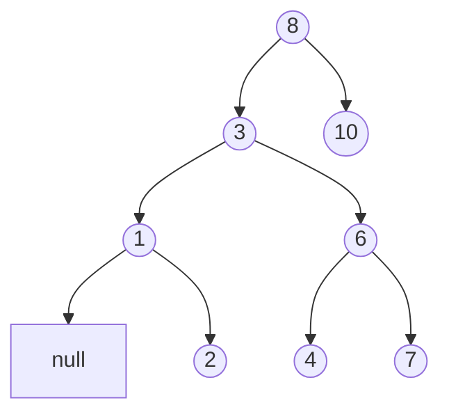

# 🌱 Growing the Tree: The BST Insert Algorithm

Now that we know how to search for values in a BST, let's learn how to **insert** new values while maintaining the BST property. This operation allows our tree to grow and store more data!

## The Intuition: Find the Right Spot 🎯

Inserting a value into a BST is like finding an empty seat in a movie theater where everyone is arranged in order of their height:
- You compare your height with others
- Move left if you're shorter, right if you're taller
- Keep moving until you find an empty seat
- Sit down without disturbing the height ordering

Similarly, when inserting a value into a BST, we navigate down the tree until we find an empty spot where the new value can be placed while maintaining the BST property.

## The Insert Algorithm Step-by-Step 📝

Here's how we insert a value into a BST:

1. Start at the root node
2. If the tree is empty (root is null), create a new node with the value and make it the root
3. If the value is less than the current node's value, go to the left child
   - If the left child is null, insert the new node there
   - Otherwise, repeat from step 3 with the left child as the current node
4. If the value is greater than the current node's value, go to the right child
   - If the right child is null, insert the new node there
   - Otherwise, repeat from step 4 with the right child as the current node
5. Return the root of the updated tree

> [!NOTE]
> This algorithm assumes no duplicate values. We'll discuss handling duplicates later.

## The Algorithm in Action: Visual Example 👁️

Let's insert the value 4 into our BST:



1. Start at **10** (root): 4 < 10, so move left
2. Visit **5**: 4 < 5, so move left
3. Visit **3**: 4 > 3, so move right
4. Right child of 3 is null: Insert new node with value 4 here

After insertion, our BST looks like:



## Implementation: Two Approaches 💻

### Recursive Approach

```javascript
function insert(root, key) {
  // Base case: empty tree or found insertion point
  if (!root) return new TreeNode(key);
  
  // Recursive cases: insert into left or right subtree
  if (key < root.val) {
    root.left = insert(root.left, key);
  } else if (key > root.val) {
    root.right = insert(root.right, key);
  }
  // If key equals root.val, it's a duplicate (ignored in this implementation)
  
  return root; // Return the unchanged or updated root
}
```

### Iterative Approach

```javascript
function insert(root, key) {
  const newNode = new TreeNode(key);
  
  // Special case: empty tree
  if (!root) return newNode;
  
  let current = root;
  let parent = null;
  
  // Find the insertion point
  while (current) {
    parent = current;
    if (key < current.val) {
      current = current.left;
    } else if (key > current.val) {
      current = current.right;
    } else {
      return root; // Duplicate found, ignore insertion
    }
  }
  
  // Perform the insertion
  if (key < parent.val) {
    parent.left = newNode;
  } else {
    parent.right = newNode;
  }
  
  return root;
}
```

<details>
<summary>Handling Duplicates</summary>

There are several ways to handle duplicate values in a BST:

1. **Ignore duplicates** (as shown in the code above)
2. **Replace the existing node** with the new value (useful if nodes contain more data than just the key)
3. **Add a count field** to each node to track duplicate occurrences
4. **Store duplicates in a list** at the node
5. **Always insert duplicates to one side** (e.g., always to the right)

The choice depends on your specific application requirements.
</details>

## Time and Space Complexity ⏱️

- **Time Complexity**: O(h) where h is the height of the tree
  - Best case (balanced tree): O(log n)
  - Worst case (degenerate/linear tree): O(n)

- **Space Complexity**:
  - Recursive: O(h) due to call stack
  - Iterative: O(1) constant space

## Try It Yourself! 💪

Given the BST below, trace the insertion of the values 9 and 2:



<details>
<summary>Solution for inserting 9</summary>

1. Start at 8: 9 > 8, go right
2. Visit 10: 9 < 10, go left
3. Left child of 10 is null: Insert 9 as left child of 10

Result:

</details>

<details>
<summary>Solution for inserting 2</summary>

1. Start at 8: 2 < 8, go left
2. Visit 3: 2 < 3, go left
3. Visit 1: 2 > 1, go right
4. Right child of 1 is null: Insert 2 as right child of 1

Result:

</details>

## Think Deeper 🤔

1. How does the insertion order affect the shape of the BST?
2. What would happen if we inserted elements in sorted order (e.g., 1, 2, 3, 4, 5...)?
3. How might we modify the insert algorithm to maintain a balanced tree?

> [!WARNING]
> If you insert elements in sorted (or nearly sorted) order into a standard BST, you'll end up with a highly unbalanced tree that performs poorly. This is why balanced BST variants like AVL trees and Red-Black trees were developed.

In the next lesson, we'll tackle the most complex BST operation: deleting a value while preserving the BST property. Get ready for a challenge! 🔪 