# ✂️ Pruning the Tree: The BST Delete Algorithm

We've learned how to search for values and insert new ones into our BST. Now, let's tackle the most challenging operation: **deleting** a value while maintaining the BST property.

## The Intuition: Handle with Care 🧩

Deleting a node from a BST is like removing a piece from a carefully balanced Jenga tower: you must ensure that the structure remains stable after the removal. 

Unlike insertion, which always happens at a leaf, deletion can occur anywhere in the tree. This makes it more complex because we need to "fill the gap" left by the deleted node while preserving the BST property.

## The Three Cases of Deletion 🔍

When deleting a node, we encounter one of three cases:

### Case 1: Deleting a Leaf Node (No Children) 🍃

This is the simplest case. Just remove the node and set its parent's pointer to null.

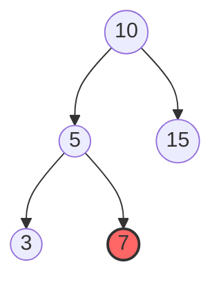

After deleting 7:

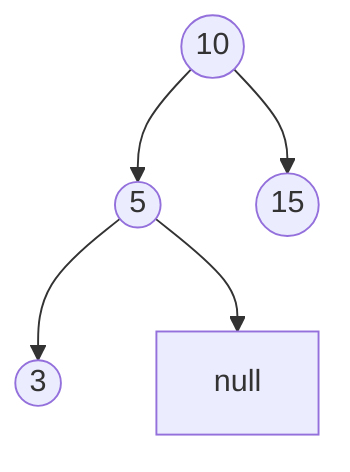

### Case 2: Deleting a Node with One Child 🌿

Replace the node with its only child.

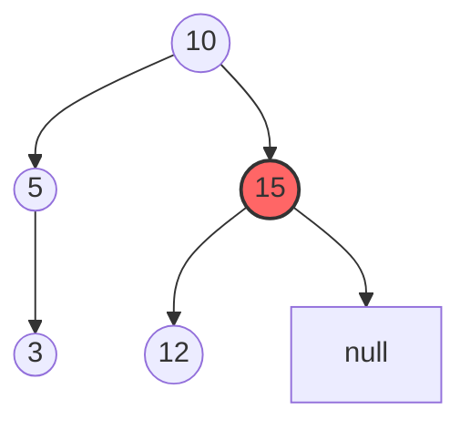

After deleting 15:

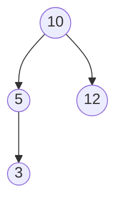

### Case 3: Deleting a Node with Two Children 🌲

This is the trickiest case. We need to:
1. Find the node's in-order successor (the smallest value in its right subtree)
2. Replace the node's value with the successor's value
3. Delete the successor (which will fall into Case 1 or Case 2)

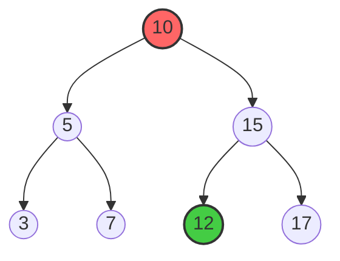

After deleting 10 (replaced with successor 12):

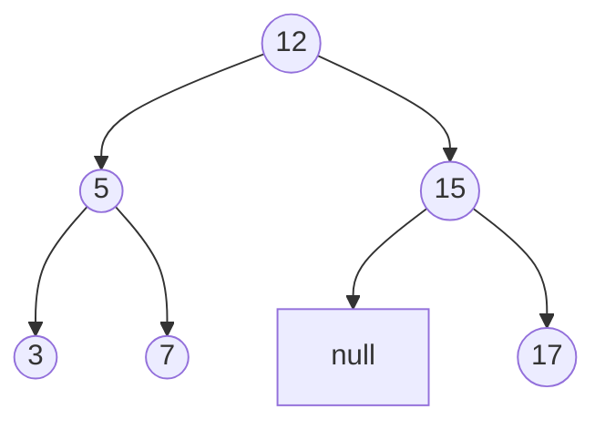

## The Delete Algorithm Step-by-Step 📝

Here's how we delete a value from a BST:

1. **Search** for the node to delete
   - If the node doesn't exist, we're done
2. **Identify the case**:
   - Case 1: Node has no children
   - Case 2: Node has one child
   - Case 3: Node has two children
3. **Handle the case appropriately**:
   - Case 1: Remove the node directly
   - Case 2: Replace the node with its child
   - Case 3: Replace with in-order successor, then delete the successor

## Implementation: The Recursive Approach 💻

```javascript
function deleteNode(root, key) {
  // Base case: empty tree
  if (!root) return null;
  
  // Search for the node to delete
  if (key < root.val) {
    root.left = deleteNode(root.left, key);
  } else if (key > root.val) {
    root.right = deleteNode(root.right, key);
  } else {
    // Node found! Handle the three cases

    // Case 1 & 2: Node has 0 or 1 child
    if (!root.left) return root.right;
    if (!root.right) return root.left;
    
    // Case 3: Node has 2 children
    // Find the in-order successor (minimum value in right subtree)
    let successor = root.right;
    while (successor.left) {
      successor = successor.left;
    }
    
    // Replace the node's value with the successor's value
    root.val = successor.val;
    
    // Delete the successor (which is guaranteed to have at most one child)
    root.right = deleteNode(root.right, successor.val);
  }
  
  return root;
}
```

<details>
<summary>Alternative for Case 3: Using Predecessor</summary>

Instead of using the in-order successor (smallest in right subtree), we can also use the in-order predecessor (largest in left subtree):

```javascript
// Case 3 alternative: Using predecessor
let predecessor = root.left;
while (predecessor.right) {
  predecessor = predecessor.right;
}
root.val = predecessor.val;
root.left = deleteNode(root.left, predecessor.val);
```

Both approaches work correctly. The choice between them can impact tree balance in some cases.
</details>

## The Algorithm in Action: Visual Example 👁️

Let's delete the value 5 from our BST (a Case 3 deletion):

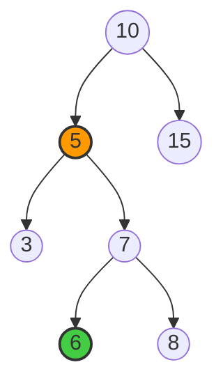

1. Find node with value 5 (found)
2. Node has two children, so find successor:
   - Go to right child (7)
   - Then go left as far as possible (6)
   - Successor is 6
3. Replace 5's value with 6
4. Delete the original successor (6) from the right subtree of the updated node

After deletion, our BST looks like:

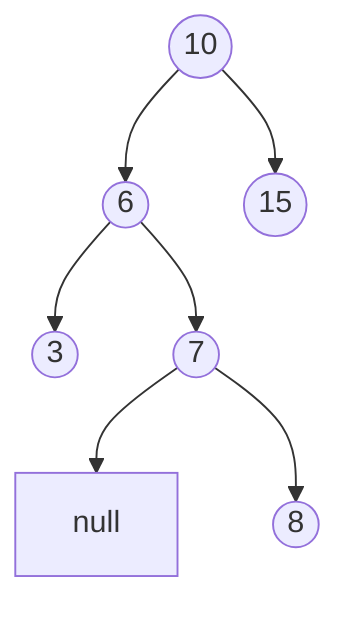

## Time and Space Complexity ⏱️

- **Time Complexity**: O(h) where h is the height of the tree
  - Best case (balanced tree): O(log n)
  - Worst case (degenerate/linear tree): O(n)

- **Space Complexity**:
  - Recursive: O(h) due to call stack
  - Iterative: O(1) constant space (implementation not shown)

> [!WARNING]
> Finding the successor in Case 3 requires additional O(h) time in the worst case, but the overall complexity remains O(h).

## Try It Yourself! 💪

Given the BST below, trace the deletion of the values 3 and 8:

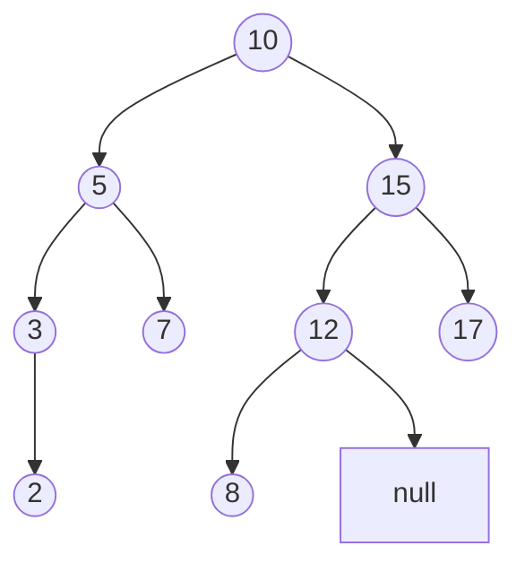

<details>
<summary>Solution for deleting 3</summary>

1. Find node with value 3 (found)
2. Node has one child (2), so replace 3 with 2

Result:
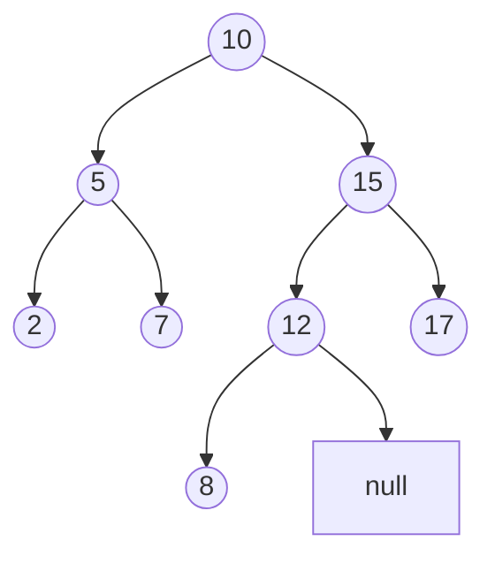
</details>

<details>
<summary>Solution for deleting 8</summary>

1. Find node with value 8 (found)
2. Node has no children, so remove it

Result:
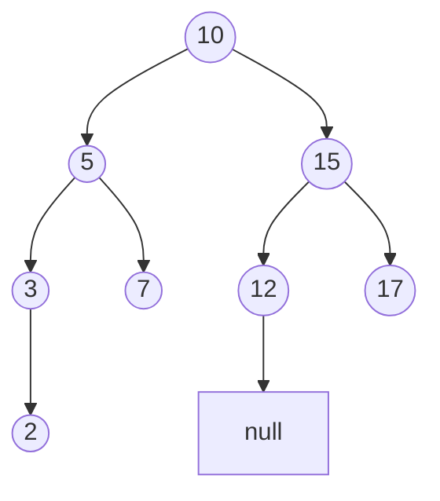
</details>

## Common Pitfalls ⚠️

1. **Not Handling Edge Cases**:
   - Deleting a node that doesn't exist
   - Deleting from an empty tree
   - Deleting the root node

2. **Successor Deletion**:
   - Remember that after replacing a node's value with its successor, you must delete the original successor

3. **Parent Pointers**:
   - If your BST implementation includes parent pointers, be sure to update these when rearranging nodes

> [!TIP]
> The recursive implementation elegantly handles many edge cases automatically, especially for updating parent pointers!

## Think Deeper 🤔

1. How would repeatedly deleting the root node affect tree balance?
2. In what scenarios might you choose to use the predecessor instead of the successor?
3. How might the deletion algorithm be modified for a self-balancing BST?

Now that you understand all three core BST operations, you have a powerful set of tools for efficiently organizing and manipulating data! 🎉 