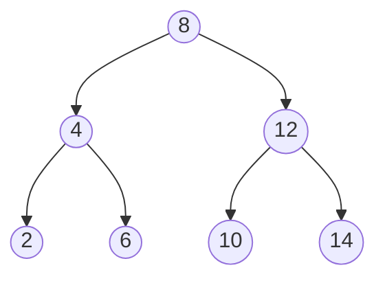
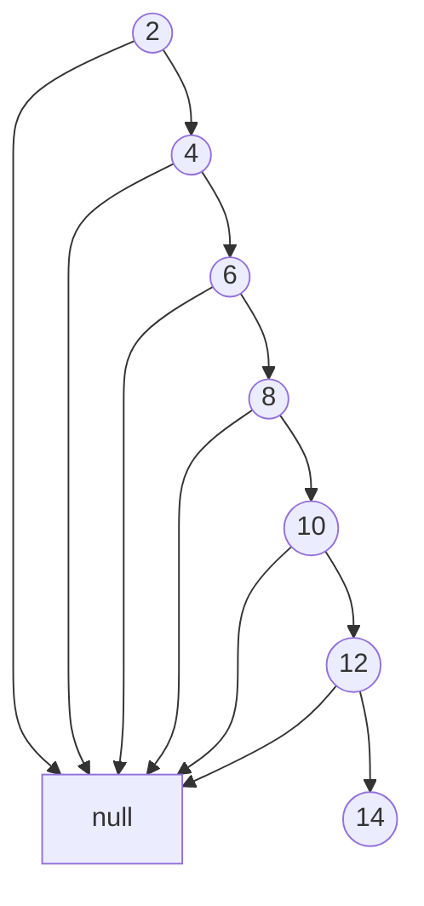
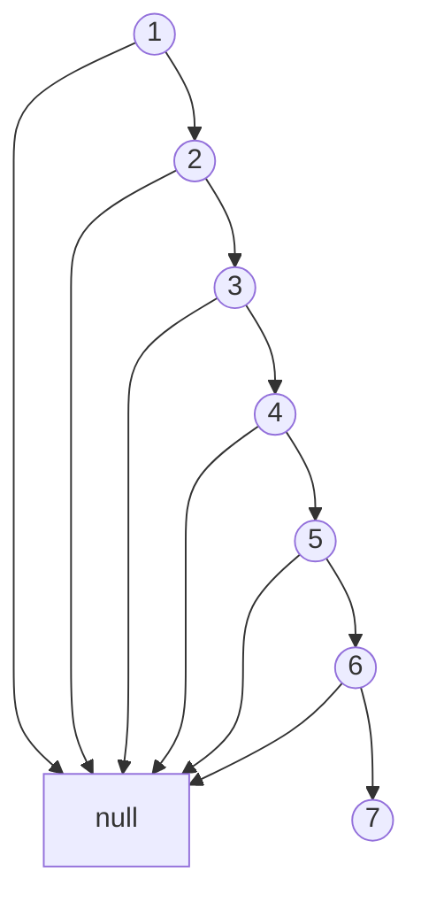
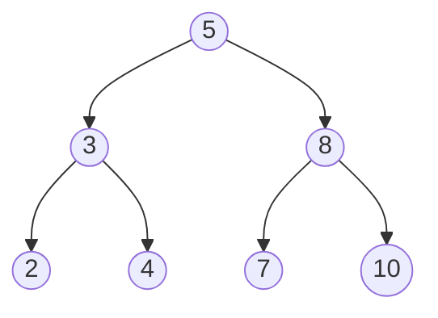
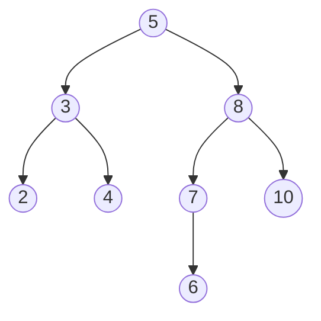
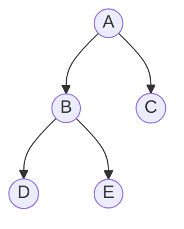
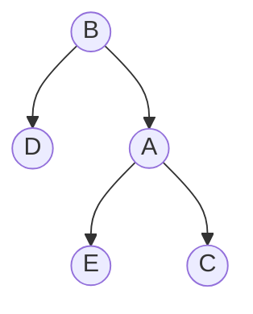

# ⚖️ Balance is Key: BST Efficiency

Now that you understand the three core BST operations (search, insert, and delete), let's explore a critical factor that affects their performance: **tree balance**.

## The Problem with Imbalance 😟

Remember that the time complexity of all BST operations is O(h), where h is the height of the tree. In an ideal scenario, a BST with n nodes would have a height of approximately log₂(n).

However, depending on the insertion order, we can end up with very different tree shapes:

### Balanced Tree (Good) ✅

- Height: ~log₂(7) ≈ 3
- Operations: O(log n) time

### Degenerate/Skewed Tree (Bad) ❌

- Height: n = 7
- Operations: O(n) time

## The Worst-Case Scenario 😱

If we insert elements in sorted (or nearly sorted) order into a standard BST, we get a degenerate tree that performs no better than a linked list!

For example, inserting [1, 2, 3, 4, 5, 6, 7] in order creates:

This turns our O(log n) operations into O(n) operations - a significant performance degradation for large datasets!

## The Solution: Self-Balancing Trees 🌟

To maintain good performance regardless of insertion order, computer scientists developed **self-balancing BSTs** that automatically adjust their structure to maintain balance.

Let's look at the most common types:

### AVL Trees

AVL trees maintain strict balance by ensuring that the height difference between left and right subtrees of any node is at most 1.

After adding 6 (potential imbalance), the tree rotates to rebalance:

### Red-Black Trees

Red-Black trees use node coloring and maintain balance with less strict rules than AVL trees, allowing for faster insertions and deletions.

### B-Trees

B-Trees generalize the BST concept to allow nodes to have more than two children, making them particularly efficient for disk-based storage systems like databases.

How Balancing Works: Rotations

Self-balancing trees maintain balance through operations called **rotations**. Here's a simple right rotation example:

Before rotation:

After right rotation:

Different self-balancing tree implementations have different rules for when and how to perform rotations.

## Comparing BST Variants ⚖️

| BST Type | Insert | Search | Delete | Space | Use Case |
|----------|--------|--------|--------|-------|----------|
| Standard BST | O(h) | O(h) | O(h) | O(n) | Simple implementation, random insertions |
| AVL Tree | O(log n)* | O(log n) | O(log n)* | O(n) | Lookup-heavy applications |
| Red-Black Tree | O(log n)* | O(log n) | O(log n)* | O(n) | General-purpose, frequent modifications |
| B-Tree | O(log n) | O(log n) | O(log n) | O(n) | Databases, file systems |

*includes rebalancing operations

## Real-World Efficiency Considerations 🌍

When implementing BST operations in real systems, consider:

1. **Expected Data Patterns**
   - Random insertions? Sorted data? Mostly static with few changes?

2. **Operation Frequency**
   - Search-heavy? Frequent insertions/deletions?

3. **Memory Constraints**
   - Can you afford the extra memory overhead of self-balancing trees?

4. **Implementation Complexity**
   - Standard BSTs are simpler to implement but may require manual rebalancing

> [!TIP]
> Many programming languages provide balanced tree implementations in their standard libraries. For example, Java's TreeMap and TreeSet use Red-Black trees, while C++'s std::map and std::set typically use Red-Black trees or AVL trees.

## Try It Yourself: Analyzing BST Efficiency 💪

Consider this scenario: You're building a system to store 1 million integer values and need to support efficient lookups.

Question 1: What's the worst-case height of a standard BST with 1,000,000 nodes?

In the worst case (completely unbalanced), the height could be 1,000,000 - making operations O(1,000,000) in the worst case!

Question 2: What's the expected height of a balanced BST with 1,000,000 nodes?

log₂(1,000,000) ≈ 20 - making operations O(20) in the worst case!

That's a difference between a lookup taking 1,000,000 steps vs. just 20 steps!

## Common Applications of Balanced BSTs 🚀

1. **Database Indexing**
   - B-Trees and variants are the backbone of most database systems

2. **In-Memory Sorted Maps/Dictionaries**
   - When you need a map/dictionary with keys in sorted order

3. **Priority Queues**
   - Efficient implementation of priority queues with changing priorities

4. **Range Queries**
   - Finding all values within a specified range efficiently

5. **Computational Geometry**
   - Spatial partitioning, nearest neighbor search

## Think Deeper 🤔

1. If you know your data will always be inserted in random order, is a self-balancing tree necessary?
2. How might you convert an unbalanced BST into a balanced one?
3. What might be more efficient than any BST implementation for certain use cases?

> [!NOTE]
> Sometimes a hash table (with O(1) average lookup) might be more efficient than any BST, but hash tables don't maintain order and aren't efficient for range queries.

In the next and final lesson, we'll put all our knowledge together and explore some real-world applications of BSTs. 🌐 