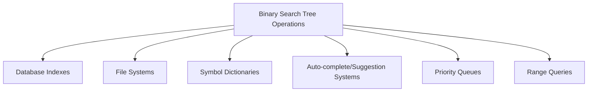

# 🏆 Mastering Binary Search Trees: Conclusion

Congratulations! You've completed our comprehensive journey through Binary Search Tree operations. Let's summarize what you've learned and explore paths for further growth.

## Key Takeaways 📝

### 1. The BST Structure 🌳
- A Binary Search Tree is a binary tree where for any node:
  - All values in the left subtree are less than the node's value
  - All values in the right subtree are greater than the node's value
- This property enables efficient search, insert, and delete operations

### 2. Core Operations ⚙️
- **Search**: Navigate the tree, comparing values to find a target
- **Insert**: Find the appropriate leaf position to add a new value
- **Delete**: Remove a value while maintaining the BST property, with three cases:
  - Leaf nodes: Simply remove
  - One child: Replace with child
  - Two children: Replace with in-order successor and delete the successor

### 3. Efficiency Considerations ⚡
- Time complexity depends on tree height: O(h)
- Balanced trees: O(log n) operations
- Unbalanced trees: Up to O(n) operations in worst case
- Self-balancing variants (AVL, Red-Black, B-Trees) guarantee O(log n) performance

## Practical Applications 🚀

BST operations form the foundation for many real-world applications:

Understanding BSTs will help you:
- Implement efficient search algorithms
- Build complex data structures
- Optimize database operations
- Analyze algorithm performance
- Make better decisions about data organization

## Common Challenges and Solutions 🧩

| Challenge | Solution |
|-----------|----------|
| Skewed trees | Use self-balancing trees (AVL, Red-Black) |
| Duplicate values | Define consistent handling policy |
| Space efficiency | Consider B-Trees for external storage |
| Heavy modifications | Red-Black trees might be preferable to AVL |
| Complex rotations | Use library implementations when available |

> [!TIP]
> When implementing BSTs in real projects, consider using existing library implementations that are well-tested and optimized.

## Code Review Checklist ✅

When reviewing BST implementations, check for:

1. Correct handling of all edge cases (empty trees, duplicates, etc.)
2. Proper balance maintenance (if using self-balancing variants)
3. Efficient traversal methods
4. Clear node structure definition
5. Minimal pointer adjustments during modifications
6. Recursive vs. iterative approach trade-offs

## Further Learning Paths 🛣️

Your journey with Binary Search Trees doesn't end here! Here are some directions to explore next:

Advanced Tree Structures

- **AVL Trees**: Learn the specific rotation rules for perfect balance
- **Red-Black Trees**: Understand the coloring rules and relaxed balance
- **B-Trees and B+ Trees**: Explore disk-friendly multi-way trees
- **Treaps**: Combine BSTs with heap properties using randomization
- **Splay Trees**: Self-adjusting trees that move frequently accessed elements to the root

Related Algorithms

- **Tree Traversals**: Pre-order, post-order, level-order
- **Morris Traversal**: In-order traversal without recursion or stack
- **Tree Serialization/Deserialization**: Converting trees to/from strings or arrays
- **Lowest Common Ancestor (LCA)**: Finding the shared ancestor of two nodes
- **Path Sum Problems**: Finding paths that sum to a target value

Practical Implementations

- Implement a custom map/dictionary using BSTs
- Build a file system directory structure
- Create an efficient database index
- Design an auto-complete system using tries (a tree variant)
- Implement a solution for geospatial nearest-neighbor search

## Final Thoughts 💭

Binary Search Trees represent a perfect balance between simplicity and power. The core principle—organizing data in a hierarchical, ordered structure—has applications far beyond the specific algorithms we've explored.

As you continue your journey in algorithms and data structures, remember that trees mirror how we naturally organize information in the real world—from family trees to organizational hierarchies. This intuitive structure is what makes tree-based algorithms both powerful and accessible.

> [!NOTE]
> The best way to solidify your understanding is through practice. Try implementing each operation from scratch, and then tackle real-world problems that benefit from BST solutions.

## Challenge Yourself! 🏋️‍♂️

As a final exercise, try implementing these BST extensions:

1. Find the kth smallest element in a BST
2. Convert a sorted array to a balanced BST
3. Implement a floor/ceiling function (nearest values less/greater than target)
4. Find the range sum of BST values between two bounds
5. Check if a binary tree satisfies the BST property

Keep growing your skills, just like a well-balanced tree! 🌱 