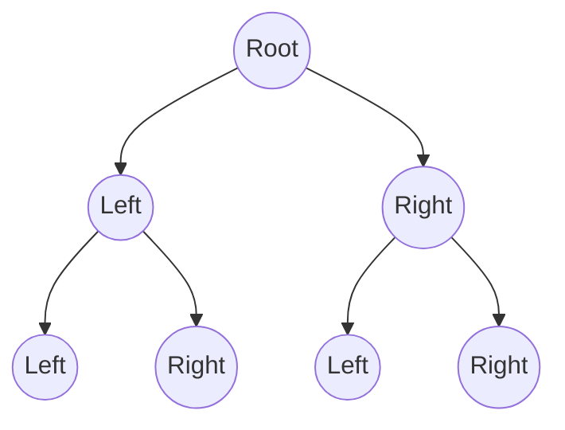

# 🌳 Binary Tree Traversal: An Introduction

> [!NOTE]
> Binary tree traversal is a fundamental operation in computer science that you'll encounter frequently in algorithm interviews and real-world applications.

## What is a Binary Tree? 

A binary tree is a hierarchical data structure where each node has at most two children, referred to as the **left child** and **right child**.



## The Problem We're Solving

Given a binary tree, we need to visit every node exactly once in a specific order. There are three classic ways to traverse a binary tree, each with its own unique pattern and use cases:

1. **In-order Traversal (LNR)**: Left subtree → Node → Right subtree
2. **Pre-order Traversal (NLR)**: Node → Left subtree → Right subtree
3. **Post-order Traversal (LRN)**: Left subtree → Right subtree → Node

Let's visualize these traversals with a simple binary tree:

```
    1
   / \
  2   3
 / \   \
4   5   6
```

The traversal results would be:
- In-order: [4, 2, 5, 1, 3, 6]
- Pre-order: [1, 2, 4, 5, 3, 6] 
- Post-order: [4, 5, 2, 6, 3, 1]

## Why Is This Important? 🤔

Binary tree traversal is not just an academic exercise:

- **In-order traversal** gives elements in sorted order in a binary search tree
- **Pre-order traversal** is used for copying trees and prefix notation
- **Post-order traversal** is used for deleting trees and postfix notation

> [!TIP]
> Think of tree traversal as "visiting someone's family home" - you can meet everyone in different orders: parents first (pre-order), children first (post-order), or left side of the family before right (in-order).

## What We'll Learn

In the coming lessons, we'll:
1. Explore each traversal method in detail
2. Implement both recursive and iterative solutions
3. Analyze the time and space complexity
4. Discuss real-world applications

**Ready to explore the trees? Let's get started! 🚀**

<details>
<summary>Something to think about...</summary>

If we know the pre-order and in-order traversal of a binary tree, can we reconstruct the original tree? What about other combinations?

</details> 