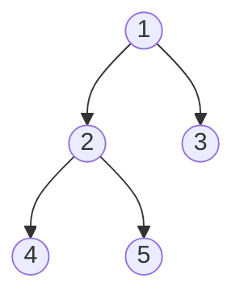
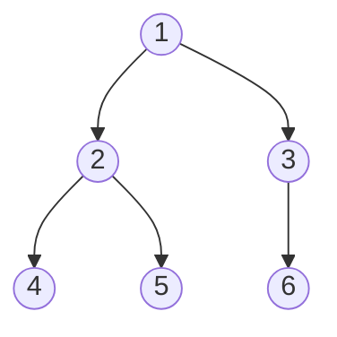
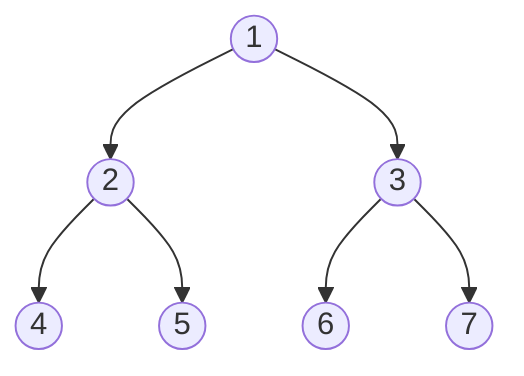
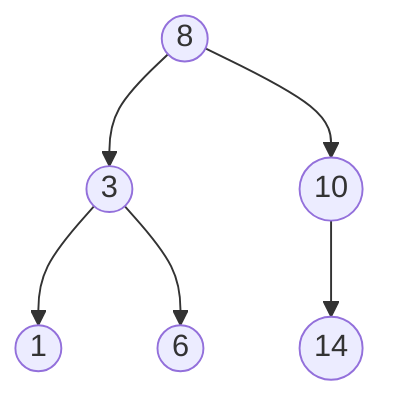

# 🧩 Binary Tree Structure and Representation

Before diving into traversal algorithms, let's understand how binary trees are represented in code and their fundamental structure.

## The TreeNode Class

At the heart of every binary tree is a simple node structure:

```javascript
class TreeNode {
  constructor(val, left = null, right = null) {
    this.val = val;     // The node's value
    this.left = left;   // Reference to left child
    this.right = right; // Reference to right child
  }
}
```

This simple structure allows us to build complex trees by connecting nodes together.

## Creating a Binary Tree

Let's create the example tree we'll use throughout our lessons:

```javascript
//      1
//     / \
//    2   3
//   / \   \
//  4   5   6

const node4 = new TreeNode(4);
const node5 = new TreeNode(5);
const node6 = new TreeNode(6);
const node2 = new TreeNode(2, node4, node5);
const node3 = new TreeNode(3, null, node6);
const root = new TreeNode(1, node2, node3);
```

> [!TIP]
> When working with trees, start by visualizing them on paper. This helps clarify the structure before implementing it in code.

## Special Types of Binary Trees

### 1. Full Binary Tree
A tree where every node has either 0 or 2 children.



### 2. Complete Binary Tree
A tree where all levels are filled except possibly the last, which is filled from left to right.



### 3. Perfect Binary Tree
A tree where all internal nodes have two children and all leaf nodes are at the same level.



### 4. Binary Search Tree (BST)
A tree with the special property: for each node, all values in the left subtree are less than the node's value, and all values in the right subtree are greater.



## Understanding Tree Terminology

- **Root**: The topmost node (node 1 in our example)
- **Leaf**: A node with no children (nodes 4, 5, and 6 in our example)
- **Internal node**: A non-leaf node (nodes 1, 2, and 3 in our example)
- **Depth**: The length of the path from the root to a node
- **Height**: The length of the longest path from a node to a leaf

> [!WARNING]
> Don't confuse a binary tree with a binary search tree (BST). All BSTs are binary trees, but not all binary trees are BSTs.

## Think About It 💭

<details>
<summary>What is the maximum number of nodes in a binary tree of height h?</summary>

A perfect binary tree of height h has 2^(h+1) - 1 nodes.

For example:
- Height 0 (just root): 2^1 - 1 = 1 node
- Height 1 (root + 2 children): 2^2 - 1 = 3 nodes
- Height 2 (perfect with 7 nodes): 2^3 - 1 = 7 nodes

</details>

<details>
<summary>What is the minimum height of a binary tree with n nodes?</summary>

For n nodes, the minimum height is ⌊log₂(n)⌋. This occurs when the tree is as "full" as possible at each level.

</details>

In the next lesson, we'll start exploring the first traversal method: in-order traversal. 