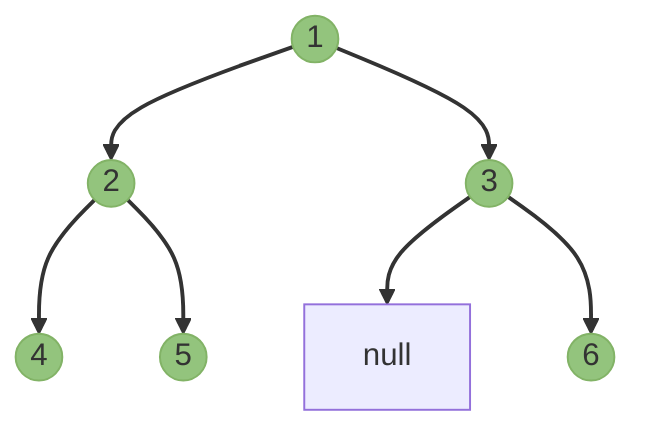

# 🔄 In-Order Traversal (LNR)

In-order traversal is perhaps the most intuitive of the traversal methods, especially when working with Binary Search Trees. It visits nodes in the following order:

1. **L**: Recursively visit the left subtree
2. **N**: Visit the current node 
3. **R**: Recursively visit the right subtree

## Visual Explanation

Consider our example tree:

```
    1
   / \
  2   3
 / \   \
4   5   6
```

The in-order traversal path follows this pattern:



Following the LNR pattern, we visit:
1. 🌿 Go left from root (1) to node 2
2. 🌿 Go left from node 2 to node 4
3. 📍 Visit node 4 (no left child)
4. 📍 Visit node 2 (done with left subtree)
5. 🌿 Go right from node 2 to node 5
6. 📍 Visit node 5 (no left child)
7. 📍 Visit node 1 (done with left subtree)
8. 🌿 Go right from node 1 to node 3
9. 📍 Visit node 3 (no left child)
10. 🌿 Go right from node 3 to node 6
11. 📍 Visit node 6 (no left child)

The resulting sequence is: **[4, 2, 5, 1, 3, 6]**

> [!NOTE]
> Notice how the values appear in ascending order? For a binary search tree, in-order traversal always gives nodes in sorted order!

## Recursive Implementation

The recursive approach is elegant and mirrors our description perfectly:

```javascript
function inOrderTraversal(root) {
  const result = [];
  
  function traverse(node) {
    if (node === null) return;
    
    // L: Process left subtree
    traverse(node.left);
    
    // N: Process current node
    result.push(node.val);
    
    // R: Process right subtree
    traverse(node.right);
  }
  
  traverse(root);
  return result;
}
```

> [!TIP]
> The base case `if (node === null) return;` is crucial! It prevents errors when reaching leaf nodes.

## Iterative Implementation 

While recursion is elegant, it can cause stack overflow for very deep trees. Here's an iterative approach using an explicit stack:

```javascript
function inOrderTraversal(root) {
  const result = [];
  const stack = [];
  let current = root;

  while (stack.length > 0 || current !== null) {
    // Go as far left as possible
    while (current !== null) {
      stack.push(current);
      current = current.left;
    }
    
    // Process current node
    current = stack.pop();
    result.push(current.val);
    
    // Move to right subtree
    current = current.right;
  }
  
  return result;
}
```

> [!WARNING]
> The iterative approach is trickier to understand! Take your time and trace through it step by step.

## Real-World Applications 🌐

In-order traversal has several practical applications:

1. **Sorted Data**: Retrieving elements from a BST in sorted order
2. **Expression Evaluation**: Evaluating infix expressions (like "a + b * c")
3. **Predecessor/Successor**: Finding the predecessor or successor of a node in a BST

## Complexity Analysis

- **Time Complexity**: O(n) where n is the number of nodes, as we visit each node exactly once.
- **Space Complexity**: 
  - O(h) for recursive approach (call stack depth)
  - O(h) for iterative approach (explicit stack)
  - Where h is the height of the tree (between log n and n depending on tree balance)

## Visualization Exercise 🎨

<details>
<summary>Trace the in-order traversal for this tree</summary>

```
    10
   /  \
  5    15
 / \     \
3   7    20
```

The in-order traversal would visit: 3, 5, 7, 10, 15, 20

</details>

In the next lesson, we'll explore pre-order traversal, which follows a different visitation pattern! 