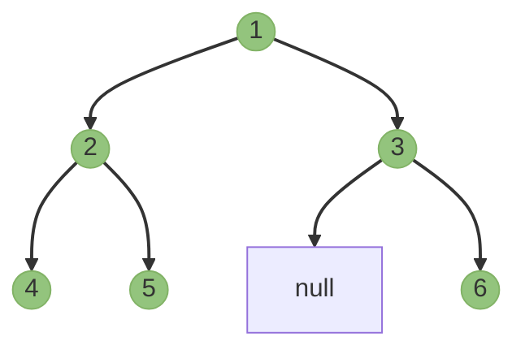
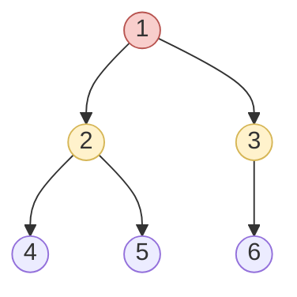

# 🔄 Pre-Order Traversal (NLR)

Pre-order traversal follows a different pattern than in-order traversal. As the name suggests, we visit the current node **before** (pre) we traverse the subtrees:

1. **N**: Visit the current node first
2. **L**: Recursively visit the left subtree
3. **R**: Recursively visit the right subtree

## Visual Explanation

Using our familiar example tree:

```
    1
   / \
  2   3
 / \   \
4   5   6
```

The pre-order traversal path follows this sequence:



Following the NLR pattern, we visit:
1. 📍 Visit the root node 1
2. 🌿 Go left to node 2
3. 📍 Visit node 2
4. 🌿 Go left to node 4
5. 📍 Visit node 4
6. 🌿 Go back up to node 2 (done with left subtree of 2)
7. 🌿 Go right to node 5
8. 📍 Visit node 5
9. 🌿 Go back up to node 1 (done with entire left subtree of 1)
10. 🌿 Go right to node 3
11. 📍 Visit node 3
12. 🌿 Go right to node 6
13. 📍 Visit node 6

The resulting sequence is: **[1, 2, 4, 5, 3, 6]**

> [!TIP]
> A key insight: pre-order traversal visits a node before any of its children. This is particularly useful when you need to process parents before their children.

## Recursive Implementation

The recursive implementation mirrors our three steps exactly:

```javascript
function preOrderTraversal(root) {
  const result = [];
  
  function traverse(node) {
    if (node === null) return;
    
    // N: Process current node first
    result.push(node.val);
    
    // L: Process left subtree
    traverse(node.left);
    
    // R: Process right subtree
    traverse(node.right);
  }
  
  traverse(root);
  return result;
}
```

Notice how simple the change is from in-order traversal - we just moved the node processing step to the top!

## Iterative Implementation

The iterative approach for pre-order is actually simpler than the one for in-order:

```javascript
function preOrderTraversal(root) {
  const result = [];
  if (root === null) return result;
  
  const stack = [root];
  
  while (stack.length > 0) {
    // Pop and process the top node
    const node = stack.pop();
    result.push(node.val);
    
    // Push right child first (so it's processed after left)
    if (node.right !== null) stack.push(node.right);
    if (node.left !== null) stack.push(node.left);
  }
  
  return result;
}
```

> [!NOTE]
> We push the right child first, then the left child. This ensures that when we pop from the stack, we get the left child before the right child (stack is LIFO - Last In, First Out).

## Real-World Applications 🌐

Pre-order traversal has several important applications:

1. **Creating Copies**: Useful for creating a copy or clone of a tree
2. **Prefix Expressions**: Converting expression trees to prefix notation
3. **Serialization**: Storing a tree structure as a sequence for later reconstruction
4. **Directory Structure**: Used in file systems to list all files in a directory and its subdirectories

## The Curious Case of Depth-First Search 🔍

Pre-order traversal is essentially a form of **Depth-First Search (DFS)** applied to a binary tree. DFS is a fundamental algorithm for exploring graph structures by going as deep as possible before backtracking.



## Complexity Analysis

- **Time Complexity**: O(n) where n is the number of nodes, as we visit each node exactly once.
- **Space Complexity**: 
  - O(h) for recursive approach (function call stack)
  - O(h) for iterative approach (explicit stack)
  - Where h is the height of the tree

## Think It Through 🤔

<details>
<summary>How would you use pre-order traversal to create a copy of a binary tree?</summary>

```javascript
function copyTree(root) {
  if (root === null) return null;
  
  // Create a new node with the same value (visit current node)
  const newNode = new TreeNode(root.val);
  
  // Recursively copy left subtree
  newNode.left = copyTree(root.left);
  
  // Recursively copy right subtree
  newNode.right = copyTree(root.right);
  
  return newNode;
}
```

This is a perfect example of pre-order traversal! We process the current node (by creating a copy), then process the left subtree, then the right subtree.

</details>

In the next lesson, we'll explore the final traversal method: post-order traversal. 