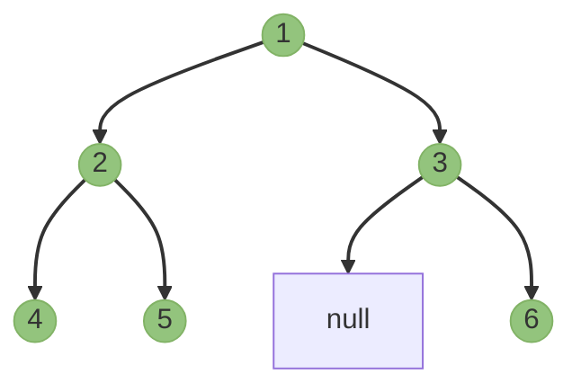
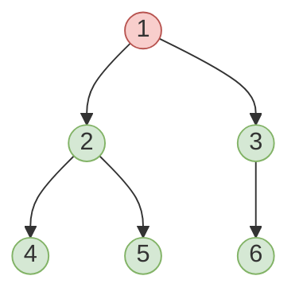

# 🔄 Post-Order Traversal (LRN)

Post-order traversal is the final classic tree traversal method. In this approach, we visit the current node **after** (post) we've traversed both subtrees:

1. **L**: Recursively visit the left subtree
2. **R**: Recursively visit the right subtree
3. **N**: Visit the current node last

## Visual Explanation

Using our example tree again:

```
    1
   / \
  2   3
 / \   \
4   5   6
```

The post-order traversal follows this pattern:



Following the LRN pattern, we visit:
1. 🌿 Go left from root (1) to node 2
2. 🌿 Go left from node 2 to node 4
3. 📍 Visit node 4 (no children)
4. 🌿 Go right from node 2 to node 5 
5. 📍 Visit node 5 (no children)
6. 📍 Visit node 2 (both children processed)
7. 🌿 Go right from node 1 to node 3
8. 🌿 Go right from node 3 to node 6
9. 📍 Visit node 6 (no children)
10. 📍 Visit node 3 (right child processed)
11. 📍 Visit node 1 (both children processed)

The resulting sequence is: **[4, 5, 2, 6, 3, 1]**

Notice that the root node is always visited last in post-order traversal, after all other nodes have been visited!

> [!TIP]
> Think of post-order as a "children first" approach - you always process all children before processing their parent.

## Recursive Implementation

The recursive implementation again mirrors our description perfectly:

```javascript
function postOrderTraversal(root) {
  const result = [];
  
  function traverse(node) {
    if (node === null) return;
    
    // L: Process left subtree
    traverse(node.left);
    
    // R: Process right subtree
    traverse(node.right);
    
    // N: Process current node last
    result.push(node.val);
  }
  
  traverse(root);
  return result;
}
```

## Iterative Implementation

The iterative approach for post-order is the most complex of all three traversal methods:

```javascript
function postOrderTraversal(root) {
  const result = [];
  if (root === null) return result;
  
  // Method 1: Using two stacks
  const stack1 = [root];
  const stack2 = [];
  
  // First, process nodes in reverse post-order (NRL) using stack1
  while (stack1.length > 0) {
    const node = stack1.pop();
    stack2.push(node);  // Save for later processing
    
    // Add left before right to stack1 (will reverse in stack2)
    if (node.left !== null) stack1.push(node.left);
    if (node.right !== null) stack1.push(node.right);
  }
  
  // Extract elements from stack2 to get post-order
  while (stack2.length > 0) {
    result.push(stack2.pop().val);
  }
  
  return result;
}
```

> [!WARNING]
> There's a clever trick here! We're essentially finding the reverse of (root, right, left) which gives us (left, right, root) - our post-order traversal.

An alternative approach with a single stack is also possible but requires tracking which nodes have been visited.

## Real-World Applications 🌐

Post-order traversal has several practical applications:

1. **Tree Deletion**: Deleting a node only after its children are deleted (prevents memory leaks)
2. **Expression Evaluation**: Evaluating postfix expressions from expression trees
3. **Directory Size Calculation**: Computing the total size of a directory by first calculating sizes of all subdirectories
4. **Dependency Resolution**: Resolving dependencies in build systems or package managers

## The "Bottom-Up" Approach 🚀

Post-order traversal is often described as a "bottom-up" approach because it processes leaf nodes first, then their parents, and finally the root.



## Complexity Analysis

- **Time Complexity**: O(n) where n is the number of nodes, as we visit each node exactly once.
- **Space Complexity**: 
  - O(h) for recursive approach (function call stack)
  - O(n) for the two-stack iterative approach (in the worst case)
  - Where h is the height of the tree

## Problem-Solving Example 🧩

<details>
<summary>How would you calculate the height of a binary tree using post-order traversal?</summary>

```javascript
function calculateHeight(root) {
  if (root === null) return -1; // Height of empty tree is -1
  
  // First, calculate height of left subtree
  const leftHeight = calculateHeight(root.left);
  
  // Then, calculate height of right subtree
  const rightHeight = calculateHeight(root.right);
  
  // Finally, determine height of current node
  return Math.max(leftHeight, rightHeight) + 1;
}
```

This is post-order traversal - we need to know the heights of both subtrees before we can determine the height of the current node.

</details>

In the next lesson, we'll compare all three traversal methods and explore level-order traversal as a bonus! 