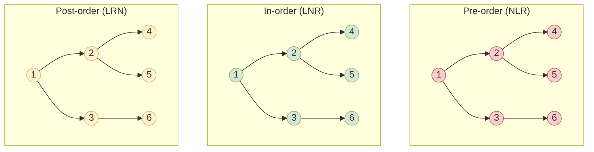
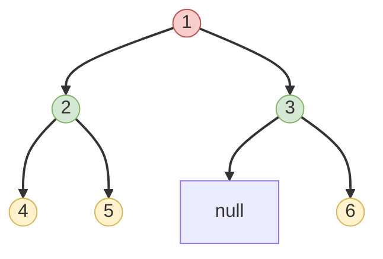

# 🔄 Traversal Methods Compared & Level-Order Traversal

Now that we've explored the three main depth-first traversal methods, let's compare them side by side and introduce a new traversal method: level-order traversal.

## Comparing the Traversal Methods

Using our example tree:

```
    1
   / \
  2   3
 / \   \
4   5   6
```

Here's a summary of the three traversal methods:

| Traversal Method | Abbreviation | Order             | Result            | Key Characteristic                   |
|------------------|--------------|-------------------|-------------------|--------------------------------------|
| In-order         | LNR          | Left → Node → Right | [4, 2, 5, 1, 3, 6] | Gives sorted order in a BST         |
| Pre-order        | NLR          | Node → Left → Right | [1, 2, 4, 5, 3, 6] | Root is always first                |
| Post-order       | LRN          | Left → Right → Node | [4, 5, 2, 6, 3, 1] | Root is always last                 |

> [!NOTE]
> All three methods are forms of **depth-first traversal** – they explore as far down a branch as possible before backtracking.

## Visual Comparison



## Choosing the Right Traversal Method

The traversal method you choose depends on your specific requirements:

1. **Use in-order when:**
   - You need elements in sorted order (for BST)
   - You need to process a node between its subtrees
   - You're working with expressions in infix notation

2. **Use pre-order when:**
   - You need to explore roots before leaves
   - You're creating a copy of the tree
   - You need to print a structured document

3. **Use post-order when:**
   - You need to delete the tree
   - You need to calculate results from the bottom up
   - Children must be processed before parents

## Introducing Level-Order Traversal 👋

So far, we've explored depth-first traversal methods. Let's introduce a breadth-first approach called **level-order traversal**.

Level-order traversal visits nodes level by level, from top to bottom, and within each level from left to right.



For our example tree, the level-order traversal result would be: **[1, 2, 3, 4, 5, 6]**

## Implementing Level-Order Traversal

Unlike the three depth-first approaches, level-order traversal uses a **queue** instead of a stack:

```javascript
function levelOrderTraversal(root) {
  const result = [];
  if (root === null) return result;
  
  const queue = [root];
  
  while (queue.length > 0) {
    const node = queue.shift(); // Remove from the front (FIFO)
    result.push(node.val);
    
    // Add children to the queue
    if (node.left !== null) queue.push(node.left);
    if (node.right !== null) queue.push(node.right);
  }
  
  return result;
}
```

> [!TIP]
> The key difference: we use a queue (First-In-First-Out) instead of a stack (Last-In-First-Out), which gives us breadth-first behavior!

## Applications of Level-Order Traversal 🌐

Level-order traversal is particularly useful for:

1. **Finding the Minimum Depth**: Finding the shortest path to a leaf node
2. **Connecting Nodes at the Same Level**: Creating links between nodes at the same depth
3. **Creating a Level-by-Level View**: Visualizing the tree level by level
4. **Serializing a Tree**: Converting a tree to a string representation
5. **Finding the Nearest Nodes**: Ideal for finding the closest nodes to the root

## Extended Challenge: Level-by-Level Output 🏆

<details>
<summary>How would you modify level-order traversal to return a 2D array, where each inner array contains nodes from a single level?</summary>

```javascript
function levelByLevelTraversal(root) {
  const result = [];
  if (root === null) return result;
  
  const queue = [root];
  
  while (queue.length > 0) {
    const levelSize = queue.length;
    const currentLevel = [];
    
    // Process all nodes at the current level
    for (let i = 0; i < levelSize; i++) {
      const node = queue.shift();
      currentLevel.push(node.val);
      
      if (node.left !== null) queue.push(node.left);
      if (node.right !== null) queue.push(node.right);
    }
    
    result.push(currentLevel);
  }
  
  return result;
}
```

This would return `[[1], [2, 3], [4, 5, 6]]` for our example tree.

</details>

## Integration with Graph Algorithms 🔍

Binary tree traversal methods directly relate to broader graph traversal algorithms:

- **Depth-First Search (DFS)**: Pre-order, in-order, and post-order are all variations of DFS
- **Breadth-First Search (BFS)**: Level-order traversal is essentially BFS applied to a tree

In the next lesson, we'll look at practical challenges and advanced tree traversal techniques! 