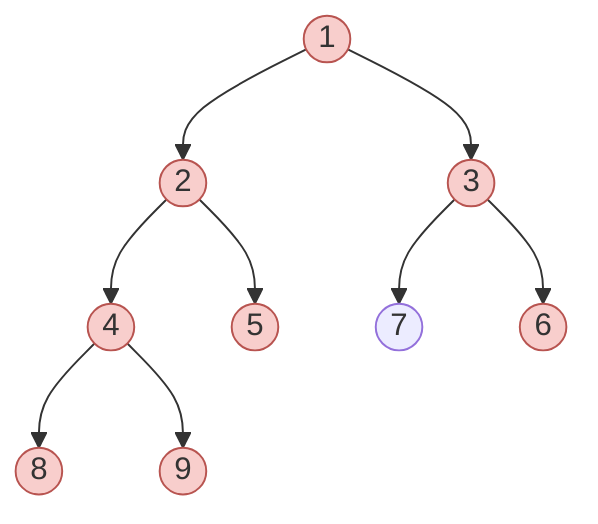
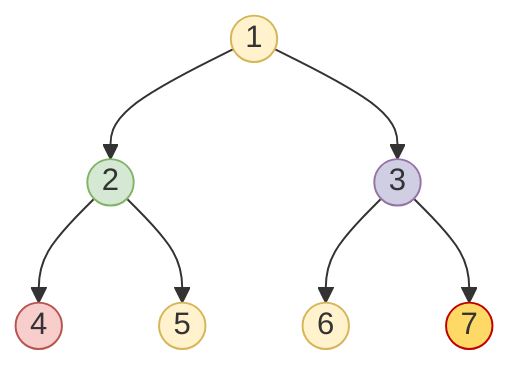

# 🚀 Advanced Tree Traversal Techniques

Now that we've covered the fundamental traversal methods, let's explore some advanced techniques and optimizations that can help you solve more complex tree problems.

## Morris Traversal: Constant Space In-Order

One of the limitations of our previous implementations is the O(h) space complexity due to the call stack or explicit stack. Morris Traversal achieves in-order traversal with O(1) space complexity by temporarily modifying the tree structure!

```javascript
function morrisInOrderTraversal(root) {
  const result = [];
  let current = root;
  
  while (current !== null) {
    if (current.left === null) {
      // If no left child, visit the node and move right
      result.push(current.val);
      current = current.right;
    } else {
      // Find the inorder predecessor (rightmost node in left subtree)
      let predecessor = current.left;
      while (predecessor.right !== null && predecessor.right !== current) {
        predecessor = predecessor.right;
      }
      
      if (predecessor.right === null) {
        // Create a temporary link from predecessor to current
        predecessor.right = current;
        current = current.left;
      } else {
        // Restore the tree structure, visit current, and move right
        predecessor.right = null;
        result.push(current.val);
        current = current.right;
      }
    }
  }
  
  return result;
}
```

> [!WARNING]
> Morris traversal temporarily modifies the tree structure, which may not be acceptable in all scenarios!

## Thread-Safe Traversal with Visitor Pattern

When traversing trees in a multi-threaded environment, using a visitor pattern can help make the code more maintainable:

```javascript
// Define visitor interface
class TreeVisitor {
  visitNode(node) {
    // Abstract method to be implemented
  }
}

// Implement specific visitor
class ValueCollector extends TreeVisitor {
  constructor() {
    super();
    this.values = [];
  }
  
  visitNode(node) {
    this.values.push(node.val);
  }
  
  getResult() {
    return this.values;
  }
}

// Traversal with visitor
function inOrderTraversal(root, visitor) {
  function traverse(node) {
    if (node === null) return;
    traverse(node.left);
    visitor.visitNode(node);
    traverse(node.right);
  }
  
  traverse(root);
}

// Usage
const collector = new ValueCollector();
inOrderTraversal(root, collector);
const result = collector.getResult();
```

## Zigzag Level Order Traversal

A variation of level-order traversal that alternates between left-to-right and right-to-left direction:

```javascript
function zigzagLevelOrder(root) {
  const result = [];
  if (root === null) return result;
  
  const queue = [root];
  let leftToRight = true;
  
  while (queue.length > 0) {
    const levelSize = queue.length;
    const currentLevel = [];
    
    for (let i = 0; i < levelSize; i++) {
      const node = queue.shift();
      
      // Add node to current level based on direction
      if (leftToRight) {
        currentLevel.push(node.val);
      } else {
        currentLevel.unshift(node.val); // Add to front
      }
      
      if (node.left !== null) queue.push(node.left);
      if (node.right !== null) queue.push(node.right);
    }
    
    result.push(currentLevel);
    leftToRight = !leftToRight; // Toggle direction
  }
  
  return result;
}
```

For our example tree, this would yield: `[[1], [3, 2], [4, 5, 6]]`

## Boundary Traversal

Boundary traversal visits all the boundary nodes of a binary tree in an anti-clockwise direction:



Implementation involves three parts:
1. Left boundary (excluding leaves)
2. All leaf nodes
3. Right boundary in reverse (excluding leaves)

## Vertical Order Traversal

Vertical order traversal groups nodes by their horizontal distance from the root:



Output: `[[4], [2], [1, 5, 6], [3], [7]]`

## Diagonal Traversal

Groups nodes that are on the same diagonal line from top-left to bottom-right:

```javascript
function diagonalTraversal(root) {
  if (root === null) return [];
  
  const result = [];
  const diagonalMap = new Map(); // Map of diagonal -> nodes
  
  function traverse(node, diagonal) {
    if (node === null) return;
    
    // Add to current diagonal
    if (!diagonalMap.has(diagonal)) {
      diagonalMap.set(diagonal, []);
    }
    diagonalMap.get(diagonal).push(node.val);
    
    // Left child has diagonal + 1
    traverse(node.left, diagonal + 1);
    
    // Right child stays on same diagonal
    traverse(node.right, diagonal);
  }
  
  traverse(root, 0);
  
  // Convert map to array
  const sortedDiagonals = [...diagonalMap.entries()]
    .sort((a, b) => a[0] - b[0])
    .map(entry => entry[1]);
  
  return sortedDiagonals;
}
```

## Density-based Traversal

A more advanced traversal method that prioritizes nodes based on subtree density (number of nodes in a subtree):

```javascript
function densityBasedTraversal(root) {
  if (root === null) return [];
  
  // Calculate node count for each subtree
  const nodeCounts = new Map();
  
  function countNodes(node) {
    if (node === null) return 0;
    const count = 1 + countNodes(node.left) + countNodes(node.right);
    nodeCounts.set(node, count);
    return count;
  }
  
  countNodes(root);
  
  // Create priority queue
  const queue = [root];
  const result = [];
  
  while (queue.length > 0) {
    // Sort queue by node count (density)
    queue.sort((a, b) => nodeCounts.get(b) - nodeCounts.get(a));
    
    const node = queue.shift();
    result.push(node.val);
    
    if (node.left !== null) queue.push(node.left);
    if (node.right !== null) queue.push(node.right);
  }
  
  return result;
}
```

> [!TIP]
> This technique is particularly useful in search problems where you want to explore denser regions of the tree first!

## Advanced Applications 🌐

These advanced traversal techniques find applications in:

1. **Graph Database Queries**: Optimizing traversal paths in graph databases
2. **Game AI**: Minimax and Alpha-Beta pruning for game trees
3. **Compiler Design**: Advanced abstract syntax tree traversal
4. **Network Design**: Optimizing network topology traversal
5. **Geographic Information Systems**: Quad-tree traversal for spatial data

In the final lesson, we'll put it all together and solve some practical tree traversal problems! 