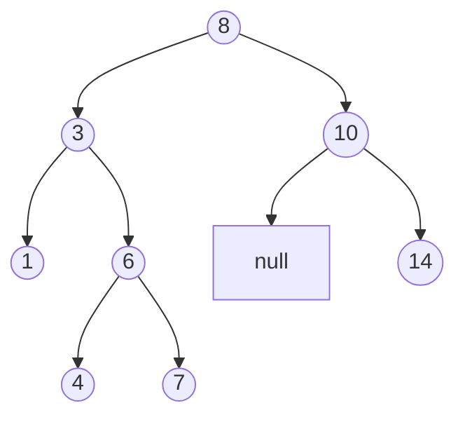

# 💪 Practical Tree Traversal Problems

Let's apply our knowledge of tree traversal to solve some practical problems. These problems will test your understanding and showcase how traversal algorithms are used in real-world scenarios.

## Problem 1: Validate Binary Search Tree 🔍

A Binary Search Tree (BST) is a binary tree where each node's value is greater than all values in its left subtree and less than all values in its right subtree.



To validate if a tree is a BST, we need to perform an in-order traversal and check if the values are in ascending order:

```javascript
function isValidBST(root) {
  let prev = null;
  
  function inOrder(node) {
    if (node === null) return true;
    
    // Traverse left subtree
    if (!inOrder(node.left)) return false;
    
    // Process current node (check if in order)
    if (prev !== null && node.val <= prev) return false;
    prev = node.val;
    
    // Traverse right subtree
    return inOrder(node.right);
  }
  
  return inOrder(root);
}
```

> [!TIP]
> This is a perfect example of how in-order traversal naturally gives sorted values in a BST!

## Problem 2: Construct Binary Tree from Traversals 🛠️

Given the pre-order and in-order traversal results, we can reconstruct the original binary tree:

```javascript
function buildTree(preorder, inorder) {
  if (preorder.length === 0 || inorder.length === 0) return null;
  
  // The first element in preorder is the root
  const rootValue = preorder[0];
  const root = new TreeNode(rootValue);
  
  // Find the position of root in inorder traversal
  const rootIndex = inorder.indexOf(rootValue);
  
  // Split the traversals to left and right subtrees
  const leftInorder = inorder.slice(0, rootIndex);
  const rightInorder = inorder.slice(rootIndex + 1);
  
  const leftPreorder = preorder.slice(1, 1 + leftInorder.length);
  const rightPreorder = preorder.slice(1 + leftInorder.length);
  
  // Recursively build left and right subtrees
  root.left = buildTree(leftPreorder, leftInorder);
  root.right = buildTree(rightPreorder, rightInorder);
  
  return root;
}
```

<details>
<summary>Why does this work?</summary>

- Pre-order traversal gives us the root first, followed by all nodes in the left subtree, then all nodes in the right subtree.
- In-order traversal gives us all nodes in the left subtree, then the root, then all nodes in the right subtree.
- By finding the root's position in the in-order traversal, we can determine which elements belong to the left and right subtrees.

This technique works because the combination of pre-order and in-order traversals uniquely identifies a binary tree!

</details>

## Problem 3: Serialize and Deserialize Binary Tree 💾

Serialization converts a tree to a string format for storage or transmission:

```javascript
function serialize(root) {
  if (root === null) return "null";
  
  // Use pre-order traversal for serialization
  const leftSerialized = serialize(root.left);
  const rightSerialized = serialize(root.right);
  
  return `${root.val},${leftSerialized},${rightSerialized}`;
}

function deserialize(data) {
  const values = data.split(',');
  let index = 0;
  
  function buildTree() {
    const val = values[index++];
    if (val === "null") return null;
    
    const node = new TreeNode(parseInt(val));
    node.left = buildTree();
    node.right = buildTree();
    
    return node;
  }
  
  return buildTree();
}
```

> [!NOTE]
> This uses pre-order traversal because it naturally puts the root first, which is ideal for recursive deserialization.

## Problem 4: Path Sum Problems 🔢

Finding if there exists a root-to-leaf path that sums to a target value:

```javascript
function hasPathSum(root, targetSum) {
  if (root === null) return false;
  
  // If we reach a leaf node, check if the sum matches
  if (root.left === null && root.right === null) {
    return root.val === targetSum;
  }
  
  // Recursively check left and right subtrees with reduced target
  return hasPathSum(root.left, targetSum - root.val) || 
         hasPathSum(root.right, targetSum - root.val);
}
```

And finding all such paths:

```javascript
function findPaths(root, targetSum) {
  const results = [];
  
  function dfs(node, remaining, path) {
    if (node === null) return;
    
    // Add current node to path
    path.push(node.val);
    
    // Check if we've reached a leaf with the correct sum
    if (node.left === null && node.right === null && remaining === node.val) {
      results.push([...path]); // Clone the path
    }
    
    // Continue traversal
    dfs(node.left, remaining - node.val, path);
    dfs(node.right, remaining - node.val, path);
    
    // Backtrack
    path.pop();
  }
  
  dfs(root, targetSum, []);
  return results;
}
```

## Problem 5: Lowest Common Ancestor 👪

Finding the lowest common ancestor (LCA) of two nodes in a binary tree:

```javascript
function lowestCommonAncestor(root, p, q) {
  // Base case
  if (root === null || root === p || root === q) return root;
  
  // Search in left and right subtrees
  const left = lowestCommonAncestor(root.left, p, q);
  const right = lowestCommonAncestor(root.right, p, q);
  
  // If both nodes were found in different subtrees, current node is LCA
  if (left !== null && right !== null) return root;
  
  // Otherwise, return the non-null result
  return left !== null ? left : right;
}
```

This uses post-order traversal - we need to know about both subtrees before making a decision at the current node.

## Problem 6: Binary Tree Cameras 📷

A more advanced problem: placing cameras on tree nodes to monitor the entire tree with the minimum number of cameras.

```javascript
function minCameraCover(root) {
  let cameraCount = 0;
  
  // Return values:
  // 0: Node needs to be covered
  // 1: Node has a camera
  // 2: Node is covered (without camera)
  function dfs(node) {
    if (node === null) return 2; // Null nodes are covered
    
    const left = dfs(node.left);
    const right = dfs(node.right);
    
    // If either child needs coverage, place camera here
    if (left === 0 || right === 0) {
      cameraCount++;
      return 1;
    }
    
    // If either child has a camera, this node is covered
    if (left === 1 || right === 1) {
      return 2;
    }
    
    // Both children are covered without cameras, this node needs coverage
    return 0;
  }
  
  // Handle root separately
  if (dfs(root) === 0) cameraCount++;
  
  return cameraCount;
}
```

This is a perfect application of post-order traversal - we need to process children before making decisions about the parent.

## Real-World Applications 🌍

Beyond these coding problems, tree traversal has many practical applications:

1. **Compiler Design**: Abstract syntax trees (ASTs) are traversed to generate code
2. **Computer Graphics**: Quad-trees and octrees are traversed for rendering and collision detection
3. **File Systems**: Directory structures are traversed for searching, copying, and deleting
4. **Machine Learning**: Decision trees are traversed for classification and prediction
5. **Network Routing**: Network topologies are traversed to find optimal paths
6. **Database Indexing**: B-trees and B+ trees are traversed for efficient data retrieval

## The Power of Tree Traversal 💡

Tree traversal is one of those fundamental techniques that appears repeatedly throughout computer science. By mastering these patterns, you're building a foundation that will serve you in countless scenarios.

The key insights to remember:

1. **In-order** (LNR): Great for ordered processing (like BSTs)
2. **Pre-order** (NLR): Great for creating copies and prefix notation
3. **Post-order** (LRN): Great for deletion and bottom-up calculations
4. **Level-order**: Great for nearest-first processing

By combining these traversal methods with other techniques like recursion, divide-and-conquer, and dynamic programming, you can solve an incredible variety of problems.

> [!TIP]
> When approaching a tree problem, first ask yourself: "What traversal pattern makes the most sense for this problem?" This will often lead you to the right solution!

Now go forth and conquer your tree problems! 🚀 