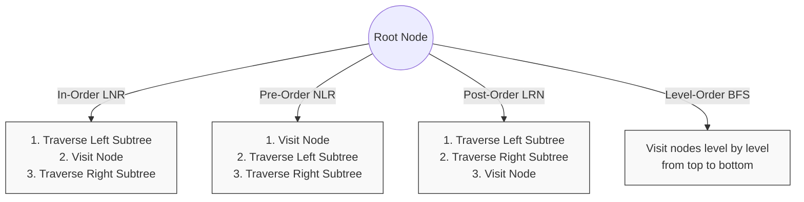

# 🏁 Binary Tree Traversal: Conclusion and Next Steps

Congratulations on reaching the end of our journey through binary tree traversal algorithms! Let's recap what we've learned and explore where to go next.

## Summary of Traversal Methods

We've covered four main traversal techniques:

Each traversal method has its own characteristics and use cases:

| Traversal Method | Key Properties | When to Use |
|------------------|----------------|------------|
| In-Order (LNR) | Visits BST nodes in sorted order | Ordered processing, BST operations |
| Pre-Order (NLR) | Root first, then subtrees | Creating copies, serialization |
| Post-Order (LRN) | Children before parents | Tree deletion, bottom-up calculations |
| Level-Order (BFS) | Level by level, top to bottom | Finding shortest paths, nearest nodes |

## Implementation Approaches

We explored two main approaches to implement tree traversal:

1. **Recursive Approach**:
   - More intuitive and cleaner code
   - Relies on the call stack
   - Potential stack overflow for deep trees

2. **Iterative Approach**:
   - Uses explicit stacks/queues
   - More complex code but more space-efficient
   - Better for very deep trees

## Advanced Techniques

We also explored advanced traversal techniques:

- **Morris Traversal**: O(1) space complexity
- **Zigzag Traversal**: Alternating directions by level
- **Vertical & Diagonal Traversal**: Different ways to group nodes
- **Thread-Safe Traversal**: Using visitor patterns for concurrent access

## Real-World Applications

These traversal methods form the foundation for many practical applications:

- **Database Systems**: B-trees for efficient storage and retrieval
- **Compilers**: Abstract syntax tree (AST) traversal
- **File Systems**: Directory traversal
- **UI Rendering**: DOM tree traversal
- **Network Routing**: Finding optimal paths
- **Artificial Intelligence**: Game trees, decision trees

## Test Your Understanding ✅

Let's see if you can apply the right traversal method to each problem:

1. You need to print a hierarchical document structure with headings and subheadings in order.

**Answer**: Pre-order traversal (NLR) is ideal for hierarchical document structures, as it processes parents before children.

2. You need to compute the total disk space used by each directory, including all subdirectories.

**Answer**: Post-order traversal (LRN) is perfect for this, as you need to calculate sizes of all subdirectories before calculating the parent directory's total size.

3. You need to find the closest common manager of two employees in an organizational chart.

**Answer**: This is a Lowest Common Ancestor (LCA) problem, which uses post-order traversal to find the result.

4. You need to find the shortest path from the root to a specific node in a tree.

**Answer**: Level-order traversal (BFS) is best for finding the shortest path, as it explores nodes closest to the root first.

## Next Steps in Your Learning Journey 🚀

Now that you've mastered binary tree traversal, here are some related topics to explore:

1. **Tree Balancing Algorithms**: AVL trees, Red-Black trees
2. **Trie Data Structures**: For efficient string operations
3. **Segment Trees**: For range queries
4. **Graph Algorithms**: DFS and BFS on general graphs
5. **Advanced Tree Structures**: B-trees, B+ trees, Quad trees
6. **Tree-based Interview Problems**: Practice on platforms like LeetCode

## Final Thoughts 💭

Tree traversal is one of those fundamental algorithms that appears repeatedly in various contexts. By understanding these patterns deeply, you're building a strong foundation for solving many complex problems.

Remember these principles:

- **Choose the right traversal method** for the problem at hand
- **Consider both recursive and iterative implementations** based on constraints
- **Think about space and time complexity** when implementing
- **Look for patterns in problems** that might suggest a specific traversal approach

> [!TIP]
> The art of tree traversal isn't just about memorizing algorithms—it's about understanding the underlying patterns and knowing when to apply each technique.

Binary trees and their traversal methods will continue to be relevant throughout your programming career. Keep practicing, exploring new variations, and applying these techniques to real-world problems.

Happy coding! 🌳✨ 