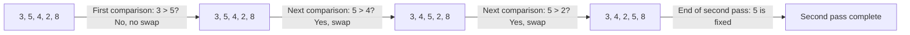

# The Building Blocks of Bubble Sort 🧱

## 🔑 Key Principles

Bubble Sort is built on four simple principles:

1. **Adjacent Comparison** 👥: We examine pairs of adjacent elements and swap them if they're in the wrong order.
2. **Multiple Passes** 🔄: We make multiple passes through the array until it's completely sorted.
3. **Bubbling Effect** ⬆️: Larger elements "bubble up" to their correct positions at the end with each pass.
4. **Completion Check** ✅: We know we're done when we can go through the entire array without making any swaps.

## 🧠 How Does Bubble Sort Think?

The algorithm follows a simple thought process:

> "I'll look at each pair of adjacent elements. If the left one is bigger than the right one, I'll swap them. After going through the whole array once, the largest element will have 'bubbled up' to the end. Then I'll repeat the process, but I won't need to check the last element because it's already in the right place."

## 🔍 Let's Visualize It

Consider this array: `[5, 3, 8, 4, 2]`

Let's watch how bubble sort works through it:

```mermaid
graph LR
    A[5, 3, 8, 4, 2] -->|First comparison: 5 > 3? Yes, swap| B[3, 5, 8, 4, 2]
    B -->|Next comparison: 5 > 8? No, no swap| C[3, 5, 8, 4, 2]
    C -->|Next comparison: 8 > 4? Yes, swap| D[3, 5, 4, 8, 2]
    D -->|Next comparison: 8 > 2? Yes, swap| E[3, 5, 4, 2, 8]
    E -->|End of first pass: 8 is fixed| F[First pass complete]
```

> [!TIP]
> Notice how the largest element (8) "bubbled up" to the end after the first pass. In the next pass, we only need to check up to the second-to-last element.

## 💫 The Magic of Multiple Passes

Each pass through the array guarantees that one more element (the largest among those not yet sorted) moves to its final position at the end.

Let's continue with the next pass on our example

Notice that we don't need to check the last element (8) because it's already in the correct position from the first pass.

## 🤔 Questions to Ponder

* Why do we need fewer comparisons with each pass through the array?
* What happens if the array is already sorted? How many passes would we need?
* Can you trace through the remaining passes for our example array?

> [!WARNING]
> A common mistake is forgetting that after each pass, the largest unsorted element will be in its final position, meaning we can reduce the number of comparisons in each subsequent pass.

In the next lesson, we'll dive deeper into the implementation details and examine the algorithm step by step with code examples. 