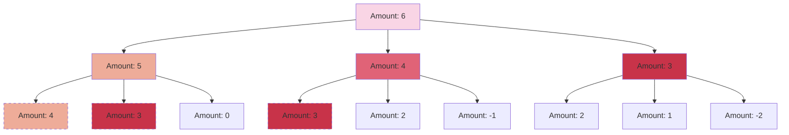

# 🧩 Dynamic Programming Fundamentals

## What is Dynamic Programming?

> [!NOTE]
> Dynamic Programming (DP) is a powerful problem-solving technique that breaks down complex problems into simpler overlapping subproblems and stores their solutions to avoid redundant calculations.

Think of dynamic programming as a smart way to solve problems by:
1. Breaking them into smaller pieces
2. Solving each piece once
3. Remembering the solutions (memoization)
4. Using these solutions to build up to the final answer

## Why Dynamic Programming for Coin Change?

The Coin Change problem is perfectly suited for dynamic programming because:

### 1. Optimal Substructure ✅

The solution to the overall problem can be constructed from optimal solutions of its subproblems.

For example, if we know the minimum coins needed for amount 7, and we have a coin of value 5, then we can use that to help find the solution for amount 12 (7 + 5).

### 2. Overlapping Subproblems ✅

We end up solving the same subproblems multiple times if we use a naive recursive approach.

In this diagram, notice how `Amount: 3` and `Amount: 4` appear multiple times. Dynamic programming helps us calculate these values just once!

## Two Main Approaches to Dynamic Programming

### 1. Top-Down Approach (Memoization)

This approach starts with the original problem and breaks it down into subproblems:

- We use recursion to solve the problem
- We store (memoize) the results of subproblems
- Before calculating any subproblem, we check if we've already solved it

> [!TIP]
> Think of memoization as a dictionary where we write down answers as we find them. When we encounter the same question again, we just look up the answer!

### 2. Bottom-Up Approach (Tabulation)

This approach starts by solving the smallest subproblems first:

- We create a table (typically an array) to store solutions
- We fill the table iteratively, starting from the base case
- Each cell in the table represents the solution to a subproblem
- We build up to the final solution

> [!TIP]
> Imagine building a staircase. You must first lay the bottom steps before you can build the higher ones. Similarly, in bottom-up DP, we solve smaller subproblems before larger ones.

## For the Coin Change Problem

Let's define what our subproblems are:

- Let `dp[i]` = minimum number of coins needed to make amount `i`
- Our goal is to find `dp[amount]`

### Key Insights:

What is our base case?

`dp[0] = 0` - It takes 0 coins to make an amount of 0.

How do we build up to larger amounts?

For each amount `i` and each coin value `coin`:
- If `i - coin >= 0`, we can use this coin
- The number of coins would be: `dp[i - coin] + 1`
- We want the minimum number of coins, so: `dp[i] = min(dp[i], dp[i - coin] + 1)`

## Visualizing the Process

Let's see how this works with a simple example:
- Coins: `[1, 2, 5]`
- Amount: `11`

We'll create a table `dp` where `dp[i]` represents the minimum coins needed for amount `i`:

| Amount | 0 | 1 | 2 | 3 | 4 | 5 | 6 | 7 | 8 | 9 | 10 | 11 |
|--------|---|---|---|---|---|---|---|---|---|---|----|----| 
| Coins  | 0 | ? | ? | ? | ? | ? | ? | ? | ? | ? | ?  | ?  |

> [!TIP]
> In the next lesson, we'll fill this table step by step and see exactly how the DP solution works!

## Key Takeaways

- 🔑 Dynamic Programming helps us solve complex problems by breaking them down into simpler subproblems
- 🧠 The two main approaches are Top-Down (memoization) and Bottom-Up (tabulation)
- 🪙 For Coin Change, we define `dp[i]` as the minimum coins needed for amount `i`
- 📝 We can build our solution iteratively by considering each coin for each amount

In the next lesson, we'll walk through a step-by-step solution using the bottom-up approach! 