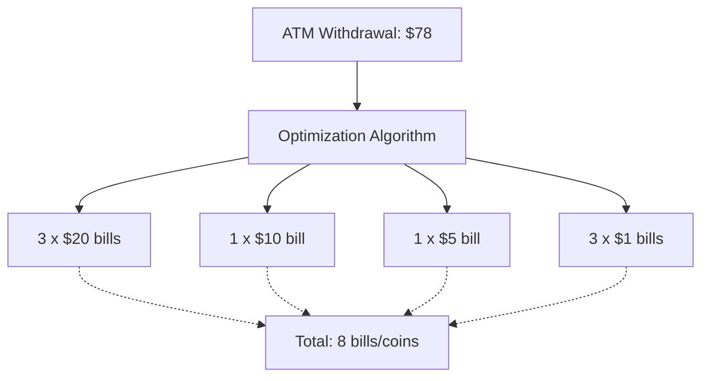

# 🌍 Real-World Applications and Optimizations

## Beyond the Algorithm: Where Coin Change is Used

The Coin Change algorithm isn't just a theoretical exercise—it has numerous practical applications in the real world.

> [!NOTE]
> The principles behind the Coin Change algorithm apply to many resource allocation and optimization problems beyond actual currency.

## Real-World Applications

### 1. Financial Systems 💰

- **ATMs and Cash Dispensers**: Determines the optimal way to dispense cash with the fewest bills/coins
- **Payment Processing**: Calculates the minimum number of electronic transactions needed
- **E-commerce Platforms**: Optimizes payment methods for online transactions



### 2. Resource Allocation 📊

- **Cloud Computing**: Minimizing the number of servers needed to handle tasks
- **Job Scheduling**: Allocating tasks to processors with minimal context switches
- **Memory Management**: Optimizing allocation of memory blocks

### 3. Transportation and Logistics 🚚

- **Package Delivery**: Determining the minimum number of vehicles needed
- **Inventory Management**: Optimizing distribution of items across warehouses
- **Shipping Containers**: Filling containers with minimal wasted space

### 4. Game Development 🎮

- **In-game Currency Systems**: Trading and exchange mechanisms
- **Resource Management Games**: Optimizing resource allocation
- **Achievement Systems**: Calculating minimum moves to complete objectives

## Variations of the Coin Change Problem

### 1. Coin Change 2: Counting Ways

Instead of finding the minimum number of coins, this variation asks for the total number of different ways to make the amount.

```javascript
function coinChange2(coins, amount) {
  const dp = new Array(amount + 1).fill(0);
  dp[0] = 1; // There's one way to make amount 0 (using no coins)
  
  // For each coin, update the ways to make each amount
  for (const coin of coins) {
    for (let i = coin; i <= amount; i++) {
      dp[i] += dp[i - coin];
    }
  }
  
  return dp[amount];
}
```

> [!TIP]
> Notice how the order of the loops is different from our original algorithm! This is because we want to count each combination only once.

### 2. Minimum Number of Specific Coins

In some scenarios, we need to return not just the minimum number of coins but also which specific coins to use.

```javascript
function coinChangeWithCoins(coins, amount) {
  const dp = new Array(amount + 1).fill(Infinity);
  const coinUsed = new Array(amount + 1).fill(-1);
  dp[0] = 0;
  
  for (let i = 1; i <= amount; i++) {
    for (let j = 0; j < coins.length; j++) {
      const coin = coins[j];
      if (i - coin >= 0 && dp[i - coin] + 1 < dp[i]) {
        dp[i] = dp[i - coin] + 1;
        coinUsed[i] = j; // Store the index of the coin used
      }
    }
  }
  
  // If no solution exists
  if (dp[amount] === Infinity) return { count: -1, coins: [] };
  
  // Reconstruct the solution
  const result = [];
  let remaining = amount;
  while (remaining > 0) {
    const coinIndex = coinUsed[remaining];
    result.push(coins[coinIndex]);
    remaining -= coins[coinIndex];
  }
  
  return { count: dp[amount], coins: result };
}
```

### 3. Constrained Coin Change

In real-world scenarios, we might have a limited supply of each coin denomination.

```javascript
function constrainedCoinChange(coins, amounts, target) {
  // coins: array of coin denominations
  // amounts: array of available quantities for each coin
  // target: target amount
  
  const dp = new Array(target + 1).fill(Infinity);
  dp[0] = 0;
  
  for (let i = 0; i < coins.length; i++) {
    const coin = coins[i];
    const quantity = amounts[i];
    
    // Use at most 'quantity' of this coin
    for (let a = target; a >= 0; a--) {
      for (let q = 1; q <= quantity && a - q * coin >= 0; q++) {
        dp[a] = Math.min(dp[a], dp[a - q * coin] + q);
      }
    }
  }
  
  return dp[target] === Infinity ? -1 : dp[target];
}
```

## Optimizations for the Coin Change Algorithm

### 1. Early Termination

We can exit early if we find a direct match with a single coin:

```javascript
function coinChange(coins, amount) {
  if (amount === 0) return 0;
  
  // Sort coins in descending order for this optimization
  coins.sort((a, b) => b - a);
  
  // Early termination: Check if amount is directly achievable with one coin
  if (coins.includes(amount)) return 1;
  
  // Proceed with standard dynamic programming
  const dp = new Array(amount + 1).fill(Infinity);
  dp[0] = 0;
  
  // Rest of the algorithm...
}
```

### 2. Pruning Invalid Combinations

If we know certain combinations will never be optimal, we can prune them:

```javascript
function coinChange(coins, amount) {
  // Remove coins larger than the amount
  coins = coins.filter(coin => coin <= amount);
  
  // Sort coins in descending order (can improve performance in some cases)
  coins.sort((a, b) => b - a);
  
  // Rest of the algorithm...
}
```

### 3. Bidirectional Search

For very large amounts, we can use a bidirectional approach:

```javascript
function coinChangeBidirectional(coins, amount) {
  if (amount === 0) return 0;
  
  // Pre-sort coins
  coins.sort((a, b) => a - b);
  
  // Basic case
  if (coins.includes(amount)) return 1;
  
  // Use BFS from both ends
  const forwardQueue = new Map();
  const backwardQueue = new Map();
  
  forwardQueue.set(0, 0);  // (amount, coins used)
  backwardQueue.set(amount, 0);
  
  const forwardVisited = new Set([0]);
  const backwardVisited = new Set([amount]);
  
  let steps = 1;
  
  while (forwardQueue.size > 0 && backwardQueue.size > 0) {
    // Expand the smaller frontier
    if (forwardQueue.size <= backwardQueue.size) {
      const result = expandFrontier(forwardQueue, forwardVisited, backwardVisited, coins, 1, amount);
      if (result !== -1) return steps + result;
    } else {
      const result = expandFrontier(backwardQueue, backwardVisited, forwardVisited, coins, -1, amount);
      if (result !== -1) return steps + result;
    }
    
    steps++;
  }
  
  return -1;
}

function expandFrontier(queue, visited, otherVisited, coins, direction, target) {
  const nextLevel = new Map();
  
  for (const [curr, steps] of queue.entries()) {
    for (const coin of coins) {
      const next = curr + direction * coin;
      
      // Check if next point is valid
      if (next < 0 || next > target) continue;
      
      // Check if we found an intersection with the other frontier
      if (otherVisited.has(next)) {
        return steps + 1;
      }
      
      // Add to next level if not visited
      if (!visited.has(next)) {
        visited.add(next);
        nextLevel.set(next, steps + 1);
      }
    }
  }
  
  // Replace queue with next level
  queue.clear();
  for (const [k, v] of nextLevel.entries()) {
    queue.set(k, v);
  }
  
  return -1;
}
```

> [!WARNING]
> This bidirectional approach can be significantly faster for specific inputs but adds implementation complexity.

## Common Pitfalls and How to Avoid Them

### 1. Forgetting Base Cases ⚠️

```javascript
// Incorrect: Missing base case
function badCoinChange(coins, amount) {
  const dp = new Array(amount + 1).fill(Infinity);
  // Missing dp[0] = 0
  
  // Rest of the algorithm...
}

// Correct: Include base case
function goodCoinChange(coins, amount) {
  const dp = new Array(amount + 1).fill(Infinity);
  dp[0] = 0; // Base case
  
  // Rest of the algorithm...
}
```

### 2. Mishandling Infinity Values ⚠️

```javascript
// Incorrect: Wrong check for Infinity
function badCoinChange(coins, amount) {
  // ...
  return dp[amount] > 10000 ? -1 : dp[amount]; // Arbitrary large value
}

// Correct: Proper check for Infinity
function goodCoinChange(coins, amount) {
  // ...
  return dp[amount] === Infinity ? -1 : dp[amount];
}
```

### 3. Off-by-One Errors ⚠️

```javascript
// Incorrect: Wrong array size
function badCoinChange(coins, amount) {
  const dp = new Array(amount).fill(Infinity); // Missing one slot
  dp[0] = 0;
  
  for (let i = 1; i < amount; i++) { // Wrong upper bound
    // ...
  }
}

// Correct: Proper array size and loop bounds
function goodCoinChange(coins, amount) {
  const dp = new Array(amount + 1).fill(Infinity); // Correct size
  dp[0] = 0;
  
  for (let i = 1; i <= amount; i++) { // Correct upper bound
    // ...
  }
}
```

## Key Takeaways

- 🔑 The Coin Change algorithm has numerous real-world applications beyond handling actual currency
- 🧩 Various modifications of the problem exist to handle different constraints and requirements
- ⚡ Optimization techniques can significantly improve performance for specific inputs
- ⚠️ Watch out for common pitfalls like missing base cases and off-by-one errors
- 💡 Understanding the core dynamic programming principle allows you to adapt this algorithm to many different scenarios

In the next and final lesson, we'll walk through a comprehensive conclusion and summary of everything we've learned about the Coin Change algorithm! 