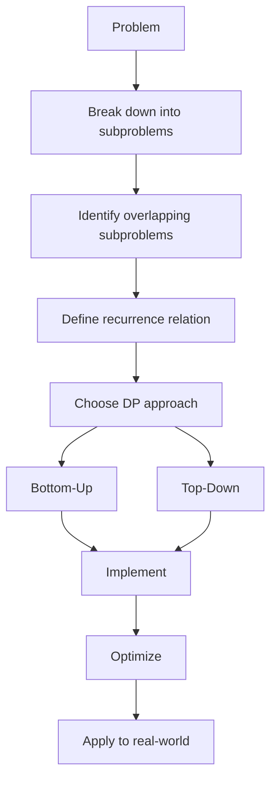

# 🎓 Conclusion: Mastering the Coin Change Algorithm

## Journey Review

Congratulations! You've completed an in-depth exploration of the Coin Change algorithm. Let's review what we've learned:

> [!NOTE]
> The Coin Change problem is a perfect example of how dynamic programming can elegantly solve complex optimization problems.

## Key Concepts Covered

### 1. Problem Understanding 📚

- **The Challenge**: Find the minimum number of coins needed to make up a given amount
- **Constraints**: Unlimited supply of each coin denomination
- **Output**: Minimum number of coins or -1 if not possible

### 2. Dynamic Programming Foundations 🧩

- **Optimal Substructure**: The solution to the original problem can be built from solutions to its subproblems
- **Overlapping Subproblems**: The same subproblems are solved multiple times, making dynamic programming efficient
- **State Definition**: `dp[i]` = minimum number of coins needed to make amount `i`
- **Base Case**: `dp[0] = 0` (it takes 0 coins to make amount 0)

### 3. Solution Approaches 🛠️

- **Bottom-Up (Tabulation)**:
  - Iterative approach
  - Builds from smaller to larger subproblems
  - Often more efficient for this problem
  
- **Top-Down (Memoization)**:
  - Recursive approach with caching
  - Starts from the main problem and breaks it down
  - More intuitive for some developers

### 4. Optimizations and Variations 🚀

- **Early Termination**: Checking if the amount matches a coin denomination
- **Pruning**: Removing unnecessary coin denominations
- **Bidirectional Search**: Approaching the problem from both ends
- **Variations**: Counting ways, tracking specific coins, handling limited coin supplies

### 5. Real-World Applications 🌎

- Financial systems
- Resource allocation
- Transportation and logistics
- Game development

## The Big Picture

The Coin Change algorithm illustrates several important concepts in computer science:

## Complexity Analysis Revisited

- **Time Complexity**: O(amount × n), where n is the number of coin denominations
  - We need to consider each coin for each amount from 1 to the target
  
- **Space Complexity**: O(amount)
  - We need to store the solution for each amount from 0 to the target

## Common Pitfalls Revisited ⚠️

1. Forgetting to initialize the base case (`dp[0] = 0`)
2. Using the wrong array size (off-by-one errors)
3. Attempting a greedy approach (doesn't always work)
4. Mishandling the "impossible" case

## Interview Tips 💼

If you encounter the Coin Change problem in an interview:

1. **Start by recognizing** that this is a classic dynamic programming problem
2. **Clarify constraints** (infinite supply of coins? can we use each coin multiple times?)
3. **Explain your approach** before coding (bottom-up or top-down)
4. **Walk through a small example** to illustrate your understanding
5. **Discuss complexity** (time and space)
6. **Consider optimizations** if time permits

## Beyond Coin Change

The principles you've learned apply to many other dynamic programming problems:

- **Knapsack Problems**: Selecting items with maximum value under weight constraints
- **Rod Cutting**: Cutting a rod to maximize profit
- **Edit Distance**: Transforming one string to another with minimum operations
- **Longest Common Subsequence**: Finding the longest subsequence present in two sequences

## Final Thoughts 💭

The Coin Change problem teaches us that:

- Complex problems can often be broken down into simpler subproblems
- Storing and reusing solutions can dramatically improve efficiency
- There's usually more than one way to approach a problem
- Understanding the theoretical foundation helps in practical applications

> [!TIP]
> The best way to master this algorithm is through practice. Try implementing both approaches and tackle variations of the problem!

## What's Next?

Now that you understand the Coin Change algorithm:

- **Practice** with different coin denominations and amounts
- **Implement** the algorithm in your preferred programming language
- **Explore** related problems like Coin Change 2 (counting ways)
- **Apply** the concepts to solve similar optimization problems
- **Extend** your knowledge to more complex dynamic programming challenges

Remember, mastering algorithms is a journey—each problem you solve builds a stronger foundation for tackling the next challenge. Keep exploring, coding, and learning!

## 🎯 Challenge Yourself

Before you go, here are some challenges to test your understanding:

Challenge 1: What if we have exactly k coins?

Modify the Coin Change algorithm to find the maximum amount you can make using exactly k coins.

Hint: Define `dp[i][j]` as the maximum amount that can be made using exactly i coins from the first j denominations.

Challenge 2: Coin Change with fees

What if there's a fixed transaction fee every time you use a specific coin?

Modify the algorithm to account for a fee array where `fees[i]` is the cost to use `coins[i]`.

Challenge 3: Optimize for space

Can you optimize the bottom-up approach to use O(max(coins)) space instead of O(amount)?

Hint: Think about which previous values you actually need at each step.

Good luck with your algorithmic journey! 🚀 