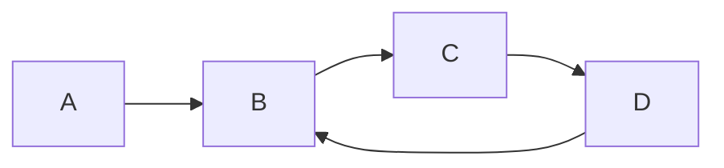

# What are Cycles and Why Do They Matter? 🔄

> [!NOTE]
> A cycle in a data structure occurs when there's a path that starts at a node and, by following pointers or edges, returns to that same node.

## 🧩 The Problem

Imagine you're walking through a maze. If you keep walking and suddenly find yourself back at a spot you've already visited, you've encountered a cycle! In computer science, detecting such cycles is incredibly important and appears in many different contexts.

Given a data structure (like a graph, linked list, or sequence), your task is to determine if it contains any cycles.

Real-world examples of cycles

- 🖥️ **Deadlocks in operating systems**: Programs waiting for resources in a circular manner
- 🌐 **Network routing loops**: Data packets circling endlessly in a network
- 💾 **Memory leaks**: Objects referencing each other circularly, preventing garbage collection
- 📊 **Circular dependencies**: Modules or classes that depend on each other in a loop

## 🎯 Cycle Detection Scenarios

### 1. Directed Graphs

In a graph with vertices and directed edges, a cycle exists when you can start at a vertex and follow a path that leads back to the same vertex.

> [!TIP]
> In the above graph, can you trace the cycle? Start at B and see if you can return to it by following the arrows!

### 2. Linked Lists

A linked list has a cycle if, by following the next pointers, you eventually return to a previously visited node.

### 3. Function Iteration

Given a function *f* and a starting value *x*, a cycle exists in the sequence *x, f(x), f(f(x)), ...* if the same value appears multiple times.

## 🤔 Why is Cycle Detection Important?

Cycles can be:
- ✅ **Desirable** in some cases (like circular buffers or round-robin scheduling)
- ❌ **Problematic** in others (like deadlocks or infinite loops)

Detecting cycles allows us to:
1. Prevent infinite loops
2. Identify potential deadlocks
3. Optimize algorithms by avoiding redundant computations
4. Verify correctness in certain applications

## 🧠 Think About It

Before we dive into solutions, consider:

1. How would you detect a cycle in a linked list if you could modify the list?
2. What if you couldn't modify the structure?
3. How might detecting cycles differ between directed and undirected graphs?

> [!TIP]
> The key intuition behind many cycle detection algorithms is: if you're following a path and revisit a node, you've found a cycle!

In the next section, we'll explore different approaches to solve this fundamental problem. 