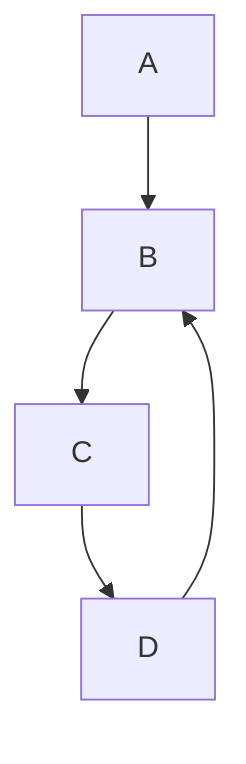

# The Naive Approach: Mark and Check 🔍

One of the most intuitive ways to detect cycles is to keep track of what we've already seen. Let's explore this approach before diving into more optimized algorithms.

## 🧪 Basic Idea

The concept is simple:
1. As we traverse the data structure, we mark or remember each element we visit
2. If we encounter an element we've already seen, we've found a cycle!

## 💡 Implementation Strategies

### Using a Set or Hash Table

The most straightforward implementation uses a set (or hash table) to track visited elements:

```javascript
function hasCycleUsingSet(head) {
  // Create a set to track visited nodes
  const visited = new Set();
  
  // Start from the head node
  let current = head;
  
  // Traverse the structure
  while (current) {
    // Check if we've seen this node before
    if (visited.has(current)) {
      return true; // Cycle detected!
    }
    
    // Mark this node as visited
    visited.add(current);
    
    // Move to the next node
    current = current.next;
  }
  
  // If we've reached the end, there's no cycle
  return false;
}
```

> [!NOTE]
> This approach works for both linked lists and graphs. For graphs, you'd need to adapt the traversal method (using BFS or DFS).

## 📊 Complexity Analysis

- **Time Complexity**: O(n) - We visit each node at most once
- **Space Complexity**: O(n) - In the worst case, we store all nodes in our set

## 🎭 Strengths and Weaknesses

### Strengths ✅
- Simple to understand and implement
- Works well for many data structures
- Can identify the exact node where the cycle begins

### Weaknesses ❌
- Uses O(n) extra space
- May not be feasible for memory-constrained environments
- For very large data structures, managing the set could become inefficient

## 🧪 Let's Test It!

Consider a linked list with nodes 1 → 2 → 3 → 4 → 2 (cycles back to 2):

<details>
<summary>Trace through the algorithm step by step</summary>

1. Create an empty visited set: `{}`
2. Start with node 1:
   - Is 1 in visited? No
   - Add 1 to visited: `{1}`
   - Move to node 2
3. At node 2:
   - Is 2 in visited? No
   - Add 2 to visited: `{1, 2}`
   - Move to node 3
4. At node 3:
   - Is 3 in visited? No
   - Add 3 to visited: `{1, 2, 3}`
   - Move to node 4
5. At node 4:
   - Is 4 in visited? No
   - Add 4 to visited: `{1, 2, 3, 4}`
   - Move to node 2
6. At node 2 (again):
   - Is 2 in visited? Yes!
   - Return true - cycle detected

</details>

## 🧠 Think Deeper

- How would you modify this approach to not just detect a cycle, but also find the start of the cycle?
- Can you think of scenarios where this approach might fail or be impractical?
- What if the elements in your data structure aren't comparable or hashable?

> [!TIP]
> While the set-based approach works well for many scenarios, in the next lesson we'll see how we can detect cycles using constant space – a major improvement for memory-constrained environments!

## 🚀 Challenge

Before moving on, try implementing this approach for a directed graph. How would you adapt the algorithm to handle graph traversal instead of linked list traversal?



In our next lesson, we'll explore Floyd's Cycle Detection Algorithm, also known as "Tortoise and Hare" - a brilliant technique that uses only constant extra space! 