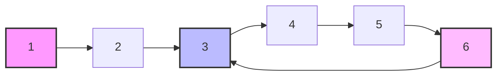
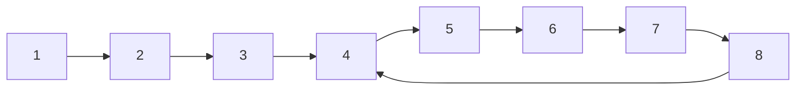

# Floyd's Cycle Detection: The Tortoise and the Hare 🐢🐇

What if we could detect cycles without using any extra space? That's where Floyd's Cycle Detection Algorithm, also known as "Tortoise and Hare," comes in. It's an elegant and space-efficient solution that relies on a simple yet powerful insight.

## 🧩 The Brilliant Insight

Imagine two runners on a circular track:
- A slow runner (the tortoise) who moves one step at a time
- A fast runner (the hare) who moves two steps at a time

If they both start at the same position and there's a circle, the faster runner will eventually catch up to (or lap) the slower runner!

> [!NOTE]
> This is the key insight: in a cycle, a faster pointer will eventually meet a slower pointer.

## 🎮 The Algorithm

1. Initialize two pointers, `slow` (tortoise) and `fast` (hare), both starting at the head
2. Move `slow` one step at a time and `fast` two steps at a time
3. If there's no cycle, `fast` will reach the end (null)
4. If there's a cycle, `fast` will eventually meet `slow` somewhere in the cycle

```javascript
function hasCycle(head) {
  if (!head || !head.next) return false;
  
  let slow = head;
  let fast = head;
  
  while (fast && fast.next) {
    slow = slow.next;         // Move one step
    fast = fast.next.next;    // Move two steps
    
    if (slow === fast) {
      return true;  // Cycle detected!
    }
  }
  
  return false;  // No cycle found
}
```

## 📺 Visualization

Let's visualize how this algorithm works on a linked list with a cycle:



<details>
<summary>Step-by-step execution</summary>

Initial state:
- Both `slow` and `fast` start at node 1

Step 1:
- `slow` moves to node 2
- `fast` moves to node 3
- They haven't met yet

Step 2:
- `slow` moves to node 3
- `fast` moves to node 5
- They haven't met yet

Step 3:
- `slow` moves to node 4
- `fast` moves to node 3
- They haven't met yet

Step 4:
- `slow` moves to node 5
- `fast` moves to node 5
- They meet at node 5! Cycle detected!

</details>

## 🧮 Mathematical Proof (Optional)

<details>
<summary>Why does this algorithm work?</summary>

Let's denote:
- μ (mu) = distance to the start of the cycle
- λ (lambda) = length of the cycle

When the tortoise enters the cycle, the hare is already inside the cycle.

The tortoise moves 1 step at a time, so after t steps, it's at position t.
The hare moves 2 steps at a time, so after t steps, it's at position 2t.

When they meet, they've traveled the same distance modulo λ (the cycle length).
This means: t ≡ 2t (mod λ), which simplifies to t ≡ 0 (mod λ).

Therefore, they meet after traveling a multiple of the cycle length!

</details>

## 📊 Complexity Analysis

- **Time Complexity**: O(n) - In the worst case, we might need to traverse the entire linked list
- **Space Complexity**: O(1) - We only use two pointers, regardless of the input size

## 🧠 Finding the Start of the Cycle

The algorithm above only tells us if a cycle exists. What if we want to find where the cycle begins?

<details>
<summary>Floyd's cycle detection can be extended to find the start of the cycle!</summary>

After detecting a cycle (when `slow` and `fast` meet):
1. Reset one pointer to the head (let's use `fast`)
2. Keep the other pointer at the meeting point
3. Move both pointers one step at a time
4. The point where they meet again is the start of the cycle!

```javascript
function detectCycleStart(head) {
  if (!head || !head.next) return null;
  
  let slow = head;
  let fast = head;
  
  // First phase: detect cycle
  while (fast && fast.next) {
    slow = slow.next;
    fast = fast.next.next;
    
    if (slow === fast) {
      // Cycle detected, enter second phase
      fast = head;
      while (slow !== fast) {
        slow = slow.next;
        fast = fast.next;
      }
      return slow; // This is the start of the cycle
    }
  }
  
  return null; // No cycle found
}
```

The mathematics behind this is fascinating - when they meet the first time, the distance from that meeting point to the cycle start is exactly the same as the distance from the head to the cycle start!

</details>

## 🎭 Strengths and Weaknesses

### Strengths ✅
- Uses constant O(1) extra space
- Simple to implement
- Works reliably for linked data structures

### Weaknesses ❌
- Only applicable to linked data structures where you can have pointers moving at different speeds
- Can be harder to understand intuitively why it works
- Doesn't work directly for arbitrary graphs (without modifications)

## 🚀 Challenge

Given this linked list with a cycle, trace through the Tortoise and Hare algorithm and determine where they will meet:



> [!TIP]
> Try working it out step by step, tracking where each pointer is after each iteration!

In our next lesson, we'll explore how to apply cycle detection algorithms to graphs using depth-first search (DFS). 