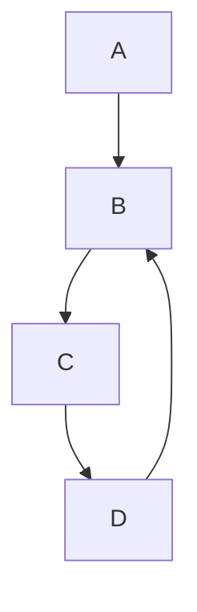
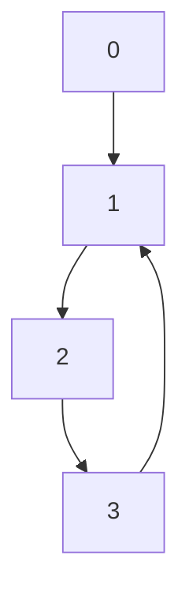
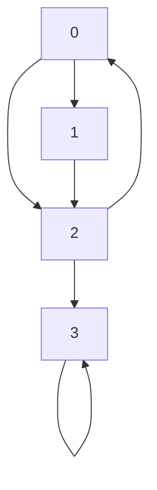

# Cycle Detection in Graphs: The DFS Approach 🕸️

So far, we've focused primarily on cycle detection in linked lists. But what about graphs? Detecting cycles in graphs is equally important and requires a slightly different approach.

## 🔍 Understanding Graph Cycles

A cycle in a graph is a path that starts and ends at the same vertex, with no repeated edges or vertices (except the start/end vertex).



> [!NOTE]
> In the graph above, B → C → D → B forms a cycle.

## 🧪 The DFS Approach

Depth-First Search (DFS) is a natural fit for cycle detection in graphs. The key idea is to keep track of vertices in the current recursion stack (or path).

### For Directed Graphs

```javascript
function hasCycleInDirectedGraph(graph) {
  const n = graph.length;
  
  // Track all visited vertices
  const visited = new Array(n).fill(false);
  
  // Track vertices in the current recursion path
  const inRecursion = new Array(n).fill(false);
  
  for (let i = 0; i < n; i++) {
    if (!visited[i] && dfsDetectCycle(i)) {
      return true;
    }
  }
  
  return false;
  
  function dfsDetectCycle(vertex) {
    // Mark current vertex as visited and part of recursion stack
    visited[vertex] = true;
    inRecursion[vertex] = true;
    
    // Check all neighbors
    for (const neighbor of graph[vertex]) {
      // If not visited, recursively check for cycles
      if (!visited[neighbor]) {
        if (dfsDetectCycle(neighbor)) {
          return true;
        }
      } 
      // If neighbor is in recursion stack, we found a cycle
      else if (inRecursion[neighbor]) {
        return true;
      }
    }
    
    // Remove vertex from recursion stack before returning
    inRecursion[vertex] = false;
    return false;
  }
}
```

## 🎬 How It Works

1. We use two arrays:
   - `visited[]` tracks all vertices we've seen
   - `inRecursion[]` tracks vertices in the current path

2. For each unvisited vertex, we start a DFS traversal

3. During traversal:
   - Mark the current vertex as visited and in the recursion stack
   - Explore all its neighbors
   - If a neighbor is already in the recursion stack, we found a cycle
   - After exploring all neighbors, remove the vertex from the recursion stack

## 💻 Visualization: DFS Traversal

Let's trace through a simple example:



<details>
<summary>Step-by-step execution</summary>

Start at vertex 0:
- Mark 0 as visited and in recursion: visited=[T,F,F,F], inRecursion=[T,F,F,F]
- Explore neighbor 1
  - Mark 1 as visited and in recursion: visited=[T,T,F,F], inRecursion=[T,T,F,F]
  - Explore neighbor 2
    - Mark 2 as visited and in recursion: visited=[T,T,T,F], inRecursion=[T,T,T,F]
    - Explore neighbor 3
      - Mark 3 as visited and in recursion: visited=[T,T,T,T], inRecursion=[T,T,T,T]
      - Explore neighbor 1
        - 1 is already visited AND in recursion! Cycle detected!

</details>

## 🧮 Handling Undirected Graphs

For undirected graphs, the approach is similar but with a key difference: we need to avoid treating the edge back to the parent as a cycle.

```javascript
function hasCycleInUndirectedGraph(graph) {
  const n = graph.length;
  const visited = new Array(n).fill(false);
  
  for (let i = 0; i < n; i++) {
    if (!visited[i] && dfsDetectCycle(i, -1)) {
      return true;
    }
  }
  
  return false;
  
  function dfsDetectCycle(vertex, parent) {
    visited[vertex] = true;
    
    for (const neighbor of graph[vertex]) {
      // If neighbor not visited, recursively check
      if (!visited[neighbor]) {
        if (dfsDetectCycle(neighbor, vertex)) {
          return true;
        }
      } 
      // If neighbor is visited and NOT the parent, cycle found
      else if (neighbor !== parent) {
        return true;
      }
    }
    
    return false;
  }
}
```

> [!WARNING]
> In undirected graphs, every edge creates a trivial "cycle" back to the parent. We must explicitly check that a visited neighbor isn't just the parent.

## 📊 Complexity Analysis

- **Time Complexity**: O(V + E) - We explore each vertex and each edge once
- **Space Complexity**: O(V) - For the recursion stack and visited arrays

## 🎭 Iterative Implementation

While the recursive approach is elegant, we can also implement this iteratively using an explicit stack:

<details>
<summary>Iterative DFS for Cycle Detection</summary>

```javascript
function hasCycleIterative(graph) {
  const n = graph.length;
  const visited = new Array(n).fill(false);
  const inStack = new Array(n).fill(false);
  
  for (let i = 0; i < n; i++) {
    if (visited[i]) continue;
    
    const stack = [i];
    inStack[i] = true;
    visited[i] = true;
    
    while (stack.length > 0) {
      const current = stack[stack.length - 1]; // Peek
      
      let allNeighborsProcessed = true;
      
      for (const neighbor of graph[current]) {
        if (!visited[neighbor]) {
          // Found unvisited neighbor
          visited[neighbor] = true;
          stack.push(neighbor);
          inStack[neighbor] = true;
          allNeighborsProcessed = false;
          break;
        } else if (inStack[neighbor]) {
          // Found cycle
          return true;
        }
      }
      
      if (allNeighborsProcessed) {
        // Remove from recursion stack
        inStack[stack.pop()] = false;
      }
    }
  }
  
  return false;
}
```

This approach mimics the recursive process using an explicit stack, which can be helpful in languages with limited recursion depth.

</details>

## 🧠 Think Deeper

- How would you modify the algorithm to not just detect cycles, but list all cycles in a graph?
- How does the approach change for weighted graphs? Does it affect cycle detection?
- Can you think of real-world applications where detecting cycles in graphs is crucial?

## 🚀 Challenge

Consider the following directed graph:



1. How many cycles does this graph contain?
2. Trace through the DFS algorithm to identify these cycles.
3. Which vertices would be marked as part of a recursion stack when a cycle is detected?

> [!TIP]
> Look for both self-loops and longer cycles in the graph. A self-loop is when a vertex has an edge to itself.

In our next lesson, we'll explore Brent's algorithm - another space-efficient approach to cycle detection! 