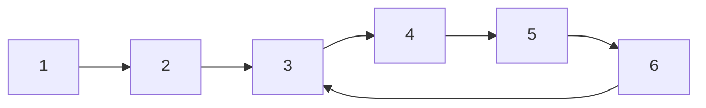

# Advanced Cycle Detection: Brent's Algorithm 🚀

So far, we've explored Floyd's "Tortoise and Hare" algorithm and DFS-based approaches for cycle detection. Now let's dive into a more efficient alternative: Brent's algorithm.

## 🧩 The Limitations of Floyd's Algorithm

While Floyd's algorithm is elegant and uses constant space, it has a potential inefficiency: both pointers (slow and fast) might spend a lot of time "chasing" each other around the cycle before meeting.

> [!NOTE]
> Brent's algorithm addresses this inefficiency by using a power-of-two-based approach to reduce the number of iterations needed to detect a cycle.

## 🚀 Introducing Brent's Algorithm

Brent's algorithm uses two pointers like Floyd's algorithm, but it moves them differently:
- One pointer stays at a fixed position
- The other pointer moves ahead by increasing power-of-two steps

When the moving pointer matches the stationary one, we've detected a cycle!

```javascript
function hasCycleBrent(head) {
  if (!head || !head.next) return false;
  
  let tortoise = head;
  let hare = head.next;
  
  // Power of 2 step counter
  let power = 1;
  let steps = 1;
  
  // Loop until we find a cycle or reach the end
  while (hare !== tortoise) {
    // End of list reached, no cycle
    if (!hare || !hare.next) return false;
    
    // Move hare forward
    hare = hare.next;
    steps++;
    
    // If we've taken 2^power steps, update tortoise and reset step count
    if (power === steps) {
      tortoise = hare;
      power *= 2;
      steps = 0;
    }
  }
  
  return true; // Cycle detected
}
```

## 🧮 How It Works

Brent's approach works in a clever way:

1. The tortoise is initially at the head, and the hare is one step ahead
2. The hare moves forward one step at a time
3. After moving the hare 2^power steps, we:
   - Move the tortoise to the hare's position
   - Double the power value
   - Reset the step counter
4. If at any point the hare equals the tortoise, we've found a cycle
5. If the hare reaches null, there's no cycle

This approach ensures that we don't waste time making the tortoise "chase" the hare around the entire cycle.

## 📺 Visualization

Let's visualize Brent's algorithm on a linked list with a cycle:



<details>
<summary>Step-by-step execution</summary>

Initial state:
- tortoise = node 1, hare = node 2
- power = 1, steps = 1

Step 1 (power = 1, steps = 1):
- power = steps, so move tortoise to node 2
- power *= 2 (now power = 2), steps = 0

Step 2 (power = 2, steps = 1):
- hare moves to node 3
- steps = 1 < power, so continue

Step 3 (power = 2, steps = 2):
- hare moves to node 4
- power = steps, so move tortoise to node 4
- power *= 2 (now power = 4), steps = 0

Step 4-7 (steps 1-4 of power = 4):
- hare moves through nodes 5, 6, 3, 4
- At step 7, hare = node 4 = tortoise
- Cycle detected!

</details>

## 📊 Complexity Analysis

- **Time Complexity**: O(λ + μ) where λ is the cycle length and μ is the distance to the cycle
  - This is often better than Floyd's O(λ + μ) in practice because we don't need to go around the entire cycle
- **Space Complexity**: O(1) - Only two pointers, regardless of input size

## 🏆 Comparing the Algorithms

| Algorithm | Time Complexity | Space Complexity | Strengths | Weaknesses |
|-----------|----------------|------------------|-----------|------------|
| Hash Set | O(n) | O(n) | Simple, can find cycle start | Higher space usage |
| Floyd's | O(λ + μ) | O(1) | Space efficient | May require many iterations |
| Brent's | O(λ + μ) | O(1) | Often faster than Floyd's | More complex implementation |
| DFS | O(V + E) | O(V) | Works on general graphs | Higher space usage |

> [!TIP]
> Choose your algorithm based on your constraints:
> - Limited memory? Consider Floyd's or Brent's
> - Need to know where cycle starts? Use Floyd's or Hash Set
> - Working with general graphs? Use DFS
> - Performance is critical? Brent's might be best

## 🧮 Finding the Cycle Length with Brent's Algorithm

<details>
<summary>We can extend Brent's algorithm to find the cycle length</summary>

```javascript
function findCycleLength(head) {
  if (!head || !head.next) return 0;
  
  let tortoise = head;
  let hare = head;
  let power = 1;
  let steps = 1;
  
  // First phase: detect cycle
  while (hare.next && hare.next.next) {
    hare = hare.next;
    steps++;
    
    if (power === steps) {
      tortoise = hare;
      power *= 2;
      steps = 0;
    }
    
    if (tortoise === hare) {
      // Cycle detected, find length
      let cycleLength = 1;
      hare = hare.next;
      
      while (tortoise !== hare) {
        hare = hare.next;
        cycleLength++;
      }
      
      return cycleLength;
    }
  }
  
  return 0; // No cycle
}
```

This extension allows us to not just detect a cycle, but measure its length as well.

</details>

## 🧠 Advanced Applications

Cycle detection algorithms have applications beyond simple data structures:

1. **Sequence prediction**: Predicting when a sequence will start repeating
2. **Random number generators**: Analyzing the period of pseudo-random sequences
3. **Deadlock detection**: Finding circular wait conditions in resource allocation
4. **Garbage collection**: Detecting reference cycles that prevent memory cleanup
5. **Compiler optimization**: Finding loops in control flow for optimization

## 🚀 Challenge

Implement Brent's algorithm for a directed graph (not just a linked list). How would you adapt it to handle the more complex structure of a graph?

> [!TIP]
> For graphs, you'll need to choose which neighbor to follow at each step. Consider using a deterministic selection process.

<details>
<summary>Here's a hint to get you started</summary>

For graphs, you could:
1. Start from a specific vertex
2. Always choose the first neighbor (or a specific neighbor based on some rule)
3. Apply Brent's algorithm to this "path" through the graph
4. Repeat from each unvisited vertex

</details>

In the next lesson, we'll explore practical applications and optimizations of cycle detection algorithms in real-world scenarios! 