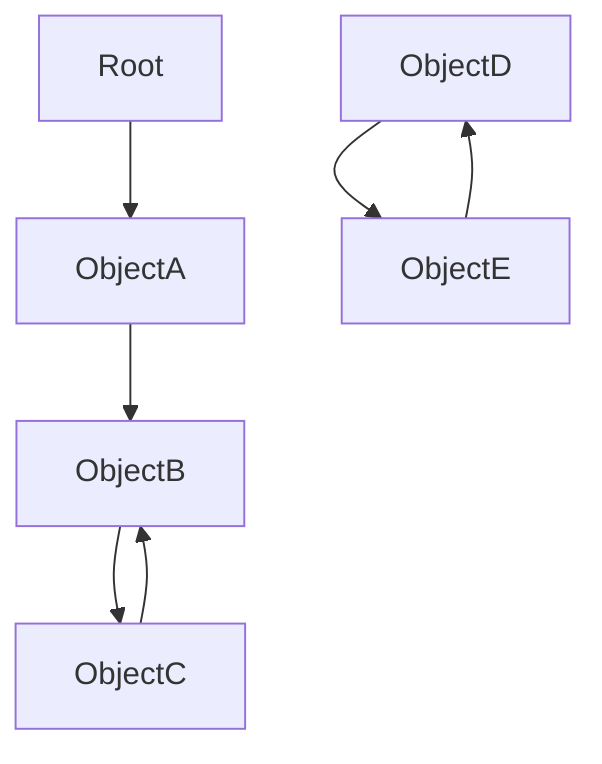
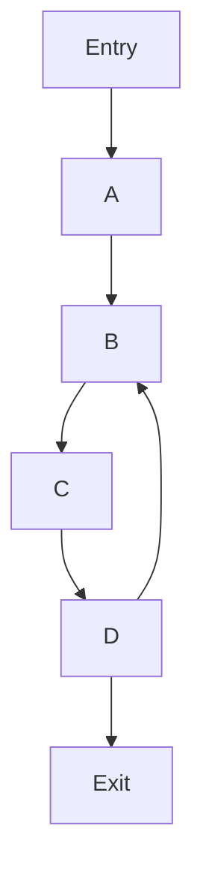
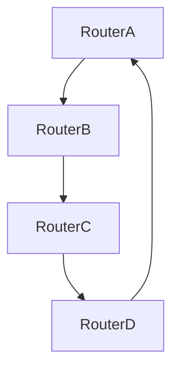

# Practical Applications of Cycle Detection 🌟

Now that we've explored various cycle detection algorithms, let's look at how they're applied in real-world scenarios and some important optimizations.

## 🏢 Real-world Applications

### 1. Deadlock Detection in Operating Systems 🖥️

Operating systems use cycle detection to identify deadlocks - situations where processes are waiting for resources in a circular manner.


> [!NOTE]
> In this resource allocation graph, a cycle indicates a deadlock. Process1 is waiting for Resource1 which is held by Process2, which is waiting for Resource2 which is held by Process1.

### 2. Garbage Collection in Memory Management 🗑️

Many programming languages use cycle detection to identify unreachable objects with circular references.



<details>
<summary>How cycle detection helps with garbage collection</summary>

In this object graph, ObjectD and ObjectE form a cycle but are not reachable from the Root. A garbage collector can use cycle detection to identify and free this memory.

Modern garbage collectors use variations of cycle detection algorithms to efficiently find and collect these orphaned cycles.

</details>

### 3. Compiler Optimization and Static Analysis 📊

Compilers use cycle detection to identify loops in control flow graphs for optimization.



> [!TIP]
> Identifying the loop B→C→D→B allows the compiler to apply optimizations like loop unrolling or parallelization.

### 4. Network Routing Protocols 🌐

Routing protocols use cycle detection to prevent routing loops.



### 5. Cryptographic Applications 🔒

Cycle detection is used in cryptographic algorithms to analyze the period of pseudo-random number generators.

## 🔧 Optimizations for Different Scenarios

### Memory-Constrained Environments

When working with limited memory:

1. **Use Space-Efficient Algorithms**
   - Choose Floyd's or Brent's algorithm over hash-based approaches
   - For graphs, consider iterative implementations to avoid recursion stack overhead

2. **Partition Large Graphs**
   - For very large graphs, consider processing subgraphs separately
   - Use boundary information to stitch results together

### Performance-Critical Applications

When speed is crucial:

1. **Heuristic Pre-checks**
   - Check for simple cases (like self-loops) before applying full algorithms
   - Use domain knowledge to prioritize likely cycle locations

2. **Parallelization**
   - For large graphs, parallelizing cycle detection across different starting points
   - Combine results from independent searches

```javascript
// Example of a simple pre-check for self-loops
function hasSelfLoop(graph) {
  for (let i = 0; i < graph.length; i++) {
    if (graph[i].includes(i)) {
      return true; // Self-loop found
    }
  }
  return false; // No self-loops
}
```

### Distributed Systems

For cycle detection across distributed components:

1. **Timestamp-Based Approaches**
   - Use logical timestamps to track message dependencies
   - Detect cycles when a node receives a message with a timestamp less than expected

2. **Token-Based Algorithms**
   - Pass tokens through the system
   - Detect cycles when a token returns to its origin

## 🧮 Advanced Implementations

### 1. Finding All Cycles in a Graph

<details>
<summary>Using Johnson's algorithm to find all cycles</summary>

Johnson's algorithm efficiently finds all elementary cycles in a directed graph:

1. Identify strongly connected components (SCCs)
2. For each SCC, use a modified DFS to find all cycles
3. Combine results from all SCCs

This approach is more efficient than naively looking for all cycles from each vertex.

</details>

### 2. Parallel Cycle Detection

<details>
<summary>Multi-threaded approach for large graphs</summary>

For large graphs, consider:

1. Partitioning the graph into relatively independent subgraphs
2. Assigning each subgraph to a separate thread
3. Using thread-safe data structures to track global state
4. Combining results from all threads

This can provide significant speedup on multi-core systems.

</details>

## 💡 Best Practices and Common Pitfalls

### Best Practices ✅

1. **Choose the Right Algorithm** for your specific use case
   - Consider memory constraints, graph size, and whether you need the cycle location

2. **Test with Edge Cases**
   - Empty structures
   - Single-element cycles (self-loops)
   - Large cycles that traverse most of the structure

3. **Consider Domain-Specific Optimizations**
   - Use knowledge about your specific problem to simplify detection

### Common Pitfalls ❌

1. **Ignoring Graph Directionality**
   - Using the wrong algorithm for directed vs. undirected graphs

2. **Confusing Parent Edges with Back Edges**
   - In undirected graphs, the edge back to a parent is not a cycle

3. **Stack Overflow in Recursive Implementations**
   - For large graphs, recursion depth can exceed limits

4. **Infinite Loops in Cycle Detection Code**
   - Ironically, bugs in cycle detection code can create infinite loops!

## 🎓 Final Thoughts

Cycle detection algorithms are a powerful tool in a programmer's toolkit. The ability to identify cycles in various data structures has applications across nearly every domain of computer science, from system-level programming to high-level application development.

> [!TIP]
> The most valuable skill is knowing which algorithm to apply in which situation. This comes with practice and understanding the trade-offs between different approaches.

As you work with these algorithms, remember:
1. **Start simple** - The hash-based approach is often good enough
2. **Optimize when needed** - Move to more sophisticated algorithms when constraints require it
3. **Test thoroughly** - Cycle detection bugs can be subtle and hard to reproduce

## 🚀 Challenge: Putting It All Together

Consider this multi-part problem that combines several aspects of cycle detection:

1. You have a large system with many components that can depend on each other
2. You need to detect dependency cycles (to prevent deadlocks)
3. The system has both memory constraints and performance requirements
4. You need to not just detect cycles, but report their exact paths

What approach would you take? Which algorithm would you choose? How would you optimize it for your specific constraints?

> [!NOTE]
> There's no single "correct" answer. The best solution depends on weighing the trade-offs for your specific scenario.

Congratulations on completing this exploration of cycle detection algorithms! You now have a powerful set of tools to apply to a wide range of problems across computer science. 