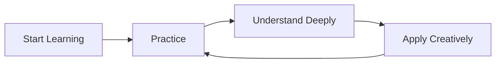

# Mastering Cycle Detection: Concluding Thoughts 🎓

Congratulations on completing this deep dive into cycle detection algorithms! Let's recap what we've learned and explore additional resources for further study.

## 🔄 What We've Covered

1. **Problem Understanding**
   - What cycles are and why detecting them matters
   - Different types of cycles in various data structures
   - Real-world applications of cycle detection

2. **Core Algorithms**
   - Simple Hash Set approach
   - Floyd's "Tortoise and Hare" algorithm
   - DFS-based cycle detection for graphs
   - Brent's algorithm for optimized detection

3. **Advanced Topics**
   - Finding cycle start points
   - Measuring cycle lengths
   - Optimizations for different scenarios
   - Implementation strategies and best practices

4. **Practical Applications**
   - Deadlock detection in operating systems
   - Memory management and garbage collection
   - Compiler optimization
   - Network routing and security

## 🧠 Key Takeaways

- **Multiple Approaches**: There's no one-size-fits-all solution for cycle detection
- **Space-Time Tradeoffs**: Choose between memory efficiency and computational speed based on your constraints
- **Structure Matters**: The data structure (linked list, graph, etc.) determines the most appropriate algorithm
- **Beyond Detection**: Often you need to not just detect cycles, but find their locations, lengths, or other properties

## 📚 Further Learning Resources

### Books

- "Introduction to Algorithms" by Cormen, Leiserson, Rivest, and Stein
- "Algorithm Design Manual" by Steven Skiena
- "Graph Algorithms in the Language of Linear Algebra" by Jeremy Kepner and John Gilbert

### Online Courses

- [Stanford's Algorithms Specialization on Coursera](https://www.coursera.org/specializations/algorithms)
- [Princeton's Algorithms on Coursera](https://www.coursera.org/learn/algorithms-part1)
- [MIT's Introduction to Algorithms](https://ocw.mit.edu/courses/electrical-engineering-and-computer-science/6-006-introduction-to-algorithms-fall-2011/)

### Interactive Resources

- [Visualgo - Algorithm Visualizations](https://visualgo.net/en)
- [Algorithm Visualizer](https://algorithm-visualizer.org/)
- [CS Academy Graph Editor](https://csacademy.com/app/graph_editor/)

## 🚀 Challenge Yourself

To truly master cycle detection, try these extension challenges:

1. **Implement a variant of Floyd's algorithm that finds all cycles in a graph**
2. **Create a visualization tool for different cycle detection algorithms**
3. **Apply cycle detection to a real-world dataset (social networks, dependencies, etc.)**
4. **Compare the performance of different algorithms on very large datasets**
5. **Develop a distributed cycle detection algorithm for a cluster computing environment**

## 💭 Philosophical Note

Cycles are fascinating not just in computer science but in many areas of life. The ability to detect patterns, loops, and circular dependencies is valuable in fields ranging from economics to psychology, from ecology to organizational management.

> [!NOTE]
> While we've focused on computational approaches to cycle detection, the fundamental insights—looking for repetition, tracking history, and identifying relationships—apply broadly across many domains of knowledge.

## 🙏 Final Words

Remember that mastering algorithms is an ongoing journey. Cycle detection may seem like a narrow topic, but it connects to fundamental concepts in computer science including:

- Graph theory
- Memory management
- System design
- Algorithm optimization
- Data structure traversal

By deeply understanding cycle detection, you've strengthened your foundation in all these areas.

Keep exploring, keep coding, and most importantly, keep looking for elegant solutions to complex problems!

> [!TIP]
> Notice the cycle in the learning process above? Sometimes cycles are exactly what we want! 😊

Happy coding! 