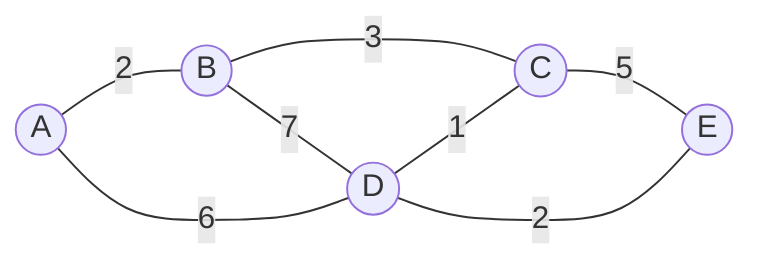

# 🧭 The Path-Finding Challenge

> [!NOTE]
> Dijkstra's algorithm solves one of the most fundamental problems in graph theory and computer science: finding the shortest path from one point to another in a weighted graph.

## 🌍 Real-World Analogies

Imagine you're planning a road trip across several cities. There are multiple possible routes between cities, each with different distances. You want to find the most efficient route that minimizes the total distance traveled.

Or picture yourself as a network packet, trying to find the fastest path through the internet to reach your destination server. Which routers should you pass through to minimize delay?

These are practical examples of the **shortest path problem** that Dijkstra's algorithm solves!

## 🧩 The Problem Formally Defined

Given:
- A graph with nodes (vertices) representing locations
- Weighted edges representing distances or costs between locations
- A source node where we start our journey

Find:
- The shortest (minimum weight) path from the source node to every other node in the graph

> [!TIP]
> In Dijkstra's algorithm, we focus on graphs with **non-negative weights**. This is crucial because the algorithm relies on the fact that adding a positive number to a path can never make it shorter!

## 📊 Example Visualization

In this example:
- We have cities A, B, C, D, and E
- The numbers on the edges represent distances between cities
- Starting at city A, what's the shortest path to reach each other city?

## 🤔 Think About It

Before diving into how Dijkstra's algorithm works, take a moment to consider:

1. How would you manually solve this problem for the graph above?
2. What information would you need to track as you explore different paths?
3. Why might a greedy approach (always choosing the nearest unvisited node) lead to the optimal solution?

💡 Hint about the approach

The key insight is that once we find the shortest path to a node, we can use that information to find the shortest paths to nodes connected to it. This is the principle of **optimal substructure** that Dijkstra's algorithm leverages.

In the next lesson, we'll begin breaking down Dijkstra's algorithm step by step! 