# 🚀 Initialization: Getting Ready for the Journey

Before we can start finding shortest paths, we need to set up our data structures and initial values. This crucial step lays the foundation for the entire algorithm.

## 🎯 Initialization Goals

The initialization phase has three main objectives:

1. Create data structures to track distances
2. Set appropriate starting values
3. Prepare our priority queue for node processing

## 🛠️ Data Structures Setup

Let's prepare the three essential components we need:

### 1. The Distance Map

```javascript
const distances = {};
```

This map will store the current shortest known distance from the source to each node in the graph. 

### 2. The Visited Set

```javascript
const visited = new Set();
```

This set keeps track of nodes we've fully processed (settled) to avoid redundant work.

### 3. The Priority Queue

```javascript
const priorityQueue = new PriorityQueue();
```

This queue will help us efficiently select the node with the smallest distance to process next.

> [!TIP]
> The priority queue implementation significantly impacts the algorithm's efficiency. While a simple array-based implementation works for small graphs, a binary heap or Fibonacci heap is recommended for larger graphs.

## 🏁 Setting Initial Values

Now we need to establish the starting values:

```javascript
// Initialize all nodes with infinity distance except the source
for (const node in graph) {
  distances[node] = node === source ? 0 : Infinity;
}

// Add source to the priority queue
priorityQueue.enqueue(source, 0);
```

Let's break down what's happening:

1. For the **source node**: Distance = 0 (it costs nothing to stay where you are)
2. For **all other nodes**: Distance = Infinity (we haven't found any path yet)
3. We add only the source node to our priority queue with priority 0

## 📊 Visualization

Here's how our data structures look after initialization for our example graph:

```mermaid
graph LR
    A((A<br>0))--2---B((B<br>∞))
    A--6---D((D<br>∞))
    B--3---C((C<br>∞))
    B--7---D
    C--5---E((E<br>∞))
    D--1---C
    D--2---E
```



Priority Queue: [A:0]  
Visited Set: {}  
Distances: {A:0, B:∞, C:∞, D:∞, E:∞}

> [!NOTE]
> The values inside the nodes represent the current known shortest distance from the source (A).

## 🤔 Why Infinity?

<details>
<summary>Why do we use Infinity for unknown distances?</summary>

We use Infinity rather than a large number because:

1. It ensures that **any real path** will be better than the initial value
2. It makes the algorithm's logic cleaner - we don't need to check if a node has been visited
3. It works with the relaxation step - any real distance will be less than Infinity
</details>

## 💻 Code Example

Here's how the initialization phase looks in JavaScript:

```javascript
function dijkstra(graph, source) {
  // Initialize data structures
  const distances = {};
  const visited = new Set();
  const pq = new PriorityQueue();
  
  // Set initial distances
  for (const node in graph) {
    distances[node] = node === source ? 0 : Infinity;
  }
  
  // Add source to priority queue
  pq.enqueue(source, 0);
  
  // ... (rest of the algorithm follows)
}
```

## 🎯 Key Takeaways

- Properly initializing the distance map is crucial for the algorithm to work correctly
- The source node starts with a distance of 0, while all other nodes start with Infinity
- Only the source node is initially added to the priority queue
- The visited set starts empty, as we haven't processed any nodes yet

In the next lesson, we'll explore the main loop of Dijkstra's algorithm and how it processes nodes to find shortest paths! 