# 🔄 The Main Loop: Processing Nodes

Now that we've set up our initial state, we're ready to dive into the heart of Dijkstra's algorithm: the main processing loop. This is where the real path-finding magic happens!

## 🎯 Loop Goal

The main loop has one core objective: **repeatedly process the node with the smallest known distance, updating the distances to its neighbors until all reachable nodes have been processed**.

## 🔄 The Processing Loop

Here's the structure of our main loop:

```javascript
// Process nodes until the priority queue is empty
while (!priorityQueue.isEmpty()) {
  // 1. Get the node with the smallest distance
  const { node: currentNode, distance: currentDistance } = priorityQueue.dequeue();
  
  // 2. Skip if we've already processed this node
  if (visited.has(currentNode)) continue;
  
  // 3. Mark as visited
  visited.add(currentNode);
  
  // 4. Process all neighbors (we'll explore this next)
  // ...
}
```

## 🚶‍♂️ Step-by-Step Walkthrough

Let's trace through the first few iterations of the loop using our example graph:

### Iteration 1: Processing Node A (distance 0)


1. We dequeue A (distance 0) from the priority queue
2. Mark A as visited
3. Process A's neighbors:
   - B: Update distance to min(∞, 0 + 2) = 2
   - D: Update distance to min(∞, 0 + 6) = 6
4. Add B and D to the priority queue

After iteration 1:
- Priority Queue: [B:2, D:6]
- Visited Set: {A}
- Distances: {A:0, B:2, C:∞, D:6, E:∞}

### Iteration 2: Processing Node B (distance 2)

```mermaid
graph LR
    A((A<br>0))--2---B((B<br>2))
    A--6---D((D<br>6))
    B--3---C((C<br>∞))
    B--7---D
    C--5---E((E<br>∞))
    D--1---C
    D--2---E
    
    style A fill:#f5a, stroke:#333
    style B fill:#f5a, stroke:#333
```



1. We dequeue B (distance 2) from the priority queue
2. Mark B as visited
3. Process B's neighbors:
   - C: Update distance to min(∞, 2 + 3) = 5
   - D: Update distance to min(6, 2 + 7) = 6 (no change)
4. Add C to the priority queue

After iteration 2:
- Priority Queue: [C:5, D:6]
- Visited Set: {A, B}
- Distances: {A:0, B:2, C:5, D:6, E:∞}

> [!NOTE]
> We check if the new path through the current node offers a better (shorter) path to each neighbor. If it does, we update the distance and add the neighbor to the priority queue.

## 🔍 Key Operation: Edge Relaxation

The core operation in the main loop is **edge relaxation**, where we check if we've found a better path to a neighbor:

```javascript
// Calculate new distance to the neighbor
const newDistance = currentDistance + weight;

// Update distance if we found a shorter path
if (newDistance < distances[neighbor]) {
  distances[neighbor] = newDistance;
  
  // Add or update neighbor in the priority queue
  priorityQueue.enqueue(neighbor, newDistance);
}
```

This operation:
1. Calculates a potential new distance through the current node
2. Compares it to the best known distance so far
3. Updates the distance if we've found a better path
4. Adds the neighbor to the priority queue for future processing

## 💻 Full Code Example

Here's the complete main loop in JavaScript:

```javascript
// Process nodes until the priority queue is empty
while (!pq.isEmpty()) {
  // Get the node with the smallest distance
  const current = pq.dequeue();
  if (!current) break;

  const { node: currentNode, distance: currentDistance } = current;

  // Skip if we've already processed this node
  if (visited.has(currentNode)) continue;

  // Mark as visited
  visited.add(currentNode);

  // Process all neighbors of the current node
  for (const edge of graph[currentNode] || []) {
    const { node: neighbor, weight } = edge;

    // Skip if we've already processed this neighbor
    if (visited.has(neighbor)) continue;

    // Calculate new distance to the neighbor
    const newDistance = currentDistance + weight;

    // Update distance if we found a shorter path
    if (newDistance < distances[neighbor]) {
      distances[neighbor] = newDistance;
      
      // Add neighbor to the priority queue
      pq.enqueue(neighbor, newDistance);
    }
  }
}
```

## 🧠 Understanding the Algorithm's Behavior

<details>
<summary>Why do we skip already visited nodes?</summary>

Once a node is marked as visited, we've found the shortest path to it. Due to the greedy nature of Dijkstra's algorithm and the fact that all weights are non-negative, we can never find a shorter path to that node later.

Skipping visited nodes is an optimization that prevents redundant work.
</details>

<details>
<summary>Why might we see a node in the queue multiple times?</summary>

A node can enter the queue multiple times if we find increasingly shorter paths to it. Each time we find a shorter path, we add the node again with the new, lower priority (distance).

Some priority queue implementations have a "decrease key" operation to update a node's priority instead of adding it multiple times.
</details>

## 🎯 Key Takeaways

- The main loop continuously processes the node with the smallest known distance
- Edge relaxation is the core operation that updates the distances to neighboring nodes
- We mark nodes as "visited" once we've found their shortest distance
- The algorithm naturally builds outward from the source node, processing nodes in order of increasing distance

In the next lesson, we'll walk through a complete example from start to finish to see how all of these pieces work together! 