# 🔎 Complete Walkthrough Example

Let's put everything together by walking through Dijkstra's algorithm on our example graph from start to finish. This will help solidify your understanding of how the algorithm works in practice.

## 📊 Our Example Graph

Our task: Find the shortest path from node A to all other nodes.

## 🚀 Initialization

We start by setting up our data structures:

- **Distances**: {A:0, B:∞, C:∞, D:∞, E:∞}
- **Visited Set**: {}
- **Priority Queue**: [A:0]

## 🔄 Full Processing Walkthrough

### Iteration 1: Process Node A (distance 0)

1. Dequeue A (distance 0)
2. Mark A as visited
3. Process neighbors:
   - Update B: distance = min(∞, 0 + 2) = 2
   - Update D: distance = min(∞, 0 + 6) = 6
4. Add B and D to the queue

After Iteration 1:
- **Distances**: {A:0, B:2, C:∞, D:6, E:∞}
- **Visited Set**: {A}
- **Priority Queue**: [B:2, D:6]

### Iteration 2: Process Node B (distance 2)

```mermaid
graph LR
    A((A<br>0))--2---B((B<br>2))
    A--6---D((D<br>6))
    B--3---C((C<br>∞))
    B--7---D
    C--5---E((E<br>∞))
    D--1---C
    D--2---E
    
    style A fill:#f5a, stroke:#333
    style B fill:#f5a, stroke:#333
```

1. Dequeue B (distance 2)
2. Mark B as visited
3. Process neighbors:
   - Update C: distance = min(∞, 2 + 3) = 5
   - Update D: distance = min(6, 2 + 7) = 6 (no change)
4. Add C to the queue

After Iteration 2:
- **Distances**: {A:0, B:2, C:5, D:6, E:∞}
- **Visited Set**: {A, B}
- **Priority Queue**: [C:5, D:6]

### Iteration 3: Process Node C (distance 5)

```mermaid
graph LR
    A((A<br>0))--2---B((B<br>2))
    A--6---D((D<br>6))
    B--3---C((C<br>5))
    B--7---D
    C--5---E((E<br>∞))
    D--1---C
    D--2---E
    
    style A fill:#f5a, stroke:#333
    style B fill:#f5a, stroke:#333
    style C fill:#f5a, stroke:#333
```

1. Dequeue C (distance 5)
2. Mark C as visited
3. Process neighbors:
   - Update E: distance = min(∞, 5 + 5) = 10
4. Add E to the queue

After Iteration 3:
- **Distances**: {A:0, B:2, C:5, D:6, E:10}
- **Visited Set**: {A, B, C}
- **Priority Queue**: [D:6, E:10]

### Iteration 4: Process Node D (distance 6)

1. Dequeue D (distance 6)
2. Mark D as visited
3. Process neighbors:
   - Update C: distance = min(5, 6 + 1) = 5 (no change, already visited)
   - Update E: distance = min(10, 6 + 2) = 8
4. Update E in the queue

After Iteration 4:
- **Distances**: {A:0, B:2, C:5, D:6, E:8}
- **Visited Set**: {A, B, C, D}
- **Priority Queue**: [E:8]

### Iteration 5: Process Node E (distance 8)

1. Dequeue E (distance 8)
2. Mark E as visited
3. E has no neighbors to process
4. Queue is now empty

Final Result:
- **Distances**: {A:0, B:2, C:5, D:6, E:8}
- **Visited Set**: {A, B, C, D, E}
- **Priority Queue**: [] (empty)

## 🔍 Tracing the Shortest Paths

From our final distances, we can see:
- Shortest path to B: 2 (directly from A)
- Shortest path to C: 5 (from A → B → C)
- Shortest path to D: 6 (directly from A)
- Shortest path to E: 8 (from A → D → E)

> [!TIP]
> To actually reconstruct the paths (not just their lengths), we would need to maintain a "previous node" map during the algorithm. This would let us backtrack from any node to the source.

## 💡 Key Observations

1. **Processing Order**: Nodes are processed in order of increasing distance from the source (A, B, C, D, E)
2. **Greedy Approach**: The algorithm always selects the closest unvisited node to continue
3. **Distance Updates**: A node's distance may be updated multiple times before it's processed (E was initially 10, then improved to 8)
4. **Optimal Substructure**: The shortest path to E (A → D → E) contains the shortest path to D (A → D)

## 🤔 Thought Exercise

What would change if we added a new edge?

Let's say we added an edge from B to E with weight 9.

This wouldn't change our final result because:
- The current shortest path to E is 8 (A → D → E)
- The potential path through B would be 2 + 9 = 11, which is longer

This demonstrates that Dijkstra's algorithm finds the globally optimal solution by making locally optimal choices.

## 🎯 Key Takeaways

- Dijkstra's algorithm builds outward from the source, processing nodes in order of increasing distance
- The algorithm guarantees the shortest path to each node when it marks that node as visited
- The final distances map gives us the shortest path lengths from the source to all other nodes
- To reconstruct the actual paths, we would need to track the "previous" node for each node

In the next lesson, we'll explore how to optimize Dijkstra's algorithm and common implementation variants! 